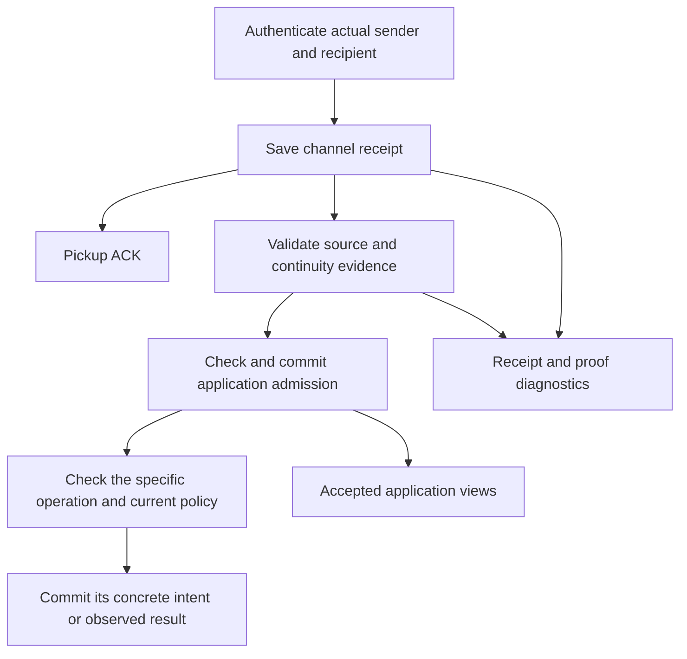
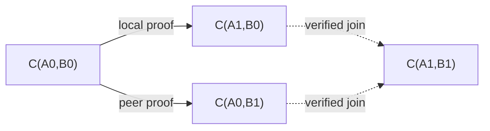
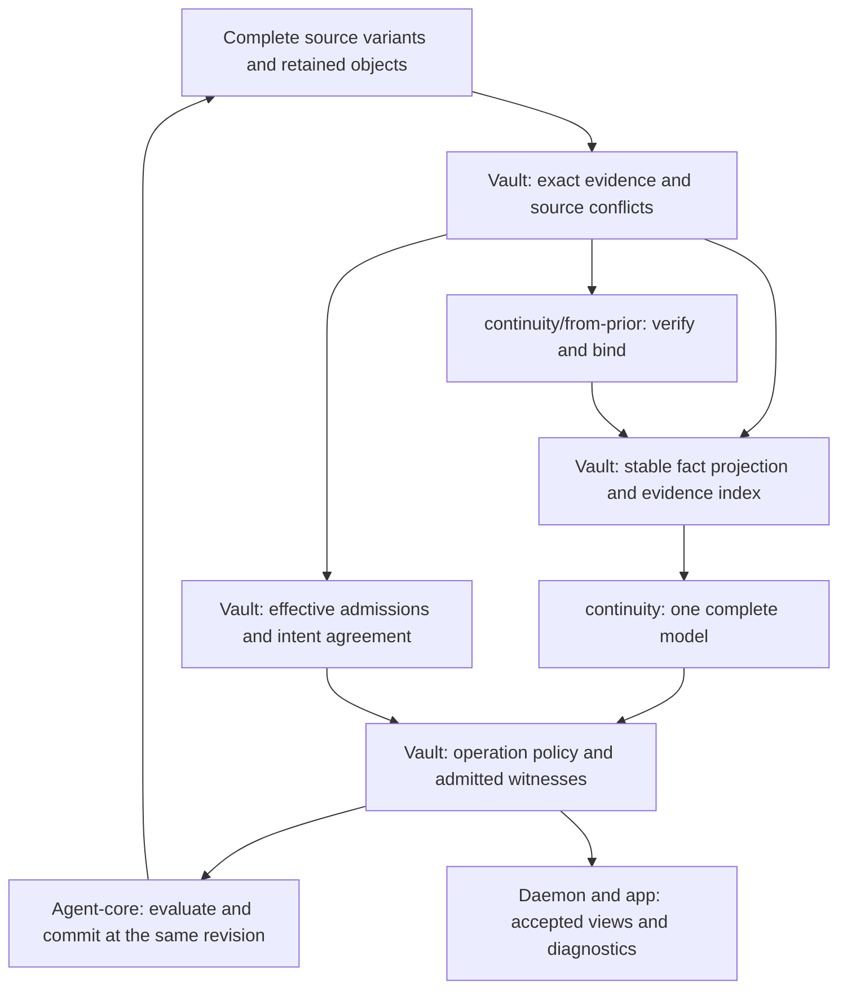

# Channels, continuity and operation evidence

Status: **phase 1; continuity integration, application admission and rotation restrictions specified, implementation pending**. This document owns channel identity, invitation
consumption, the vault evidence adapter and operation eligibility. The
[`@estoc/continuity` API and host contract](../../packages/continuity/README.md)
own proof and graph semantics; this document specifies their application use. Storage
envelopes and durability follow [event-store.md](event-store.md). Sending and
effect ordering follow [distributed-delivery.md](distributed-delivery.md).
The capitalized requirement words have their BCP 14 meanings.

<a id="model"></a>

## 1. Model

A **channel** is the fixed ordered pair `(localDid, peerDid)` of distinct
canonical `did:peer:4` communication DIDs, viewed from one vault. Each
message retains its sender, recipient, authenticated keys and exact immutable
document evidence. Mediator DIDs follow a separate
[resolution policy](relationships.md#mediator-resolution).

A **continuity link** is a derived replacement of exactly one endpoint in the
context of one channel. The fold computes it from received proofs, resolution
evidence and local rotation decisions; no link event is stored.
Links form a directed graph whose authority is scoped to each channel context.

A **contact** organizes selected channels with local names and preferences.
Creation selects complete local/peer DID pairs and may precede receipt or peer
resolution. Contact edits affect presentation and preferences, not message
identity or protocol authority. Channels and continuity exist independently of
contacts; unassigned channels remain usable.



Receipt needs no invitation consumption, contact or continuity history.
Anonymous input has no channel or application execution. Each later operation
checks its own evidence and policy under section 6.

<a id="channel-identity"></a>

## 2. Channel identity

Validate and canonicalize both DIDs under
[the DID profile](relationships.md#peer-did-numalgo-4-profile). A channel value
has exactly these two DID strings:

```ts
type Channel = { localDid: Did; peerDid: Did };
```

Both endpoints use the canonical numalgo-4 short form. Compare each role
byte-for-byte; equal endpoints are invalid. `(A, B)` and `(B, A)` are different
vault-local views.
Receiving from B at A and sending from A to B use the same `(A, B)` channel.
The notation `C(A, B)` throughout this profile means `{localDid: A, peerDid: B}`.

Receipts derive the pair from the local key's DID and authenticated sender.
Outbound intents derive it from `senderDidId` and canonical `recipientDid`.
Source-based facts use the pair of their referenced message. Missing exact
endpoint evidence leaves that projection pending; contact membership, another
observation or a shared key cannot supply it.

Selectors such as contact membership and blocking store the two canonical DID
strings directly. Canonicalize supplied long forms before storing a selector.
Its syntax and distinctness can be checked offline; missing DID documents or
local entities leave evidence unresolved and grant no authority.
Compare selectors by both roles. Sort sets by unsigned UTF-8 byte order of
`RFC8785([localDid, peerDid])`, with no duplicate pairs. This ordering sorts the
set, not the two endpoints within a pair.

Replacing either DID creates another channel; document CIDs, keys and resolution
event IDs are verification evidence. Changing a numalgo-4 encoded document
yields another DID. Shared keys or services never alias distinct DIDs.

<a id="receipt"></a>

## 3. Durable receipt

Perform exact recipient, route, cryptographic, syntax, resource and current
sender checks under [the receive gate](relationships.md#hard-pre-vault-gate).
Do not consult contact membership or continuity membership. Retired local keys
may drain an otherwise eligible retained route; retirement still blocks new
sending, disclosure and new invitation consumption.

Under the operation lock, recheck local prerequisites, commit/reuse the exact
resolution document, then commit `message.in` with objects and receipt ordinal.
Derive the channel from the actual local recipient and authenticated sender;
anonymous input has no peer or channel. Preserve the original `fromPrior`, local key,
resolution reference, hashes and source as immutable observations.

Normal pickup ACK follows process-durable receipt. An unknown, blocked,
superseded or incomplete channel can still retain an authenticated observation.
Receipt grants no peer ACK, protocol effect or invitation consumption.
Hard cryptographic/wrong-recipient/resource rejection keeps the terminal
pre-vault ACK path. Failure to durably save an otherwise receivable input
withholds pickup ACK.

<a id="carried-proof-and-library-boundary"></a>

### 3.1 Carried proof and library boundary

Present-sender authentication and permission to inherit a predecessor's
channel authority are distinct checks. A phase-1 DIDComm adapter MUST support
authenticated unpack independently of `from_prior` verification. It MUST return
the original string-valued `from_prior` unchanged and distinguish an unverified
claim from verified proof metadata. Missing predecessor material, a malformed
JWT or an invalid proof MUST NOT prevent otherwise valid authenticated receipt
and its pickup ACK. An absent or explicitly null `from_prior` header denotes no
carried proof; any other non-string value fails ordinary wire syntax checks.

The adapter MUST retain all envelope integrity, current-sender authorization,
recipient and cross-layer addressing checks. Failure of those checks follows
the hard pre-vault gate; no failed authentication may be presented as success.
Predecessor resolution and proof verification occur after receipt under
[the proof rule](relationships.md#predecessor-resolution), through
`@estoc/continuity/from-prior`. The DIDComm library authenticates the envelope;
the continuity package verifies the original proof against the issuer's own
immutable document. Never strip the proof or treat decoding as verification. A library
that couples proof verification to unpack needs an explicit deferred-proof
mode; waiting unopened for continuity is not a phase-1 fallback.

The authenticated recipient is the local key-agreement method that
successfully decrypts the authcrypt layer. Recipient identifiers from an
anonymous wrapper MUST NOT be attributed to that layer; a phase-1 receiver
whose library does not report the authcrypt layer's own recipients MUST
refuse an authcrypt layer wrapped in an anonymous one, sender protection
included. The plaintext `to` header is audience information and MUST NOT replace
envelope-derived recipient evidence. Its absence, or its
failure to name the local recipient, does not by itself fail the phase-1
receive gate; an implementation MAY record a bounded diagnostic. This
profile follows the DIDComm Message Headers acceptance rule for `to` where
it conflicts with the Message Layer Addressing Consistency rule.

Save the message in its actual authenticated sender/recipient channel while
continuity is pending or invalid. Invalid proof authorizes no operation based
on that proof. Per-source ingress limits use the authenticated sender, never
the unverified `from_prior.iss`.
This uses the rotation primitive in
[DIDComm Messaging 2.1](https://identity.foundation/didcomm-messaging/spec/v2.1/#did-rotation).
The channel graph and local policy below are this application's design.

<a id="verification-status"></a>

### 3.2 Verification status and display

Receipt and continuity verification are separate visible facts. A saved
authenticated message MAY be inspected before application admission, with an
explicit diagnostic status beside it, outside the ordinary accepted conversation.
Do not present a pending sender as the verified continuation of an earlier peer or silently group it on that basis.
The UI MUST distinguish these derived states:

| State | Meaning |
| --- | --- |
| `not-present` | No `from_prior`; ordinary channel policy still applies |
| `pending-proof` | A proof is present but its required verification document/evidence is unavailable |
| `pending-history` | The proof verifies, but an exact source, endpoint or rotation record needed for the queried continuity path is missing |
| `verified` | Both proof and channel context validate; the link is derivable |
| `invalid` | The carried claims or complete verification evidence fail validation |
| `conflict` | Complete evidence establishes competing successors or contradictory channel authority |

Rebuild these states from retained evidence. Missing imported references remain
pending, not invalid. Missing local issuer material may add a bounded
diagnostic; its absence is not proof of a bad signature. Channel denial and
invitation/operation status are shown separately. Invitation availability
does not make continuity pending. If an imported receipt's
own sender evidence is missing, show that pending authentication separately;
do not claim its sender has already been verified. Pending/invalid/conflicted
continuity grants no authority through that continuity. Same-channel historical
ACK attribution uses section 5.2's direct identity rule and its own source checks.
Application admission is a separate fact under
[section 6.1](#application-admission); `verified` alone does not mean accepted.
Later evidence may update the display and graph without another pickup, receipt
ordinal or message ID. That change alone grants no new automatic dispatch action.

<a id="invitation-consumed"></a>

## 4. Invitation consumption

`invitation.consumed` automatically assigns a one-use OOB invitation to the
peer authenticated by an exact receipt. Consumption is independent of sending,
automatic output, preparation, rotation, ACK/error attribution and display; it
grants no channel or continuity authority. Its data has exactly two fields and
`roots` is empty:

```json
{
  "type": "invitation.consumed",
  "roots": [],
  "data": {
    "disclosureEventId": "019b2a61-84d8-734a-a996-963bb503e30f",
    "sourceEventId": "019b2a71-4c18-760a-9017-b3e265aa89d1"
  }
}
```

Both references are required, non-null and already committed:

- `disclosureEventId` names one `did.disclosed` with `as == "oob"` and
  `uses == "one"`;
- `sourceEventId` names one complete source witness under section 6, with
  `fromPrior == null`, the disclosure's exact local recipient DID and
  `pthid == disclosure.oobId`.

The consumer is the source's canonical peer DID within the disclosure's fixed
local DID. Validated long and short DID spellings identify the same consumer;
continuity does not transfer consumption to a successor peer.

The active runtime MUST process consumption automatically under the operation
lock, checking invitation policy, local DID/route lifecycle, denial, supersession,
conflicts and availability.
For an unconsumed disclosure, process retained non-erased proof-free receipts
matching its local recipient and `oobId` in ascending
`receiptOrderKey` order under [vault events](vault-events.md#message-in).
Select the first eligible receipt with effective admission. Skip definitively
invalid candidates and candidates whose only blockers are current denial,
supersession or conflict with already admitted intent. Among the remaining
candidates, missing evidence or an unfinished admission-reconciliation pass at
an earlier receipt defers selection; a receipt-integrity conflict leaves selection
conflicted.
Commit the consumption before presenting it as complete.

Reuse a complete consumption for the same disclosure and canonical peer;
another peer cannot consume an unavailable invitation. Imported complete
records naming different consumers make it conflicted and unavailable, with
no event-order winner. Incomplete records that could establish another consumer
leave availability pending; another receipt cannot replace their exact source.
Validate each record's positive evidence before aggregate availability, so a
consumption does not invalidate itself.

Complete consumption never reopens, including after erasure, denial, retirement,
conflict or contact deletion. Retain its event and exact source/disclosure
skeletons. Import validates the references, not past policy or the producer's
then-visible receipt set; later receipts cannot replace the consumer. Admission
is a prerequisite for creating consumption, not for validating a committed
consumption or preserving its consumer.

On reopen, restore, import or evidence recovery, rebuild existing consumption
first. The active runtime MUST then automatically complete missing consumption
under the same ordering and current eligibility checks, without redelivery or
user action. A pure fold never appends events; missing evidence stays pending
and erased input cannot start consumption. This local recovery grants no
dispatch action. Many-use invitations have no consumption event or exclusive
consumer. Consumption never disables the disclosed DID.

<a id="continuity"></a>
<a id="channel-linked"></a>

## 5. Derived continuity

The vault projects retained proof evidence and local rotation decisions into
`@estoc/continuity` and uses its queries. The package's public types, JSDoc,
README host contract and tests define normalization, joins, contexts, conflict
scope and query outcomes. The descriptions and join diagram below explain the
evidence mapping; they do not define another graph algorithm. The
[integration contract](#continuity-integration) fixes the host responsibilities.
Proof verification is local and appends no verification events.
Application admission is a separate durable decision under section 6.1.

<a id="peer-proof-evidence"></a>

### Peer proof evidence

The fold derives the issuer document from each committed authenticated
`message.in` carrier's original `fromPrior` under
[predecessor resolution](relationships.md#predecessor-resolution). A validated
long-form `iss` yields its immutable document using
[the fixed representation](vault-events.md#peer-resolved). A short-form `iss`
uses a retained method-valid `peer.resolved` document whose validated long form
derives that short form. Without this material, a proof that passes the checks
not requiring the document stays `pending-proof`.

Each carrier verifies its own original JWT against that document; no event
stores a source/document association or a trusted verification result. The
carrier fixes its authenticated sender and local endpoint. Its `fromPrior`
remains event metadata after message-content erasure, so a long-form issuer
remains derivable. For short-form issuers, the `peer.resolved` root retains the
document independently of message content. A disposable resolver or verification
cache cannot be the sole source of this material during rebuild.

For a complete authenticated carrier `M` addressed to local DID `A`, validate
the original JWT's signature, `kid`, `iss`, `sub` and derived document under
[the proof checks](vault-events.md#relationship-peertransitioned). Its `sub`
must match the carrier's authenticated sender. Then derive:

```text
B0 = canonicalDid(fromPrior.iss)
B1 = canonicalDid(M.from)
peer link = C(A, B0) -> C(A, B1)
```

`A`, `B0` and `B1` must form two valid distinct channel pairs, with `B0 != B1`.
The authenticated carrier fixes `A` and `B1`; the verified proof fixes `B0`.
These facts suffice to derive the link without an earlier message in `C(A,B0)`.
A missing source or endpoint dependency defers the link. Operations using it
still follow section 6.

A link remains supported by a complete authenticated carrier whose own JWT
verifies, even when another carrier is incomplete or invalid. Another carrier's
authentication or proof result cannot complete this carrier. Missing required
material defers its verification; a complete failed check makes its proof
invalid. Intrinsically invalid claims cannot be repaired by supplying material.

<a id="did-rotationselected"></a>

### Local rotation decisions

A local rotation may be selected before any outbound message exists. Preserve
that decision as `did.rotationSelected`, with `roots == []` and five closed fields:

```json
{
  "type": "did.rotationSelected",
  "roots": [],
  "data": {
    "fromDidId": "019b2a60-c68e-75bf-b6fb-ae1a41f8d715",
    "peerDid": "did:peer:4zQmaszWy5nSWq5GjKaGPuRCuFfwBqML1SAQNxPJdpAxx3fP",
    "toDidId": "019b4d12-22d3-7fd0-82fb-f33864a75dd5",
    "sourceEventId": null,
    "fromPrior": "<compact-jwt>"
  }
}
```

`fromDidId` names the already committed local DID `A0`; `peerDid` stores the
canonical peer DID `B`. They fix the oriented old pair `C(A0,B)`, including
when `sourceEventId` is null. `toDidId` names an eligible local DID `A1`, distinct
from both old endpoints; its `did.created` is committed earlier or in the same
atomic commit as this decision. Its document and route come from that creation.
Validate both local DID entities and their exact retained
key evidence. The original JWT is signed by the retained local `A0`
authentication method, with exact `iss`/`sub` spellings for `A0`/`A1`.
Peer resolution is not supplied by this local signature;
each outgoing package retains its own peer resolution.

`sourceEventId` is null for manual rotation; otherwise it MUST name the complete
source witness in `C(A0,B)` selected by the live privacy policy.
Before committing a new decision, the producer additionally requires effective
admission of that source and of the independent predecessor-confirming witness.
The producer rechecks local lifecycle, denial, conflicts and operation-specific
policy under the operation lock, including peer supersession for source-derived
work. It requires
exact-address confirmation of `A0` by a complete source witness in the same
peer context. That confirmation needs no prior handler
execution or reply and MUST NOT depend on the rotation being selected.

Commit the decision before any dependent intent or disclosure.
The local rotation context of `C(A0,B)` contains all channels retaining local
DID `A0` and connected through verified peer-only replacements under section 5.1.
A producer MUST NOT commit a decision from `A0` when a decision from `A0`
already exists anywhere in that context. Under the operation lock, fold all
available evidence before checking this condition. Reuse the existing successor
and frozen proof; verified joins carry that choice to the related peer pairs.
Do not create another decision or notification selection, or retarget the
original notification. Missing dependencies defer reuse instead of authorizing
allocation. A missing original notification remains manual work only while its
source, when present, remains eligible under section 6. After that source's
peer is superseded in the decision's context, no notification intent is created.
An already committed intent remains historical evidence; a replaced peer
recipient prohibits its dispatch under section 8;
newly prepared successor-channel messages carry the frozen proof until exact
successor confirmation. A manual decision without a source still follows the
ordinary send restrictions. Evidence verified only after decisions were committed
can still reveal a conflict under section 5.1.
A decision extending an earlier successor requires exact-address confirmation
of that successor in the applicable peer context. Confirmation permits extension,
not another branch from the earlier predecessor. The fold derives
`C(A0,B) -> C(A1,B)` from this decision,
with both pairs fixed by the decision's fields and referenced local entities.
When validating a committed decision and deriving its link, require its complete
source, when present, and independent complete predecessor-confirming evidence,
but no admission for either witness. This preserves existing decisions without
admissions; it grants neither a new decision nor general application acceptance
of those receipts. Missing or invalid exact evidence still defers or refuses
the decision.
The same `A0` used with an unrelated peer defines a different rotation context.
A prepared message carrying this local proof must match the selected decision;
it cannot independently select another rotation. Recovery of the decision
grants no dispatch action.

### 5.1 Both endpoints can rotate

At the same exact `C(A0,B0)`, a valid local decision deriving `C(A1,B0)` and a
verified peer carrier deriving `C(A0,B1)` justify `C(A1,B1)`. They must share
the same oriented predecessor DID pair with complete decision and proof
evidence. Operations validate the decision and carrier, not graph rows.
The joined channel's local DID is the local link's successor; its peer DID is
the peer link's successor. Each operation in the joined channel retains its
own required peer resolution evidence for its exact immutable endpoint
documents. This is a derived join, not a fabricated received message or
fabricated wire proof.



Only these evidence-backed joins are permitted. Sharing a DID, key or contact
cannot fill a missing side. Competing successors for the same
endpoint/context, cycles and contradictory identity evidence are visible
conflicts, not ordinary opposite-side rotation.

Phase 1 retains all independently valid branch evidence and exposes the fork;
it defines no operation to select a winning branch or clear this conflict.
Ordinary authenticated receipt remains available under section 3. The affected
context grants no authority through conflicted continuity under section 3.2
and has no default send head under section 8. Previously recorded outcomes
remain intact.

For peer replacements, one context includes channels connected by validated
local-only replacements while retaining the same canonical peer DID. Compare
competing peer successors across that context. For local replacements,
apply the symmetric rule through
peer-only replacements. A join transports the existing two replacements; it
does not create another competing choice. Each derived link exposes its exact
source witnesses; equivalent DID spellings neither split the context nor hide
competing successors. These contexts are derived queries; message identifiers
remain fixed by their actual channel and sender.

Use the package's full projection and independent-confirmation rules; do not
implement a second closure, fork detector or join algorithm in the vault.
Fold the full available evidence before checking current conflicts or authorizing
new work; enumeration order and intermediate graph rows cannot authorize dispatch.

### 5.2 Supersession, confirmation and authorization

A verified peer link stops new application work from its old peer in
that channel context. The same peer supersession applies through verified
local-only links in that context, including either end of those local links;
local address rotation cannot restore the old peer's authority. It does not
affect an unrelated channel using the same public peer DID. In a verified join,
the peer link supplies this same supersession fact at the joined local endpoint.

This prevents old-peer input from continuing to trigger traffic to a replaced
address. It includes creating a requested ACK, Ping reply or rotation notification,
even by manual completion and even when the input was sent before supersession.
The message may still be durably received without a response; no ACK does not
prove nondelivery. Unadmitted old-peer observations have the
`ignored-superseded` disposition under section 6.1. Previously admitted history
remains, but cannot create new old-peer responses. Explicit user sends and
manual dispatch to the replaced peer are prohibited under section 8.

An admitted complete source witness can confirm knowledge of an exact local address
when its recipient is that address and its authenticated peer is the selected
peer or a verified role-preserving successor in the same local-only/paired-link
context. An observation addressed to a predecessor confirms no successor.
No handler execution or reply prerequisite is imposed on that witness.
New rotation decisions and new proof-free preparation require its effective
admission. Validation of an existing local decision instead uses the independent
complete confirmation evidence defined in section 5, without requiring admission.
A local decision or its descendants cannot supply its own predecessor
confirmation; missing independent evidence leaves the decision pending.
Confirmation permits future newly prepared messages to omit the
frozen proof; it does not edit a committed package or acknowledge
any particular wire ID.

For ACK attribution in the exact same canonical channel, compare both endpoint
roles directly and require the admitted source's own authentication/proof,
receipt integrity, admitted intent agreement and target/package evidence.
An unrelated aggregate rotation conflict does not by itself invalidate this
same-channel historical observation. Do not require `path(c, c)` to be usable:
the package deliberately reports conflict even for that query in a conflicted
context. This rule supplies no new-send or response authority.

Cross-channel ACK attribution instead requires a usable `model.path(old, carrier)`
and its exact evidence. It preserves endpoint roles through forward replacements
and joins. General undirected graph connectivity never
authorizes ACKs, sending or protocol effects. An unrelated channel in the same
contact cannot acknowledge a message even when it chooses the same wire ID.

<a id="continuity-integration"></a>

### 5.3 Vault integration contract

The adapter belongs in `@estoc/vault`. Agent-core performs decisions and durable
commits using that adapter's results; daemon records and app views consume the
same policy projections through the existing app → daemon → agent-core → vault
dependency path. They MUST NOT maintain a separate continuity graph or infer
application acceptance from raw receipts.



**Source inventory and projection.** Read every canonical variant from the
[event store](event-store.md#scan), including conflicts, and retain an index
from each fact and evidence reference to its exact sources, documents and
validation dependencies. Check event-ID ambiguity before filtering by type or
normalizing fields. A collision remains a host integrity fault even when its
variants normalize to identical facts; package fact equality cannot erase it.
Operations depending on that source or reference grant no authority. Where
individually verifiable variants project to different values of one fact ID,
pass all those values so the model exposes their conflict and diagnostic graph.
No first-arrival or preferred-variant projection is permitted.
For saved local choices and denials, account for every variant's possible
selector: a relevant conflicted or unprojected record remains an operation
blocker, rather than disappearing as an absent choice or block. Unrelated
channels do not inherit that fault merely by sharing a DID.

Use `PROFILE_VERSION = "estoc-continuity/1"` and proof profile
`FROM_PRIOR_PROFILE = "estoc-from-prior/1"`. A snapshot's `identityNamespace`
is the vault's immutable anchor DID, never its replica ID. Use the following
stable fact IDs; evidence references are the source event IDs. These strings
belong only to the derived projection, not the event envelope or wire protocol.

| Validated retained source | Projected facts |
| --- | --- |
| Authenticated proof-free `message.in` E | `receipt:E:observation`, an `address-observed` at the exact receipt pair with `carriedTransition: null` |
| Authenticated rotation carrier E whose own JWT verifies and binds | `receipt:E:transition` and `receipt:E:observation`; the observation references that exact transition, both with receipt E |
| Saved `did.rotationSelected` E with valid local entities, key ownership and frozen proof | `decision:E`, a `local-decision` at its fixed predecessor pair |
| Missing or failed source/proof/binding prerequisites | Host pending/invalid/conflict diagnostics and dependency index; never a fabricated proof-free observation |
| Admission, block, contact or outbound intent | Host state only; no continuity fact |

Replace E by the canonical event ID, identically across replicas and rebuilds.
Never allocate new fact IDs to conceal variants of one source. For a saved
decision, `sourceEventId != null` maps to that receipt's observation ID only
after checking it is the exact predecessor-confirming source in the decision's
pair, not merely a business trigger. Null remains null. The model evaluates
confirmation and graph prerequisites; the adapter must not require the decision
to already have a usable link before projecting it. Keep saved decisions whose
host evidence is still unresolved in the inventory. Before successor allocation,
inspect those records as well as `localDecisions()`; a pending saved choice
cannot be mistaken for permission to allocate another successor.

**Proof boundary.** Use `inspectFromPrior` only to locate issuer material, then
`verifyFromPrior` with the retained issuer long form and `bindFromPrior` with
the exact original token, receipt reference, authenticated sender and local
recipient. The bound rotation yields the two same-receipt facts above. Proof
creation uses `createFromPrior` and a host-held signer capability; vault checks
local key ownership and the local producer's fixed spellings and saves the
returned token before dependent work. Import never trusts a cached verified type.

Decoding success is not profile validation. Document-independent failures must
be distinguishable from missing issuer material, including malformed claims,
unsupported JOSE headers/time claims and canonical sender/subject mismatch.
Keep that validation in the shared package boundary. If its public API does
not expose the necessary precheck, extend and test the package API before
completing the adapter; do not create another JWT parser in vault or agent-core.
The current `inspectFromPrior` alone does not establish those checks.

This application revision projects **rotations only**. Retain otherwise
receivable ending tokens as unsupported-proof diagnostics, without projecting
an ending or granting admission/effects from that proof. Anonymous receipt
still has no channel. Do not convert an ending into `channel.blocked`, global
DID retirement or synthetic confirmation. Enabling the package's ending feature
requires an explicit application policy and event/UI revision; it is not an
incidental consequence of replacing the verifier.

**One model, separate admission.** Derive one complete model from all host-validated
evidence, including observations without admission and committed local decisions.
They are needed to rebuild links and detect conflicts. Do not filter out
unadmitted observations, insert admission as a fact or make consumer-specific
graphs. Facts are a rebuildable projection, not the durable inventory: newly
learned contradictions may retract previously projected evidence. Do not union
old cached facts back into a fresh projection.

For new rotation, short-form disclosure or omission of the frozen proof, take
the eligible observations from `confirmation(localDid, peerDid)` and select
one whose exact receipt has effective admission and meets that consumer's
integrity checks. A bare `confirmed` result is insufficient. Require admission
for that observation, not every fact in its `support`: historical decisions
and their rebuilding witnesses retain their own validation rules. Each returned
witness's references must still be unambiguous. If no admitted observation
qualifies, keep the operation unconfirmed even when the package reports confirmation.

| Query or situation | Host interpretation |
| --- | --- |
| `head: head` | Candidate pair only; check exact evidence, source integrity, local lifecycle, denial and the operation's requirements |
| `head: no-evidence` | A first-contact send may use the requested exact pair with local ownership, peer evidence, route and policy checks; invent no receipt or confirmation |
| `head: unresolved` | Preserve the pending reason and saved choice; no predecessor fallback or new successor allocation |
| `head: conflict` | No default or explicit send in the affected context; retain diagnostics and historical outcomes |
| `head: ended` | No send authority; this rotation-only adapter must surface an unsupported-profile diagnostic if such a fact enters its model |
| `changes()` | Examine status and support; a nonempty list alone is not a usable replacement |
| `history()` | Positive diagnostic graph; directional successor traversal may propagate denial, but undirected connectivity grants no authority |
| Proof-free receipt in a conflicted context | Per-source authentication/admission remains independent of observation graph status; apply section 6.1's actual blockers |

`no-evidence` is not a fallback for a missing or conflicted exact source, an
unprojected saved decision or an incomplete proof that the operation needs.
Combine model outcomes with the host dependency/fault index before authorizing
anything. Package `support` explains a witness, not the absence of other
conflicts or a replayable snapshot; retain the full source cut and profile to
reproduce an answer.

**Revision and commit.** Source validation, the complete fact projection,
admission fold, policy checks and dependent commit must use the same valid
revision. Holding the vault operation lock from scan through commit satisfies
this. If verification runs outside the lock, compare its captured revision
under the lock and rebuild/recheck on change before committing. A cache key
includes the exact token, issuer material, binding and profile; source or
dependency contradictions invalidate it even when those bytes are unchanged.
Import, receipt, document recovery and policy/decision commits cannot leave a
previously authorized projection active. Release locks before network I/O.

<a id="message-scoped"></a>
<a id="message-accepted"></a>
<a id="operation-eligibility"></a>

## 6. Operation eligibility

Each operation checks its evidence and current policy before recording its
intent, local decision or result.

A **complete source witness** is one unambiguous authenticated `message.in` with a valid
local recipient/key mapping, canonical sender and its own exact resolution
document. Its actual DID pair fixes its channel. A carried rotation proof also
requires its own verified JWT and valid bound predecessor/successor pair under
section 5. These per-source checks do not establish a usable graph path;
consumers that need continuity additionally check that path and its conflicts. Proof-free
input needs no continuity witness. Another carrier cannot supply this source's
sender authentication, proof result or immutable claims.
Missing exact references defer the affected consumer;
incompatible authentication, intent or continuity evidence conflicts.

Before creating a new automatic intent, the producer checks its admitted complete
source witness under the operation lock, current denial, supersession, local
lifecycle, operation-specific policy and any existing equivalent intent.
Local rotation follows section 5's endpoint, proof and confirmation rules,
including its exact source when present. A user send without an inbound source
follows the user-send rules. Automatic intents retain their exact source;
rotation decisions retain their fixed pair, successor, proof and nullable source.
Each record establishes only that operation's local choice.
All referenced events must be committed first. No intent can supply
its own source authentication or continuity proof.

Import/rebuild validates each saved action's evidence references and protocol
rules, not the producer's past wall-clock policy. Ordinary later rotation
or blocking does not erase an earlier intent, local result or recorded
submission. Admission is a producer prerequisite for new decisions, consumption
and input-derived intents; its absence does not invalidate committed records
or their derived links, consumers, packages or submissions. Those records still
require their own exact cryptographic and reference evidence. They cannot
substitute for admission in chat, profile, received ACK/error projections or
new address confirmation. Current denial, expiry and conflicts still govern
new work and
dispatch. Peer supersession prevents new admission and source-derived work
from the old peer, and prevents preparation or dispatch to that old peer even
for an existing intent. Retaining history supplies no dispatch action.
Incomplete consistent siblings do not erase a complete witness. Different
incomplete rows cannot be assembled into one witness.

Received ACKs and Report Problem correlation are observations, not commands.
They require an admitted complete source witness and the exact target/path checks,
including protocol thread correlation for Report Problem, but no handler
decision. Admission is required even for these read-only projections. Current
blocking or supersession does not erase ACK evidence from a previously admitted
source; a newly received or still-unadmitted old-peer ACK supplies none.
Invalid/conflicting evidence needed for attribution still prevents it; a
same-channel observation does not require a continuity path under section 5.2.
Body erasure preserves committed event facts but prevents new content-derived
work and invalidates display data that requires the erased bytes under
[application views](vault-events.md#application-message-views).

<a id="admission"></a>
<a id="channel-accepted"></a>
<a id="application-admission"></a>

### 6.1 Durable application admission

`message.in` records an authenticated observation, not permission to apply it.
Keep otherwise receivable observations under section 3, including old-peer
messages. Cryptographic, syntax, recipient and resource gates still reject
ineligible ingress; this is not a requirement to retain arbitrary traffic.
Retention and explicit content erasure continue to follow the ordinary rules.
Pickup ACK only removes a transport delivery and grants no application authority.

Before a receipt can contribute accepted chat, profile values, an incoming ACK,
Report Problem correlation, new invitation consumption, new address confirmation
or a new input-derived operation, commit `message.admitted` for that exact
observation.
This is a local acceptance decision, not a cached signature-verification result,
a handler result, or permission to send. Its closed payload and roots are:

```json
{
  "type": "message.admitted",
  "roots": [],
  "data": { "sourceEventId": "019b0000-0000-7000-8000-000000000001" }
}
```

`sourceEventId` is a non-null `EventReference<"message.in">`. The source and its
required evidence MUST already be committed. Admission retains no extra body
roots and does not undo erasure. Multiple admissions of the same exact source
are equivalent decisions, not multiple executions. Admission of one duplicate
cannot lend authority to another duplicate's headers or authentication.

The single active executor serializes admission with receipt, evidence import,
rotation decisions and policy changes under the operation lock. Before admitting,
fold all available evidence, verify the source as a complete witness and reject
receipt-integrity faults or a candidate contradicting already admitted logical
intent. A conflicting candidate remains a raw diagnostic, not a second local
acceptance. This intentionally preserves the first locally admitted content
even when the conflicting duplicate's peer is still current. It does not select
a winner between conflicting admissions imported from independent histories.
Check current channel denial and peer supersession; retirement alone does
not prevent draining a receivable local address. An anonymous, invalid,
conflicted or still-incomplete source cannot acquire a new admission. Erased
content cannot be reconstructed by admission; retained authenticated headers
may still be admitted for operations that do not require those bytes.
A peer proof discovered in this pass takes effect before any dependent
admission or application effect. No wall-clock timestamp, JWT `iat`, UUID order
or order of iteration can override a known verified replacement.

This profile requires a carried proof to verify before admitting its carrier,
even when current-sender authentication is complete. A missing short-form
issuer document leaves that source pending indefinitely if the material never
arrives; a definitively invalid proof leaves it refused. Both remain inspectable
as diagnostics, without accepted chat/profile state or automatic responses.
There is no fallback that silently treats the carrier as proof-free or as a new
relationship. This deliberately keeps one admission boundary for all application
uses while the carrier's claimed continuity is unresolved. It cannot identify an
unannounced successor: proof-free input from an unrelated DID follows its own
channel policy, without inheriting a predecessor's denial until a verified path
is known.

Verify peer carriers and derive their peer replacements independently of
admission, so the proof needed to decide admission does not depend on that
same decision. Rebuild local links from committed decisions and their independent
complete predecessor-confirmation witnesses under section 5; admission is required
when producing a new decision, not when rebuilding an existing link.
Even an unadmitted carrier may expose a verified replacement
or competing proof. This does not admit its application payload or authorize
address confirmation from it. Independently valid competing rotation proofs
remain available to detect continuity conflicts; admission cannot hide them.
Unadmitted payloads, including old-peer duplicates, do not enter application
intent agreement or invalidate accepted history merely by contradicting its
content. Their raw discrepancy remains visible as a diagnostic.

An **effective admission** is an unambiguous schema-valid `message.admitted` whose exact source
has complete positive authentication and endpoint evidence, whose own carried
JWT, if present, verifies and derives a valid peer pair, and whose logical input
is unaffected by receipt-integrity faults or source/reference collisions. Check these per-source facts
independently of aggregate intent or continuity conflicts and current policy.
Missing exact evidence leaves the admission pending; invalid source/proof
evidence or a receipt-integrity fault grants no effective admission.

Then compare claims across effective admissions. Contradictory admitted claims
remain admitted, with a separate logical-input conflict that suppresses affected
application use under [vault events](vault-events.md#inbound-message-and-execution-fold).
Competing verified continuity likewise remains a separate conflict checked by
each consumer. Neither conflict chooses a winning admission by event order or
repeatedly removes/re-adds admissions. Independently committed operation and
submission facts retain their own validation rules.
Rebuild does not re-evaluate the producer's past denial or supersession policy against today's
graph: a later replacement must not erase previously admitted history.
As with other local decisions, the event records a trusted vault runtime's
choice; it is not a cryptographic proof of what another disconnected runtime
knew. Do not synthesize past acceptance from message timestamps or receipt order.

Expose receipt, proof status and application disposition separately. Apply the
following table from top to bottom; the first matching row wins:

| Disposition | Meaning |
| --- | --- |
| `refused` | Definitive source authentication, endpoint or carried-proof invalidity, or a receipt/source-reference integrity fault; expose the reason |
| `admitted` | At least one effective admission names this exact source, including after later denial or supersession |
| `ignored-superseded` | No effective admission, and the authenticated peer has a verified replacement in this channel context |
| `pending-admission` | None of the above; expose missing evidence, unfinished admission or the current admission blocker |

Current channel denial and conflict with already admitted intent block new
admission. Aggregate continuity conflict also blocks a proof-carrying source
whose required peer link is conflicted; proof-free input requires no such link.
These blockers do not invalidate an effective admission.
Expose them separately; `pending-admission` does not promise eventual eligibility.
Logical-input conflict is also separate from each source's
disposition. Disposition is a derived view with its
supporting admission/source evidence, not a mutable Boolean on `message.in`.
Ordinary conversation, profile and delivery-state projections consume only
admitted sources. Raw pending/ignored/refused observations may be inspected
with their status, but MUST NOT generate ordinary message notifications or
silently become accepted history. Historical admitted sources remain visible;
current policy still prevents new responses to a superseded peer.

A crash after receipt but before admission leaves no application acceptance.
After rebuilding the full available graph, local recovery admits a still
eligible source and finishes local projections. This is acceptance now, not
backdated acceptance, and grants no live dispatch action. In particular, if
rotation became known meanwhile, the old source stays unadmitted even if it
was sent or received earlier. Resolve an uncertain admission commit before
retrying or applying anything. Pure fold/replay never appends an admission.

The active runtime MUST reconcile missing admissions on open, restore, full
import, durable receipt and recovery of required evidence.
Under the operation lock, rebuild the full available graph and existing
admissions first, then evaluate sources without
effective admission in ascending `receiptOrderKey`. Integrity-conflicted keys
grant no admission and need no event-order tie-break. Reapply the checks above
to each candidate; missing evidence for one does not block unrelated candidates.
Commit each new admission and refresh effective admissions and logical intent
agreement before evaluating the next candidate. Two contradictory candidates
must not both be approved against one stale pre-pass fold. A transaction may
batch the decisions only if its ordered evaluation includes earlier staged
admissions and publication remains atomic; no dependent work observes them
before successful durable publication. Resolve uncertain publication before
continuing the pass.
Ignored or definitively refused sources gain no admission. Reuse an existing
saved admission if repaired evidence makes it effective; do not append a
replacement. After durable publication, refold the committed view before any
dependent consumption, ACK projection or effect. Finish this local pass before dependent application work, then
reconcile invitation consumption. No restart or redelivery is required. A
successful pass creates no dispatch action; only the current live delivery,
if still eligible, retains its original action under the receive procedure.

Neither a saved operation record nor a UI cache can stand in for an admission.
Restored or imported receipts without admission follow the same reconciliation
and disposition rules. Importing actual admissions with complete evidence can
restore accepted history.

### 6.2 Merge, restore and disconnected replicas

Merge unions all canonical values per event ID under the
[source preservation contract](event-store.md#invariants). A collided source or
admission ID has no effective admission, regardless of arrival order or
normalization. Import admissions with their exact sources and
proof evidence; import order must not determine their meaning. Once the same
complete union is available, all readers derive the same admitted history and
current restrictions. A late duplicate without its own admission cannot extend
a previously admitted message's ACK targets, receipt timing or profile content.
A consistent admitted duplicate keeps the original logical input accepted;
contradictory independently admitted claims still expose an application intent
conflict. A late unadmitted old-peer duplicate cannot create that conflict.

Do not use the global minimum receipt ordinal or author tie-break as a global
rotation cutoff: disconnected histories have no shared physical receive order.
If one independent history admitted an observation before learning a rotation,
its valid admission remains historical evidence after merge; another history's
local refusal cannot retroactively undo that fact or a reply already sent.
This does not authorize processing an unadmitted old-peer source after merge.

Phase 1 has one active executor. Future simultaneous replicas must define who
coordinates admission and dispatch, including rotation knowledge, before being
enabled. Requiring all replicas to stop as soon as any replica knows a rotation
requires coordination or suspending application processing while freshness
cannot be established. Offline independent processing cannot promise that rule.
Neither mediator fan-out nor deterministic event ordering provides it.

Restore from a snapshot that omits a rotation can lose knowledge of that
restriction. A fresh author, a seed or an admission event is not an anti-rollback
mechanism. State this limitation; recover newer history when available. Do not
use an old address as a guaranteed repair channel or enable manual bypass of a
known replacement. A fresh relationship may be needed when history is lost.
A deliberate new relationship using an unrelated local DID can form a new
context; a verified local successor remains in the old context and cannot
bypass its restriction. The new context inherits no prior conversation
authority, and the old peer address has no guaranteed delivery or safety.

<a id="effects-and-recovery"></a>

## 7. Identity, local policy and display

The logical inbound identity is `(canonical sender DID, canonical recipient DID, wire ID)`.
Key variants independently authorized by the same immutable DID document can
agree on that one input; intent differences conflict. Another channel always
has another logical input and
execution ID, even if its wire ID/content is equal and continuity is proven.
Neither later graph discovery nor grouping merges executions. The ID formulas
and within-channel vectors are in [delivery](distributed-delivery.md#observation-ids-and-vectors).

ACK, Ping reply and rotation notification are independent concrete intents
with distinct deterministic tuples. Each tuple permits one immutable intent.
Only the single active executor may react automatically to eligible live input;
historical input follows section 8's dispatch rules.

<a id="channel-blocked"></a>

### 7.1 Blocking

`channel.blocked` has `roots == []` and three required data fields:

```json
{
  "type": "channel.blocked",
  "roots": [],
  "data": {
    "localDid": "did:peer:4zQmd8CpeFPci817KDsbSAKWcXAE2mjvCQSasRewvbSF54Bd",
    "peerDid": "did:peer:4zQmaszWy5nSWq5GjKaGPuRCuFfwBqML1SAQNxPJdpAxx3fP",
    "includeSuccessors": true
  }
}
```

The DID pair obeys section 2's selector rules; `includeSuccessors` is Boolean.
It is a permanent local denial decision for that channel. When
`includeSuccessors` is true, the denial covers successors in the least
positive closure of section 5.1, including paths masked by a continuity
conflict. This deny-only traversal grants no continuity or operation
authority. Missing required evidence still defers inheritance;
each operation still checks its own evidence and policy. Known contradictory
authority prevents new work. It does not prevent authenticated receipt/pickup
ACK or infer a global block of a DID.
Denial prevents new admission, including for an ACK received after blocking
that names an earlier outbound. That source remains pending-admission with a
denial blocker and contributes no ACK state. An already effective admission
and its valid ACK evidence survive later blocking.

<a id="display-relationships"></a>
<a id="contact-channels"></a>

### 7.2 Contacts and channel views

`contact.channelsSet` directly selects a contact's channels under
[the contact membership schema](vault-events.md#contact-channelsset).
Two channels sharing a peer DID at different local addresses remain independently
selectable. [Contact creation](vault-events.md#contact-created) records a non-empty
initial set; clearing it leaves no contact-based send choice.

A UI MAY traverse verified continuity from the selected channels to display
related history. New user sends follow the head-selection rule in section 8.
This traversal is a rebuildable view, not a membership update or a stable
chain/component ID.
Pending, invalid or conflicted evidence cannot silently establish continuity.
The UI MUST distinguish selected channels from derived related history.
Missing evidence may change the derived view without changing the saved selection.
Unassigned channels may be browsed directly.

A product's explicit "delete and block" action separately appends denial
decisions for the concrete selected channels and optional successors; later
contact membership changes cannot expand or remove them. Application views
retain their source channels even when a contact displays data from several chains.

<a id="fixed-outbound-channel"></a>

## 8. Fixed outbound channel and dispatch authority

For a new user send, query `model.head` from each selected channel against the
complete projection and apply the host checks in section 5.3. A usable **head**
is a candidate for current operation policy. `no-evidence` permits the explicit
first-contact case there; `unresolved`, `conflict` or `ended` supplies no default.
A saved but unconfirmed local rotation is unresolved, not permission to send
from its predecessor. Two competing saved local successors conflict even before
either is confirmed. No ineligible head or pending choice silently falls back
to a predecessor.

For contact-based sending, `writeTo[]` contains the distinct eligible candidate
pairs from those `head` or first-contact `no-evidence` results for the selected
contexts. A `contact.useDid` preference also matches verified local
successors of its DID along forward paths in those contexts. It grants no path
to an unrelated channel sharing that DID. After applying any saved preference,
exactly one eligible head supplies the default; otherwise the user must select
a concrete eligible channel. A verified peer replacement prohibits using its
old peer DID as recipient in that context, including explicit pre-rotation
sends, preparation of queued intents, first dispatch and manual retries.
A local rotation likewise prevents new sends, preparation or dispatch using the old local
sender in its rotation context; unrelated contexts sharing that DID remain
independent. Do not delete the DID or its keys globally. Automatic replies
follow their protocol's selection rules and these current restrictions
under [delivery](distributed-delivery.md#built-in-independent-operations).

`message.out` freezes `senderDidId` and `recipientDid` before preparation or
transport. This immutable channel avoids relying on recovery to prove that an
earlier call did not occur.

Rotation changes current eligibility but MUST NOT move an existing
intent, including an unprepared or automatic one, to another channel.
If that channel can no longer send, retain the original outcome and require an
explicit new send with a new wire ID to use a successor channel. Message IDs,
automatic effect IDs and frozen ACK arrays are never rewritten to follow it.

Before transport, commit `message.prepared` to freeze one package for the
message. Every call uses that package's exact bytes and ID, including the first
call and manual retries. Later rotation, confirmation or termination cannot
replace it. Missing package bytes/evidence defer sending; conflicting prepared
packages suppress it without an event-order winner. An uncertain preparation
commit must be resolved before dispatch or further preparation.

An initial send may run only from the live local user action or eligible
live input that created its intent. Resolving, preparing and registering before
that initial call may wait/retry locally. After a transport call fails or its
outcome becomes uncertain, another call requires a fresh explicit manual retry.
Reopen, import, restore, author change, duplicate receipt, rotation and loss of
local state supply no dispatch authority.

A manual retry of an uncompleted message preserves the exact channel, wire ID,
package ID and envelope; check current expiry, erasure, retained keys, route,
security restrictions, endpoint replacement and content availability again.
Recheck under the operation lock immediately before authorizing each transport
call. A call already in flight cannot be recalled; record its actual outcome
without granting another call. Do not hold the lock across network I/O.
A submitted or terminal message cannot retry. A deliberate new send, including
a send over a new channel, creates a new message ID. Any local UI link to the old message is
informative and cannot alias execution or imply that the first send failed.

Recovery exposes pending messages for manual action. A prepared package does
not prove a call occurred, and missing submission does not prove nondelivery.
Rebuilding receipt-derived views grants no dispatch action.

An explicit manual action may create a missing protocol-response intent only
while its source, channel authority and content remain eligible under the
normal response rules. It preserves the source's deterministic execution/tuple.
If an intent already exists, reuse it under the manual dispatch checks above;
a replaced sender or peer recipient prohibits its preparation and dispatch.
The intent remains a saved fact, not an exception to current restrictions.
The first dispatch of historical work is manual. Completion cannot reopen a
submitted/erased response or use
another tuple to bypass an existing selection or conflict.

Sender policy alone cannot constrain an external peer. Cross-channel reuse of
a wire ID is not a channel-local duplicate, and this profile provides no
cross-channel exactly-once guarantee. Protocols needing business idempotency
must define an authenticated application operation ID and its own rules.

<a id="required-conformance-cases"></a>

## 9. Required conformance cases

These cases include host policy and integration behavior. Passing the package's
own model/proof tests alone does not establish application conformance.

- <a id="ch-1"></a> **CH-1.** A channel is an ordered local/peer canonical DID pair, independent of keys, routes and contacts. Local sending and peer receipt share that pair; reversing local/peer roles selects a different vault-local view.
- <a id="ch-2"></a> **CH-2.** First authenticated receipt commits and pickup-ACKs without invitation consumption, continuity history or a contact.
- <a id="ch-3"></a> **CH-3.** A valid retained proof with complete authenticated source and endpoints derives its link without an earlier predecessor-channel message. Invitation state cannot make it pending-history; recovering required evidence adds no receipt or stored graph event.
- <a id="ch-4"></a> **CH-4.** A recovered peer supersession refuses new old-peer input through its local-only context while preserving channel receipt and previous decisions.
- <a id="ch-5"></a> **CH-5.** Complete independent local/peer links at one exact predecessor pair justify their diagonal join without synthetic observations; unrelated shared DIDs justify nothing.
- <a id="ch-6"></a> **CH-6.** Observations with the same sender/recipient/wire-ID triple, equal intent and authorized keys share one execution. Another channel has another execution.
- <a id="ch-7"></a> **CH-7.** Contradictory independently admitted intent with complete source witnesses suppresses new effects; previously submitted IDs and outcomes remain unchanged.
- <a id="ch-8"></a> **CH-8.** Unknown policy, missing verification evidence and invalid continuity leave receipts intact and grant no effects.
- <a id="ch-9"></a> **CH-9.** A retained channel denial applies independently of contact membership; deleting a contact alone grants or revokes no cryptographic authority.
- <a id="ch-10"></a> **CH-10.** Crash after receipt, invitation consumption or a concrete intent/result preserves each committed fact; reopen recomputes proof verification and pending-work views without appending events for verification or dispatching old work.
- <a id="ch-11"></a> **CH-11.** Competing one-use invite receipts can both be saved; only a complete invitation.consumed records a consumer. Crash, erasure, denial and retirement never reopen that consumption.
- <a id="ch-12"></a> **CH-12.** Missing recoverable local receive material waits without pickup ACK; current-sender authentication uses locally available numalgo-4 material. Definitive envelope/authentication rejection pickup-ACKs without an observation. Missing predecessor proof material is never a pre-receipt wait.
- <a id="ch-13"></a> **CH-13.** One-use consumption is automatic and needs no additional user decision. Select the first eligible admitted non-erased receipt in receiptOrderKey order. An earlier candidate with missing evidence or an unfinished admission-reconciliation pass defers selection. A candidate blocked only by denial, supersession or admitted-intent conflict is skipped, even when its disposition is pending-admission, allowing a later eligible peer to consume. Timeout, control type and matching pthid alone establish no consumption.
- <a id="ch-14"></a> **CH-14.** A peer link applies only in its validated channel/local-continuation context and does not replace the peer in unrelated public-DID channels.
- <a id="ch-15"></a> **CH-15.** Earlier source evidence, intents and results survive ordinary rotation and later extensions; contradictory identity evidence or same-end successors suppress new work without rewriting identity.
- <a id="ch-16"></a> **CH-16.** Retained retired recipient keys can drain eligible routes; new sending, disclosure and invitation consumption obey retirement.
- <a id="ch-17"></a> **CH-17.** An incomplete consistent sibling cannot create another same-channel execution or erase a complete witness. Cross-channel observations never merge executions.
- <a id="ch-18"></a> **CH-18.** Recovery uses retained authentication evidence without fresh resolution of a saved receipt; new network deliveries authenticate afresh.
- <a id="ch-19"></a> **CH-19.** Intent freezes its oriented channel; rotation never retargets a queued, prepared or submitted message. A replaced sender or peer recipient prohibits new preparation/dispatch, including manual retry; sending on a successor needs a new ID.
- <a id="ch-20"></a> **CH-20.** Commit the fixed package before transport. Crashes immediately before the call and after transport acceptance both reopen without automatic submission or proof of whether the call occurred.
- <a id="ch-21"></a> **CH-21.** Initial send and manual retry use the committed package exactly, even if it has never been sent. Missing bytes defer; changing package or channel requires a new message ID.
- <a id="ch-22"></a> **CH-22.** Import, restore, replica change, duplicate pickup and missing ACK never dispatch an old intent or regenerate an automatic response for sending.
- <a id="ch-23"></a> **CH-23.** Submitted or terminal messages cannot retry. Deliberate new sends get new IDs and do not establish that the original was undelivered.
- <a id="ch-24"></a> **CH-24.** Missing submission grants no automatic recovery sending; incomplete exact references remain pending, and conflicting prepared packages prevent sending without selecting an event-order winner.
- <a id="ch-25"></a> **CH-25.** Renaming or merging contacts and changing their channel sets changes no message/execution ID, ACK authorization, verification evidence, denials or invitations.
- <a id="ch-26"></a> **CH-26.** A successor-channel ACK needs a verified role-preserving path to the exact outbound; general connectivity or shared display membership is insufficient.
- <a id="ch-27"></a> **CH-27.** Swapping sender and recipient with the same wire ID produces different inbound/execution identities; changing either endpoint also changes those identities.
- <a id="ch-28"></a> **CH-28.** A cyclic proof/rotation-confirmation dependency grants no continuity authority. Invitation consumption cannot supply missing proof, endpoint or confirmation evidence.
- <a id="ch-29"></a> **CH-29.** Learning a missing graph link after independent channel executions never merges or replays those executions.
- <a id="ch-36"></a> **CH-36.** The phase-1 adapter authenticates a carrier without resolving its predecessor. Receipt commits and pickup-ACKs with the exact original from_prior; UI shows pending-proof and no verified peer continuity or application effect. Proof failure never changes the authenticated source used for ingress limits.
- <a id="ch-37"></a> **CH-37.** Deriving the issuer document from the original JWT and verifying its link need no earlier predecessor-channel message. A valid signature with a missing required source/endpoint/rotation record shows pending-history for that path; restoring it completes the path through local recomputation.
- <a id="ch-38"></a> **CH-38.** A malformed string-valued carried JWT, wrong sub or complete failed signature check shows invalid while preserving authenticated receipt and pickup ACK. A valid short-form issuer without a matching retained peer.resolved document stays pending-proof, even when its long form appears only in message.out.recipientDid or another carrier's JWT. Tampered envelope integrity or mismatched current-sender/recipient evidence still fails the receive gate and creates no message.in.

- <a id="ch-39"></a> **CH-39.** Importing missing proof/history updates verification status, links and eligible ACK projections without a new receipt ordinal, input identity or automatic reply/notification dispatch.
- <a id="ch-40"></a> **CH-40.** Rebuilding from receipts with their original JWTs, retained immutable issuer material and local decisions yields the same graph and verification statuses in any import order. No consumer references a link/status projection row as an event.
- <a id="ch-41"></a> **CH-41.** A local rotation decision fixes fromDidId, canonical peerDid, toDidId, nullable sourceEventId and fromPrior, and survives a crash before any outbound exists. A manual decision still fixes its peer with a null source; another peer sharing the old local DID cannot inherit it. Later preparation reuses its exact successor and JWT; merely preparing a package cannot select a competing rotation.
- <a id="ch-42"></a> **CH-42.** A link supported by one independently authenticated and verified carrier survives an invalid or incomplete sibling. That sibling cannot borrow the first carrier's authentication or proof result; missing required material remains pending and each JWT is verified independently.
- <a id="ch-43"></a> **CH-43.** An unassigned channel supports receipt, sending and continuity without a contact. Contact creation is a separate product decision.
- <a id="ch-44"></a> **CH-44.** Two channels sharing a peer DID but using different local DIDs can be selected independently for a contact. Selection does not globally associate that peer DID's channels.
- <a id="ch-45"></a> **CH-45.** Newly verified continuity may extend a contact's derived history or eligible send choices without changing contact.channelsSet. Missing/conflicting evidence changes only the affected view or eligibility; no stable chain ID or automatic send is created.
- <a id="ch-46"></a> **CH-46.** Contact and block selectors compare both canonical localDid and peerDid. The same peer at another local DID stays separate; successor blocking follows every directed path of the least positive closure from the selected pair, conflicted continuity included, and grants no authority by that traversal.
- <a id="ch-47"></a> **CH-47.** One invitation fixes its local recipient. Consumption by the same canonical peer is idempotent across validated long/short spelling; another peer conflicts, while another disclosure with a distinct oobId at a different local DID has independent consumption. Verified peer rotation neither transfers nor reopens the recorded consumption.

- <a id="ch-48"></a> **CH-48.** Missing exact local-DID or peer-resolution evidence leaves a source-derived pair pending. Another event, contact selector or shared key cannot substitute for that evidence; restoring it derives the same pair without changing saved message identities.
- <a id="ch-49"></a> **CH-49.** Without consuming an invitation, an admitted complete live source may produce a policy-permitted automatic intent, its valid fixed-channel package and a local rotation with independent exact-address confirmation. Import validates their own source, endpoints and proof and never dispatches them.
- <a id="ch-50"></a> **CH-50.** An invitation consumption with a missing exact disclosure or source remains pending even if another receipt could independently justify the same consumer. That wait cannot block complete links, joins, rotation notifications or another operation with complete evidence.
- <a id="ch-51"></a> **CH-51.** Without consuming an invitation, an application may derive channel-scoped display data from an admitted complete source and readable non-erased content under its protocol and display policy. Missing authentication or required proof prevents a verified claim; derived data creates no contact, changes no petname and grants no dispatch action.
- <a id="ch-52"></a> **CH-52.** Without consuming an invitation, an admitted complete authenticated ACK or Report Problem carrier can be attributed to its exact outbound through a valid same-channel or role-preserving successor path and the required ID/thread match. An unrelated peer knowing the ID cannot supply attribution. These observations neither establish submission nor authorize retry.
- <a id="ch-53"></a> **CH-53.** Many-use and non-OOB disclosures cannot be consumed. Republishing an invitation reuses its disclosure; distinct imported OOB disclosures with the same non-null oobId conflict and cannot supply another use or reopen prior consumption.
- <a id="ch-54"></a> **CH-54.** Consumption requires already committed disclosure and admitted source references, not same-batch prerequisites. After a crash before consumption commit, recovery automatically records the first currently eligible retained source; after commit, recovery preserves that consumer even if an earlier receipt is imported. Erased or currently refused input starts no consumption. Neither crash prefix dispatches a reply or disables the disclosed DID.
- <a id="ch-55"></a> **CH-55.** A selected C(A0,B0) with verified local and peer replacements defaults to the unique joined head C(A1,B1), including when contact.useDid still names A0. No ineligible head, conflict or cycle falls back to a predecessor. Explicit pre-rotation sends, queued preparation and manual retries on replaced endpoints are refused. Old-peer receipt still commits and pickup-ACKs, but no new admission, ACK attribution, profile update or reply is allowed. Previously admitted history and recorded submissions remain, and import order never retargets an intent.

- <a id="ch-56"></a> **CH-56.** Repeated rotation work reuses the decision from the same local predecessor throughout its verified peer-only context. After (A0,B0) selects A1, a valid B0-to-B1 carrier cannot select A2 or another notification; new sends default to C(A1,B1). Supersession of source B0 prevents creating a missing notification; replacement of its fixed peer recipient prevents dispatch of an existing one. Source-free decisions also obey endpoint restrictions. Extending A1 needs independent admitted exact-address confirmation. Successor allocation and its decision commit atomically; later competing evidence exposes a conflict without choosing a winner.

- <a id="ch-57"></a> **CH-57.** B0 sends an admitted chat/ACK, then a verified B0-to-B1 proof is learned. A later B0 chat/ACK is stored and pickup-ACKed but stays ignored-superseded: no chat notification, profile update, ACK attribution/timing, invitation consumption, address confirmation or response. Prior admitted history remains. The sender's earlier created_time/iat does not bypass the restriction.
- <a id="ch-58"></a> **CH-58.** Crash after receipt but before message.admitted produces no application effect. Recovery with a newly known replacement leaves that old source ignored; without supersession and with complete current evidence it commits admission now, never dispatch. Required evidence arriving during normal operation triggers the same ordered reconciliation without restart or redelivery; missing evidence for one candidate does not block unrelated admissions. Crash after admission preserves accepted history. Uncertain commits are resolved before another admission or application effect.
- <a id="ch-59"></a> **CH-59.** message.admitted has exactly non-null sourceEventId referencing message.in and empty roots. Missing exact evidence stays pending; invalid source/proof evidence or receipt-integrity faults prevent effective admission; admitted-intent conflict is exposed separately and grants no application authority. Multiple admissions of one source are idempotent. An admitted duplicate cannot authorize a late duplicate's headers or change ACK timing through that unadmitted duplicate. A conflicting unadmitted old-peer payload cannot poison admitted chat or ACK history; conflicting independent admissions do expose an application conflict.
- <a id="ch-60"></a> **CH-60.** Every permutation of the same event union yields the same admissions, accepted history and current restrictions. Importing a rotation never fabricates a receipt cutoff or deletes a valid prior admission. A valid admission from independently run history remains evidence, without claiming the other runtime knew the rotation or undoing effects already sent.
- <a id="ch-61"></a> **CH-61.** A proof pending for issuer material does not admit its carrier, even with complete current-sender authentication. If material never arrives, the carrier remains diagnostic indefinitely; invalid proof is refused and neither case falls back to a new relationship. Restoring the material derives continuity independently of admission; new admission/effects recheck the full graph. Unadmitted old-peer input cannot newly confirm a local address; admitted historical confirmation remains available without introducing a self-supporting rotation cycle.
- <a id="ch-62"></a> **CH-62.** A restored snapshot without an admission does not prove historical acceptance. Reconciliation can only admit currently eligible sources now; unadmitted superseded sources remain ignored diagnostics and supply no chat/profile/ACK state. Known replacements forbid manual old-address sends within their context; a deliberate new relationship at an unrelated local DID remains possible without inheriting old authority, while a verified local successor cannot bypass the restriction; missing rotation history is an explicit rollback limitation, not reconstructed from a seed, receipt ordinal, UUID or wall clock. Erasure retains admission metadata but restores no content.
- <a id="ch-63"></a> **CH-63.** A queued or prepared old-endpoint intent cannot dispatch or retry once its endpoint is replaced, including manual actions. Its fixed bytes and history remain. A transport call authorized before replacement may complete and record its actual outcome; no subsequent call is authorized. Independent contexts sharing the DID remain usable.
- <a id="ch-64"></a> **CH-64.** Validation of committed rotation, invitation consumption, automatic outbound, package and submission records with complete evidence preserves their derived local links, exclusive consumer, fixed intents/packages and submitted state regardless of whether source admissions are available, even after peer supersession. Missing exact authentication/proof/confirmation references still defer those records. They supply no chat/profile/ACK admission and cannot authorize a new source-derived decision or intent without an admitted source.
- <a id="ch-65"></a> **CH-65.** Source/proof invalidity or receipt-integrity faults take precedence over a saved admission. Otherwise an effective admission stays admitted after denial, supersession or an independently admitted intent conflict; that conflict separately blocks application use. Without effective admission, verified supersession precedes pending-admission. Denial alone leaves an unadmitted source pending with a denial blocker, including a late ACK for a pre-block outbound; an ACK admitted before blocking retains its attribution. Competing B0-to-B1 and B0-to-B2 proofs block new admission of those proof-carrying sources, but do not by themselves block an otherwise eligible proof-free source from B1 in its own channel.
- <a id="ch-66"></a> **CH-66.** In one pickup batch, an eligible B0 chat followed by a verified B0-to-B1 carrier completes receipt and admission before the rotation receipt commits, preserving the chat as admitted history. Reverse pickup order leaves the B0 chat ignored-superseded. Parallel decryption cannot change that result. A replacement imported before the chat's admission still blocks it; a crash after its receipt but before admission follows current-policy recovery rather than reconstructing batch order.

- <a id="ch-67"></a> **CH-67.** Rebuilding or restoring the same source inventory yields identical fact IDs, evidence references, anchor namespace and profile, despite different replica IDs or event enumeration. A carrier produces a transition and observation with the same receipt reference; another carrier's proof cannot complete it.
- <a id="ch-68"></a> **CH-68.** Same-ID source variants carrying different successors survive scan, import, export and restore and reach the model as conflicting fact values. If variants instead normalize to identical facts, the host source fault still blocks dependent admission, confirmation, paths and sending. Filtering by event type or clearing caches cannot hide the fault.
- <a id="ch-69"></a> **CH-69.** The full projection rebuilds a saved local rotation and its join using a predecessor observation without admission. That observation alone cannot confirm an address for new work. A qualifying admitted observation may use a witness whose support includes unadmitted historical evidence; do not require admission for every support fact or filter the model per consumer.
- <a id="ch-70"></a> **CH-70.** A first-contact pair with no facts returns no-evidence and permits a policy-eligible explicit send without a synthetic receipt or confirmation. An unconfirmed saved rotation stays unresolved without predecessor fallback; two different saved successors conflict before confirmation. An unprojected saved decision also prevents another allocation.
- <a id="ch-71"></a> **CH-71.** With two competing peer successors, otherwise valid proof-free input in its own channel may gain admission despite the model's conflicted observation status. A previously admitted same-channel ACK with complete source/target evidence remains attributable without path(c,c). A cross-channel ACK needing that conflicted path is not attributable, and no new send bypasses the conflict.
- <a id="ch-72"></a> **CH-72.** The adapter accepts a valid long-form issuer with an equivalent short-form kid and a short-form subject matching the authenticated long-form sender, with original JWT bytes unchanged. It accepts absent typ and JWT/application/jwt case variants, and rejects exp, nbf, unsupported critical headers and unauthorized keys under the package profile.
- <a id="ch-73"></a> **CH-73.** Without issuer material, document-independent malformed claims/profile headers and canonical sender mismatch remain invalid; a well-formed unresolved issuer remains pending-proof. Successful inspection alone cannot establish profile validity. Evidence recovery verifies and binds the exact saved token without replaying the receive action.
- <a id="ch-74"></a> **CH-74.** Two pending receipts with the same logical input and contradictory intent are reconciled in receiptOrderKey order. The second sees the first newly committed or transactionally staged admission and gains none. Crash or uncertain commit before publication authorizes no dependent consumption, ACK projection or effect; recovery reads committed admissions before proceeding.
- <a id="ch-75"></a> **CH-75.** Concurrent direct deliveries with different transport keys share the pickup receipt/admission sequence. A later rotation receipt cannot commit ahead of an earlier delivery's admission decision through a separate lock. Network completion of pickup ACK or automatic output does not hold that sequence; separately imported evidence still applies before admission.
- <a id="ch-76"></a> **CH-76.** Import a collision or replacement after verification but before an operation commit. The captured revision cannot authorize the operation: revalidate and refold against the changed inventory. Dependency damage or repair invalidates affected verification/projection caches even without a new event. A fresh projection never revives withdrawn facts by unioning its old cache.
- <a id="ch-77"></a> **CH-77.** Shared host policy gates user send, preparation, first dispatch and manual retry at both fixed endpoints. No daemon/app flag enables pre-rotation bypass. Preserve the intent, package, wire ID and actual in-flight/submitted outcome when a later rotation removes eligibility.
- <a id="ch-78"></a> **CH-78.** Otherwise receivable ending tokens, including a valid signed-audience ending and an unbound basic ending, remain unsupported-proof diagnostics in this application revision. They create no graph ending, admission, channel block, DID retirement or confirmation; anonymous receipt supplies no channel.
- <a id="ch-79"></a> **CH-79.** Daemon/app accepted conversation, profile and ACK views use the same effective admissions and source validation as the runtime. Raw pending/refused/ignored receipts remain separately inspectable. Open, restore, import and evidence recovery refresh those views and missing admissions without minting LiveInput/LiveAction or sending historical ACKs, replies or notifications.
