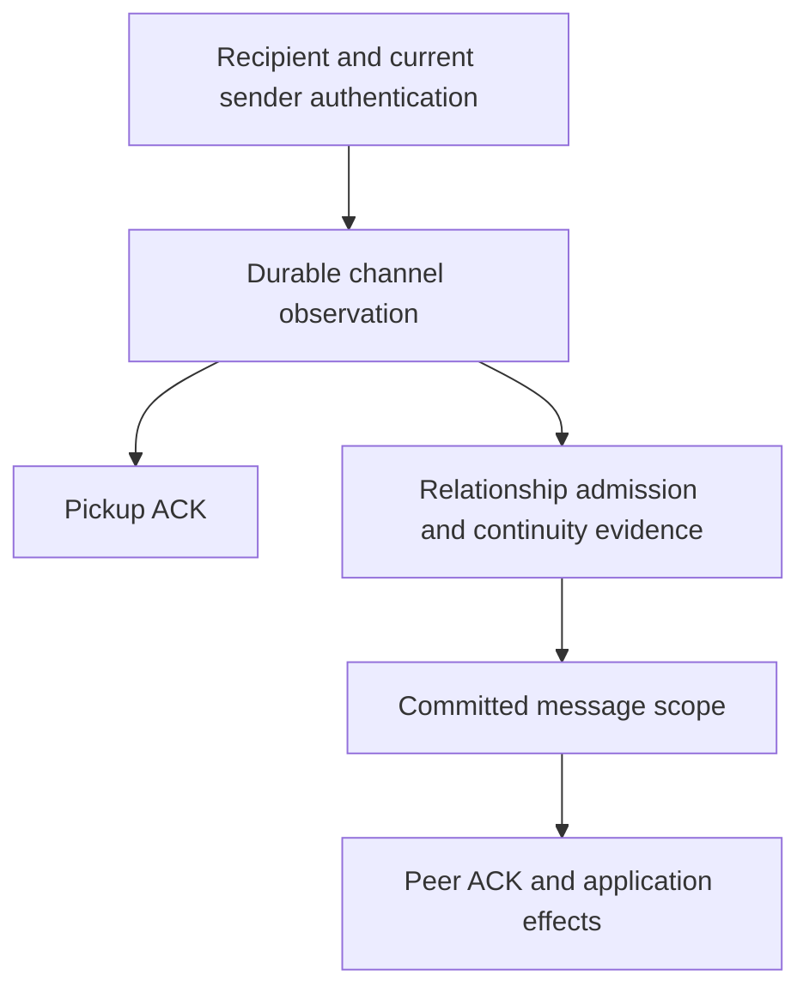

# Channels and relationship admission

Status: **draft, phase 1**. This document defines the boundary between durable
communication evidence and relationship authority. It owns channel identity,
relationship admission and `message.scoped`; the event envelope and storage
contracts remain those of [event-store.md](event-store.md).

The capitalized requirement words have their BCP 14 meanings.

<a id="model"></a>

## 1. Model

A **channel** is a fixed unordered pair of distinct canonical communication
DIDs. Its local/peer orientation belongs to the vault using it. A channel has
no rotating endpoint, contact, privileged sender or implicit relationship.
Authentication evidence belongs to individual observations and packages;
channel identity does not pin a document revision or authorize every key ever
used under either DID.

A **relationship** has an explicitly admitted root channel, immutable root
document evidence and two directed address histories. Those histories justify
membership of further channels. A relationship can be incomplete while its
channels continue to receive authenticated observations. A **contact** groups
relationships for local user policy; a contact assignment is not a proof of
channel continuity.



Admission, scope and effects read relationship state. Channel receipt MUST NOT
require a binding, a rooted relationship prefix, invitation availability,
contact admission or a relationship's current peer endpoint. Missing or
conflicting upper-layer evidence cannot create a second relationship as a
side effect of receipt.

Anonymous observations have no channel or relationship. Their exact local key
and retained bytes remain receipt evidence under the delivery profile.

<a id="channel-identity"></a>

## 2. Channel identity

Validate and canonicalize both DIDs using
[the DID profile](relationships.md#peer-did-numalgo-4-profile). Sort their
UTF-8 bytes in unsigned byte order. Use the existing UUID namespace derivation
with the new purpose `channel`:

```text
[lo, hi] = sortCanonicalDids([A, B])
channelId = UUIDv5(estocNamespace("channel"), RFC8785(["v1", lo, hi]))
```

The namespace vector is `bab533fd-a809-5ec6-80bc-6eb81f7c17f9`.
Identifier-only fixtures, using the same canonical inputs as the
[relationship vectors](relationships.md#symmetric-relationship-identity):

| A | B | channelId |
| --- | --- | --- |
| `did:peer:4zQmd8CpeFPci817KDsbSAKWcXAE2mjvCQSasRewvbSF54Bd` | `did:web:bob.example` | `88a41cd6-a196-52a4-87df-7ce060e7d373` |
| `did:web:zoe.example` | `did:web:amy.example` | `8e0d9d52-628f-5440-ab58-2b6227341e85` |

Both `[A, B]` and `[B, A]` MUST produce the listed result. These are naming
fixtures, not live resolution or authentication fixtures. The channel and
root relationship have different IDs because their namespace purposes differ.

Equal DIDs are not a channel. Long/short numalgo-4 spellings identify the same
channel only after validating the long form. A changed key or route under an
unchanged supported external DID does not change its channel ID; each new
observation still needs current authentication and each scoped observation
still needs the relationship's exact historical key authorization.

`ChannelId` is a UUIDv5 entity ID. It is not a wire header. A channel exists as
a projection of authenticated `message.in`, `message.prepared`, or explicit
relationship root evidence naming its pair. No `channel.created` event or
first-message election is required. Both sides derive the same channel ID;
each address transition uses another channel ID.

For a relationship R whose local history is A0, A1 and peer history B0, B1,
the justified channel set is the Cartesian product:

```text
C(A0, B0), C(A1, B0), C(A0, B1), C(A1, B1)
```

Membership does not assert that a message was exchanged on every such channel.
Receiving on C(A1, B1) does not create the other channels' observations.

<a id="receipt"></a>

## 3. Durable receipt

The receiver first performs exact-recipient, route, cryptographic, syntax and
current-sender checks under [the receive gate](relationships.md#hard-pre-vault-gate).
Those checks MUST NOT consult relationship membership. A retired local DID
may still receive at its retained exact key while its bound route remains
eligible; retirement blocks new relationship admission and new sending.

Under the operation lock, recheck those local prerequisites, commit/reuse the
exact `peer.resolved` and its document, then commit `message.in` and content.
`message.in.channelId` is required and is derived from the actual recipient
and authenticated sender; it is null exactly for anonymous input. Receipt has
no `relationshipBindingEventId` or `peerTransitionEventId`. Keep the actual
local key, resolution reference, original `fromPrior`, hashes, ordinal and
source as immutable evidence. Neither import nor later admission rewrites it.

Pickup ACK follows this process-durable receipt, including a receipt whose
relationship is unknown, conflicted, deleted, superseded or awaiting evidence.
Pickup ACK records transfer of queue responsibility; it authorizes no peer ACK,
invitation consumption, profile lift, address confirmation or application effect.
Failure before durable receipt withholds pickup ACK. Safe cryptographic or
wrong-recipient rejection retains the existing terminal pre-vault ACK path.

Receipt does not classify an authenticated message as an accepted application
input. The UI may expose an unassigned inbox with its authenticated addresses;
it MUST NOT attribute that input to a contact or execute its protocol merely
because a channel exists. Explicit erase uses the ordinary permanent
message/root erasure rule. Unassigned receipt is portable retained state, not
a cache that a restart or timeout silently drops.

### 3.1 Carried proofs and library boundaries

Authentication of the present sender and authorization to continue a prior
relationship are distinct predicates. A retained `fromPrior` is a claim until
verified against the exact predecessor snapshot and scoped history. It cannot
authorize a new relationship, inherit trust or select an ACK namespace.

Use maintained DIDComm/JOSE verification APIs. An adapter MUST NOT strip a
carried proof, fabricate an unpack success or treat a decode-only API as
signature verification. If the library cannot return authenticated plaintext
without predecessor material, keep the envelope in the pre-authentication wait
until that cryptographic prerequisite is available; no `message.in` or pickup
ACK is permitted from a failed unpack. The adapter may use retained issuer
documents to authenticate the carried cryptographic material; upper-layer
continuity still requires the exact pin of the selected relationship. A current
issuer document cannot replace that pin.

An implementation that can independently authenticate the present sender may
record the original proof as pending evidence. A proven invalid carried proof
authorizes no `message.scoped` or effect. This boundary follows the distinction
between sender-key authentication and DID rotation in
[DIDComm Messaging 2.1](https://identity.foundation/didcomm-messaging/spec/v2.1/#did-rotation).
The draft does not assert that the current unpack adapter already exposes the
required separation.

<a id="admission"></a>

## 4. Relationship admission

Receiving on an unassigned channel MUST NOT automatically create a relationship
because no relationship was found. The default is an unassigned receipt.
The root admission decision must come from one of:

1. an explicit local user decision to accept this channel as a new relationship;
2. an explicit user-authored outbound selecting new root addresses; or
3. a local invitation whose disclosure policy explicitly authorizes admission,
   with `did.disclosed.admitRelationship == true` and its exact recipient,
   parent-thread and single-use checks satisfied.

Control-message types, an absent lookup result, a timeout, restart, a changed
wire ID and contact-name similarity supply no admission decision. An incoming
continuation with missing history remains unassigned until that history is
recovered. A known incomplete or contradictory membership blocks admission of
another R at that channel. An explicit admission made without any retained
competing claim is a durable local decision; later incompatible history produces an
upper-layer conflict, not automatic reassignment or replay.
An intentionally erased unassigned input MUST NOT trigger automatic invitation
admission on recovery. Existing root/scope skeletons retain their decisions.

`relationship.bound` records the admitted root channel and exact root pin;
[RZ identity](relationships.md#symmetric-relationship-identity) continues to
derive R from that admitted root pair. Thus opposite explicit first sends
over the same pair still derive one R, with no new wire handshake. R is not
derived from an arbitrary channel later received during rotation.

The binding includes `channelId` and nullable `sourceEventId`. Inbound admission
names the exact already committed authenticated `message.in` used for the root
decision; its channel, local key and resolution must match the binding. A null
source is permitted for an explicit local/outbound decision. This reference
freezes provenance, not a requirement that the source already have a scope.
The root source is proof-free. All later relationship evidence must use this
same root, even if the root binding is temporarily absent in an import.

Inbound contact creation or assignment requires valid committed scope, never
plain receipt or an unfinished invitation admission. An explicit outbound may
record its selected contact with its offline intent. A contact can group
independently admitted relationships, but cannot merge their
execution/ACK namespaces or their proof-authorized channels.

<a id="continuity"></a>

## 5. Continuity and membership

The retained local and peer transitions remain relationship-scoped upper-layer
evidence. A proof does not globally alias a public DID across all relationships
using it. A transition's complete carrier witness is an authenticated channel
observation, with its own exact resolution and proof; it does not require a
`message.scoped` event for that carrier. Predecessor confirmation likewise uses
one complete channel observation independently validated in the predecessor
prefix. This prevents a scope/transition/confirmation dependency cycle.

Begin with a valid admitted root. Extend either side only using its verified
predecessor, exact pinned document, complete witness and required confirmation.
Repeat positive derivation until no further node can be added. Absence of a
root or intermediate node means incomplete evidence; absence alone is never
proof of a contradictory address. Immutable field mismatches, invalid proofs,
competing successors and cycles are conflicts. Event order elects no winner.

The resulting channel-to-relationship index is used for admission and scope,
not receipt. Distinct validated R claims on one channel conflict at this layer;
retain the channel observations. For incomplete claims, follow explicit event
references and the addresses those references name; do not infer that a
partially indexed channel is a new relationship. There is no exhaustive
pending-pair scan on the receipt path.

Concurrent local and peer rotation derives the four channels in section 2
from the two independent histories. It needs no synthetic observations and no
global address ownership. Privacy allocation still prefers fresh addresses.

<a id="message-scoped"></a>

## 6. `message.scoped`

This portable event records relationship acceptance separately from receipt.
It is the prerequisite for peer ACK processing and application execution.

```json
{
  "type": "message.scoped",
  "roots": [],
  "data": {
    "sourceEventId": "019b2a71-4c18-760a-9017-b3e265aa89d1",
    "relationshipId": "35807a1e-3b8a-52f5-9580-29cd5265882e",
    "relationshipBindingEventId": "019b4d11-22d3-7fd0-82fb-f33864a75dd5",
    "localTransitionEventIds": [],
    "peerTransitionEventIds": []
  }
}
```

The closed payload has exactly these five required fields. `sourceEventId`
names one authenticated `message.in`; the binding names this R. Each array is
an ordered, contiguous, duplicate-free path of exact transition event references
from the binding root through the observed local or peer node. Empty arrays
mean the respective root. Each edge names this R, validates its own evidence,
and begins at the preceding node. The local terminal node supplies the
observation's `localKeyName`; the peer terminal node supplies its canonical DID
and the pinned document authorizing its authenticated key. Each non-root
document comes from that path's peer transition. A carried proof must be
witnessed by the path's matching peer edge; decoding its issuer is insufficient.

These paths freeze positive historical evidence, not a snapshot of every event
in the vault. Equivalent duplicate bindings/edges may produce equivalent scope
evidence. Missing references defer validation of the scope; a contradicted path
conflicts it. Later append-only extensions do not invalidate an older valid
prefix. A later conflicting branch or incompatible claim suppresses new work
while retaining all historical receipts and committed effects.

Validate the source, binding and exact positive paths before deriving global
work eligibility. Current tips, contact tombstones and invitation availability
are not retroactive evidence-validation tests. From the retained positive
evidence, derive competing channel claims, conflicting scope assignments and
invitation consumers, then suppress new affected work. In particular,
invitation consumption cannot depend on first declaring that same invitation
available. A later policy/conflict result never releases a structurally valid
committed consumption.

Under the writer lock, before appending scope:

1. require unique, consistent R membership and validate the complete source row
   against the paths above;
2. require the observed peer to be R's current peer, except a matching duplicate
   of a logical input already scoped in R;
3. check contact tombstones, invitation availability and relationship policy;
4. reuse equivalent scope evidence for this exact source, and reject another
   relationship for that source or its authenticated observation message-ID
   group; and
5. commit the scope only after every referenced event has committed.

When this operation creates an inbound root, the same lock covers admission
lookup, invitation authorization, binding commit/reuse and scope commit. Both
commits remain separate so scope names a returned binding event ID. An
interrupted operation resumes from its committed prefix and rechecks policy.

The current-peer test is a producer-time decision at relationship acceptance.
Import validates the saved paths and evidence; it does not reject an earlier
scope merely because a later transition exists. A new observation from an old
peer can remain durably recorded with refused scope and no effect. It cannot
use receipt or a new wire ID to renew that peer's authority.

Scope is immutable. Import with two non-equivalent R scopes for one source or
authenticated observation message-ID group exposes conflict; no arrival-order winner, scope edit or
automatic relationship merge is allowed. A relationship-scoped send cannot
use an unassigned channel as its peer merely because the channel authenticates.

<a id="effects-and-recovery"></a>

## 7. ACKs, effects and recovery

Before scope, an observation is `unassigned`, `awaiting-evidence`, or
`refused`; these are rebuildable projections. None authorizes a handler,
profile lift, ultimate ACK, invitation consumption or automatic reply. Such
an observation does not prevent unrelated scoped input from being processed.

After valid scope, existing logical identity applies:
`executionId = UUIDv5(estocNamespace("message-execution"),
RFC8785(["v2", {"relationship": R}, wireMessageId]))`.
Compare authenticated intent evidence within this R before authorizing work.
Equal-intent duplicates across channels/authorized keys use one execution;
different intents conflict. A second observation whose own channel facts are
consistent but whose scope is still unknown supplies no second execution and
does not erase an existing accepted scope. Once admitted, it joins that same
execution or exposes a conflict. Contradictory authenticated evidence remains
visible even when no new effect is eligible. Submitted outputs never reopen.

Ultimate ACK lookup uses the accepted R and exact outbound membership, never
only a channel or wire ID. ACK target selection requires committed valid scope
for each target. Receipt ordinals still order candidates; learning an older
alias cannot change an already frozen `ack` array.

An invitation is consumed only by a committed valid root `message.scoped`
whose source satisfies the disclosure's recipient and `pthid` checks. Hold the
operation lock across availability recheck and scope commit. Automatic root
admission also requires the disclosure's durable `admitRelationship` permission;
manual admission is an explicit local decision. Plain receipt or
an interrupted root binding consumes nothing. Importing incompatible committed
consumers exposes an invitation conflict and suppresses new affected work.

Contact tombstones and erasure remain attached to their durable identities.
Unassigned channels do not inherit permission from a shared name/key; discovering
a deleted relationship cannot create another contact automatically. Explicit
erase/cleanup releases content through the ordinary held-root rules; retained
channel and scope skeletons preserve duplicate, invitation and denial evidence.

Reopen enumerates unscoped receipts, incomplete bindings/transitions/scopes and
unfinished accepted executions. Recover scope from saved channel evidence,
without mediator redelivery or re-resolving the current sender for a receipt
already authenticated and committed. A new delivery still authenticates afresh
under the sender-freshness policy. Missing historical bytes remain a local
recovery dependency. A relationship wait consumes no sender-resolution budget.

<a id="required-conformance-cases"></a>

## 8. Required conformance cases

1. <a id="ch-1"></a> Channel derivation is symmetric and independent of keys,
   routes, contacts, R admission and valid numalgo-4 presentation spelling.
2. <a id="ch-2"></a> A first authenticated receipt commits resolution then
   channel observation and pickup-ACKs, with no binding, contact or scope.
3. <a id="ch-3"></a> Missing binding and a missing first local edge leave a
   later-local-channel receipt durable and unassigned; recovery scopes it in
   the original R without creating another R.
4. <a id="ch-4"></a> A retained peer edge at a later local key survives missing
   binding/local prefix; an old-peer receipt is stored and pickup-ACKed, then
   refused scope once the recovered history establishes supersession.
5. <a id="ch-5"></a> Simultaneous local and peer rotation yields all four
   channel combinations in one R; no synthetic receipt or extra R is created.
6. <a id="ch-6"></a> Two authenticated keys/channels carrying the same R/wire ID
   and equal intent produce one execution and one automatic effect tuple.
7. <a id="ch-7"></a> Contradictory admitted intent evidence suppresses new work;
   previously submitted outputs and identifiers are unchanged.
8. <a id="ch-8"></a> Unknown scope, missing root snapshots and invalid upper-layer
   claims never block independent channel receipt or authorize an effect.
9. <a id="ch-9"></a> A deleted relationship recovered after channel receipt
   creates no new contact, response or privilege; its tombstone still applies.
10. <a id="ch-10"></a> Crash after receipt but before binding/scope leaves a
    recoverable unassigned observation; crash after scope reuses scope/effects.
11. <a id="ch-11"></a> Two contenders for a single-use invitation can both be
    received; only the permitted root scope consumes it and authorizes work.
    A disclosure with admitRelationship false waits for a manual decision;
    restart preserves that choice and erasure prevents new automatic admission.
12. <a id="ch-12"></a> An unpack API that has not authenticated plaintext yields
    no channel observation; failed or pending proof work is never fabricated.
13. <a id="ch-13"></a> An unknown channel, restart, new wire ID or absent lookup
    cannot create R; explicit root admission and verified continuation can.
14. <a id="ch-14"></a> A shared public DID's transition affects only its R;
    channel authentication alone transfers no scope to another relationship.
15. <a id="ch-15"></a> Frozen scope paths survive later valid extensions; an
    imported incompatible scope remains a conflict with no automatic merge.
16. <a id="ch-16"></a> Retired local keys with eligible routes can receive;
    new relationship admission and new sending still fail lifecycle checks.
17. <a id="ch-17"></a> An unscoped duplicate cannot execute separately or erase
    a prior accepted scope; later admission aliases or conflicts it explicitly.
18. <a id="ch-18"></a> Recovery of committed channel observations uses saved
    authentication evidence; a new network delivery still resolves as required.
