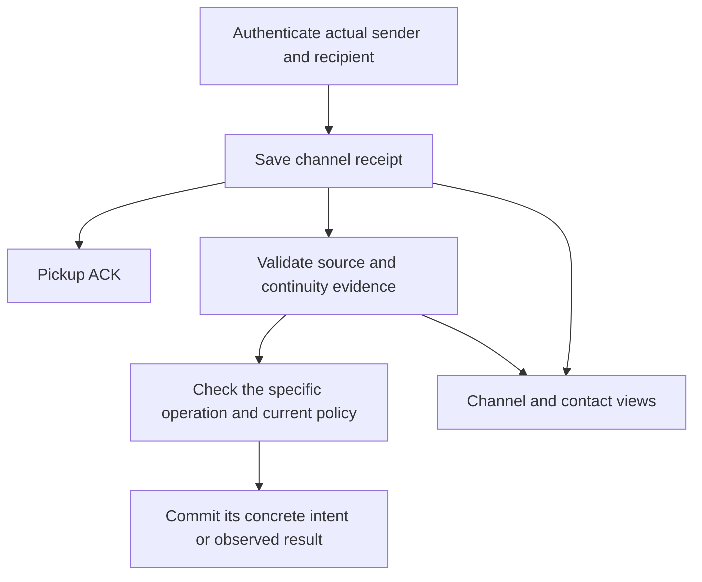
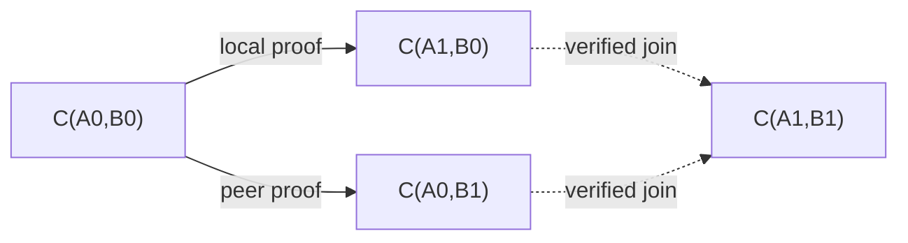

# Channels, continuity and local acceptance

Status: **draft, phase 1**. This document owns channel identity, channel
acceptance, directed continuity evidence and operation eligibility. Storage
envelopes and durability follow [event-store.md](event-store.md). Sending and
effect ordering follow [distributed-delivery.md](distributed-delivery.md).
The capitalized requirement words have their BCP 14 meanings.

<a id="model"></a>

## 1. Model

A **channel** is the fixed ordered pair `(localDid, peerDid)` of distinct
canonical communication DIDs, viewed from one vault. Messages retain their actual
sender, recipient, authenticated keys and document snapshots. A DID's changed
document does not change the pair. Each authentication or preparation
uses the document authorized by that DID method for that operation and retains
its exact evidence. A snapshot records what was verified; it is not a permanent
limit on the keys that the same DID may authorize later.

A **continuity link** is a derived replacement of exactly one endpoint in the
context of one channel. The fold computes it from received proofs, resolution
evidence and local rotation decisions; no link event is stored.
Links form a directed graph whose authority is scoped to each channel context.

A **contact** records local names, preferences and direct channel selections.
It may display several disconnected channel histories. Editing these selections,
renaming or merging contact views changes no message identity, permission,
authentication evidence, ACK authorization or dispatch eligibility.
Channels and their continuity graph exist independently of contacts; an
unassigned channel remains usable without creating a contact or another group.



Receipt never needs channel acceptance, display assignment or complete
continuity history. Anonymous input has no channel or application execution.
Each operation checks its own evidence and local policy. Sending, automatic
output, package preparation and local rotation need no channel acceptance.
Profile lifts and received ACK/error observations require acceptance under
section 6, independently of whether a contact is assigned.

<a id="channel-identity"></a>

## 2. Channel identity

Validate and canonicalize both DIDs under
[the DID profile](relationships.md#peer-did-numalgo-4-profile). A channel value
has exactly these two DID strings:

```ts
type Channel = { localDid: Did; peerDid: Did };
```

Peer DID numalgo-4 uses its canonical short form. Other methods use their
method-defined canonical spelling. Compare each role byte-for-byte; equal
endpoints are invalid. `(A, B)` and `(B, A)` are different vault-local views.
Receiving from B at A and sending from A to B use the same `(A, B)` channel.
The notation `C(A, B)` throughout this profile means `{localDid: A, peerDid: B}`.

Receipts derive the pair from the local key's DID and authenticated sender.
Outbound intents derive it from `senderDidId` and canonical `recipientDid`.
Acceptance derives it from its local DID and exact peer resolution. Source-based
facts use the pair of their referenced message. Missing exact endpoint evidence
leaves that projection pending; contact membership, another observation or a
shared key cannot supply it.

Selectors such as contact membership and blocking store the two canonical DID
strings directly. Canonicalize supplied long forms before storing a selector.
Its syntax and distinctness can be checked offline; missing DID documents or
local entities leave evidence unresolved and grant no authority.
Compare selectors by both roles. Sort sets by unsigned UTF-8 byte order of
`RFC8785([localDid, peerDid])`, with no duplicate pairs. This ordering sorts the
set, not the two endpoints within a pair.

Replacing either DID means another channel. Updating keys, service endpoints
or other document contents under the same supported mutable DID does not.
Document CIDs, selected keys and resolution event IDs remain verification
evidence; message identities use the canonical sender and recipient DIDs.

For `did:web`, document updates follow the method's HTTPS resolution rules;
they require no `from_prior` and create no continuity link. For `did:peer:4`,
the validated document is immutable under its canonical DID; a changed encoded
document yields another DID. Neither method aliases different DIDs merely
because they share keys or services. See [DID resolution](relationships.md#did-resolution-requirements).

<a id="receipt"></a>

## 3. Durable receipt

Perform exact recipient, route, cryptographic, syntax, resource and current
sender checks under [the receive gate](relationships.md#hard-pre-vault-gate).
Do not consult contact membership or continuity membership. Retired local keys
may drain an otherwise eligible retained route; retirement still blocks new
sending, disclosure and channel acceptance.

Under the operation lock, recheck local prerequisites, commit/reuse the exact
resolution document, then commit `message.in` with objects and receipt ordinal.
Derive the channel from the actual local recipient and authenticated sender;
anonymous input has no peer or channel. Preserve the original `fromPrior`, local key,
resolution reference, hashes and source as immutable observations.

Normal pickup ACK follows process-durable receipt. An unknown, blocked,
superseded or incomplete channel can still retain an authenticated observation.
Receipt grants no peer ACK, protocol effect, invitation consumption or profile
lift. Hard cryptographic/wrong-recipient/resource rejection keeps the terminal
pre-vault ACK path. Failure to durably save an otherwise receivable input
withholds pickup ACK.

### 3.1 Carried proof and library boundary

Present-sender authentication and permission to inherit a predecessor's
channel authority are distinct checks. A raw `from_prior` is a retained claim
until verified. Use maintained DIDComm/JOSE verification APIs and the exact
predecessor document. Never strip the proof, fabricate unpack success or treat
decoding as verification. If unpack cannot authenticate plaintext without
missing predecessor material, wait unopened without `message.in` or pickup ACK.

A successful independent authentication may retain pending or invalid
continuity evidence. Invalid proof authorizes no operation based on that proof.
This uses the rotation primitive in
[DIDComm Messaging 2.1](https://identity.foundation/didcomm-messaging/spec/v2.1/#did-rotation).
The channel graph and local policy below are this application's design.

<a id="verification-status"></a>

### 3.2 Verification status and display

Receipt and continuity verification are separate visible facts. A saved
authenticated message MAY be displayed before continuity completes, with an
explicit status beside the message. Do not present a pending sender as the
verified continuation of an earlier peer or silently group it on that basis.
The UI MUST distinguish these derived states:

| State | Meaning |
| --- | --- |
| `not-present` | No `from_prior`; ordinary channel policy still applies |
| `pending-proof` | A proof is present but its required verification document/evidence is unavailable |
| `pending-history` | The proof verifies, but an exact source, endpoint or rotation record needed for the queried continuity path is missing |
| `verified` | Both proof and channel context validate; the link is derivable |
| `invalid` | The carried claims or complete verification evidence fail validation |
| `conflict` | Complete evidence establishes competing successors or contradictory channel authority |

Rebuild these states from retained evidence. Missing imported references remain
pending, not invalid. Resolver failures may add a bounded diagnostic; a failed
fetch without a document is not proof of a bad signature. Channel denial and
acceptance/operation status are shown separately. Missing channel acceptance
alone does not make continuity pending. If an imported receipt's
own sender evidence is missing, show that pending authentication separately;
do not claim its sender has already been verified. Pending/invalid/conflicted
continuity grants no peer ACK, handler effect or inherited channel permission.
Later evidence may update the display and graph without another pickup, receipt
ordinal or message ID. That change alone grants no new automatic dispatch action.

<a id="admission"></a>
<a id="channel-accepted"></a>

## 4. Channel acceptance and evidence

`channel.accepted` records a local decision to use an exact DID-pair channel,
with the evidence and policy basis for that decision. It does not fix a peer
document revision for future traffic or identify a larger chain. The closed
payload contains exactly the four fields in this example:

```json
{
  "type": "channel.accepted",
  "roots": [],
  "data": {
    "localDidId": "019b2a60-c68e-75bf-b6fb-ae1a41f8d715",
    "peerResolutionEventId": "019b2a72-0626-7a87-a310-941fe4c1ce77",
    "sourceEventId": "019b2a71-4c18-760a-9017-b3e265aa89d1",
    "basis": { "kind": "manual" }
  }
}
```

The local DID and canonical resolved peer determine the channel pair. Resolution
`localKeyName` must match this local DID. Retain the exact document, supported
methods and selected key as historical evidence. Each later receipt or package
references its own resolution; it need not use this document CID or key. An
ordinary method-authorized update needs no replacement acceptance.

Complete acceptances for the same oriented canonical DID pair may coexist,
including different valid `did:web` revisions and selected keys. Validate each
decision's own source and basis independently; equivalence of the pair cannot
fill missing references or transfer invitation consumption. Different revisions
alone are not a conflict. A DID mismatch, invalid document or inconsistent
local DID/key mapping remains invalid or conflicted as appropriate. No event
order selects a channel-wide winning document or unions historical key sets
into authority for new traffic.

`sourceEventId` is required and nullable. An incoming acceptance references an
already committed complete authenticated `message.in` in this exact channel
whose local key and resolution match. A local/outbound decision may use null.
`basis` is exactly one of these closed forms:

```ts
type ChannelAcceptanceBasis =
  | { kind: "manual" }
  | { kind: "outbound"; messageId: MessageId }
  | { kind: "invitation"; disclosureEventId: EventReference<"did.disclosed"> }
  | { kind: "peer-continuation";
      predecessorAcceptanceEventId: EventReference<"channel.accepted"> }
  | { kind: "local-continuation";
      predecessorAcceptanceEventId: EventReference<"channel.accepted">;
      rotationEventId: EventReference<"did.rotationSelected"> }
  | { kind: "join";
      predecessorAcceptanceEventId: EventReference<"channel.accepted">;
      rotationEventId: EventReference<"did.rotationSelected">;
      peerSourceEventId: EventReference<"message.in"> };
```

Manual acceptance is an explicit local decision. Outbound acceptance must name
an explicit user-authored intent at exactly this fixed channel; an automatic
reply cannot use itself as its admission authority. Invitation acceptance
requires an exact source receipt, live disclosed recipient, matching `pthid`,
available use and `did.disclosed.admitChannel == true`. A `peer-continuation`
uses the acceptance's non-null `sourceEventId` as the proof carrier and its
explicit predecessor acceptance. A `local-continuation` uses the selected
rotation and a complete acceptance of its fixed predecessor pair. A `join`
uses a complete acceptance of the shared predecessor pair, that rotation and
the exact opposite-side carrier. The referenced predecessor acceptance is
required for inheriting acceptance, not for deriving the underlying links.
Each must derive the target pair under the rules below; missing or cyclic
evidence grants no inherited permission. All event references in the basis
name already committed events; none names a projection row.

An unknown channel remains unaccepted until one of these bases exists. Missing
lookup, restart, timeout, control-message type or display similarity grants
nothing. A proof-bearing input with unresolved/invalid continuity cannot bypass
that check through automatic invitation acceptance. Explicit manual acceptance
does not validate or discard an invalid carried proof.

An inbound channel acceptance from a proof-free source with matching local OOB
recipient and `pthid` consumes that invitation, whether its basis is invitation
or explicit manual acceptance. The consumer is the exact channel, not a display
group. Other bases and other recipients consume nothing. Commit under the lock
after rechecking availability. Receipt alone consumes nothing; once acceptance
commits, a crash before message processing does not reopen the invitation.
Missing exact acceptance/source evidence makes potential consumption pending.
Validate positive consumption evidence before current availability; erasure,
later conflicts and contact deletion never release a committed consumption.

<a id="continuity"></a>
<a id="channel-linked"></a>

## 5. Derived continuity

The graph is a rebuildable projection of retained evidence. Folding reads
retained inputs only; network resolution and event appends belong to
producer/recovery operations.
Its inputs are the following facts.

<a id="message-frompriorresolved"></a>

### Peer proof evidence

`message.fromPriorResolved` associates one received proof with the exact
predecessor document obtained for its verification. Its closed data has only
these two fields; `roots` contains exactly `documentCid`:

```json
{
  "type": "message.fromPriorResolved",
  "roots": ["bafkrei...predecessor-document"],
  "data": {
    "sourceEventId": "019b2a81-4c18-760a-9017-b3e265aa89d1",
    "documentCid": "bafkrei...predecessor-document"
  }
}
```

The exact source is an already committed authenticated `message.in` with a
non-null original `fromPrior`. The document is the method-valid issuer document,
stored as raw RFC 8785 canonical JSON under the same representation rules as
[resolution evidence](vault-events.md#peer-resolved). Obtain it under
[predecessor resolution](relationships.md#predecessor-resolution). This event
records a resolution result, not a trusted Boolean verification result. It may
retain a document that does not authorize the JWT key or fails to verify its
signature; the fold computes that failure. Its source reference supplies the
sender, local endpoint and original JWT. Link direction is derived from this
evidence; channel acceptance is a separate local decision under section 4.

For a complete authenticated carrier `M` addressed to local DID `A`, validate
the original JWT's signature, `kid`, `iss`, `sub` and retained document under
[the proof checks](vault-events.md#relationship-peertransitioned). Its `sub`
must match the carrier's authenticated sender. Then derive:

```text
B0 = canonicalDid(fromPrior.iss)
B1 = canonicalDid(M.from)
peer link = C(A, B0) -> C(A, B1)
```

`A`, `B0` and `B1` must form two valid distinct channel pairs, with `B0 != B1`.
The authenticated carrier fixes `A` and `B1`; the verified proof fixes `B0`.
These facts suffice to derive the link without a predecessor acceptance or
an earlier message in `C(A,B0)`. A missing source or endpoint dependency defers
the link; an absent acceptance does not. Link validity alone grants no local
acceptance, new operation or dispatch action.

A complete proof witness can serve another independently authenticated carrier
with the same compact JWT, canonical sender and canonical local recipient.
Each witness uses one exact source/document association; fields cannot be
assembled from different incomplete rows. Retained valid witnesses remain
valid after method updates; a later failed check or missing sibling does not
erase them. Without a valid witness, missing known dependencies mean pending;
otherwise complete failed checks mean invalid. Intrinsically invalid claims
cannot be repaired by another document. Arbitrary historical documents with
no such source association grant no proof authority.

<a id="did-rotationselected"></a>

### Local rotation decisions

A local rotation may be selected before any outbound message exists. Preserve
that decision as `did.rotationSelected`, with `roots == []` and five closed fields:

```json
{
  "type": "did.rotationSelected",
  "roots": [],
  "data": {
    "fromDidId": "019b2a60-c68e-75bf-b6fb-ae1a41f8d715",
    "peerDid": "did:web:bob.example",
    "toDidId": "019b4d12-22d3-7fd0-82fb-f33864a75dd5",
    "sourceEventId": null,
    "fromPrior": "<compact-jwt>"
  }
}
```

`fromDidId` names the already committed local DID `A0`; `peerDid` stores the
canonical peer DID `B`. They fix the oriented old pair `C(A0,B)`, including
when `sourceEventId` is null. `toDidId` names an already committed eligible
local DID `A1`, distinct from both old endpoints; its document and route come
from `did.created`. Validate both local DID entities and their exact retained
key evidence. The original JWT is signed by the retained local `A0`
authentication method, with exact `iss`/`sub` spellings for `A0`/`A1`. Neither
peer resolution nor channel acceptance is supplied by this local signature;
each outgoing package retains its own peer resolution.

`sourceEventId` is null for manual rotation or names the complete source
witness in exactly `C(A0,B)` selected by the live privacy policy. Its local
recipient and canonical authenticated sender MUST match `fromDidId` and
`peerDid`. The producer rechecks local lifecycle, denial, supersession,
conflicts and operation-specific policy under the operation lock. It requires
exact-address confirmation of `A0` by a complete source witness in the same
peer context. That confirmation needs no channel acceptance, prior handler
execution or reply and MUST NOT depend on the rotation being selected.

Commit the decision before any dependent intent, optional successor acceptance
or disclosure. Reuse its successor and frozen proof after interruption; no
same-end branch before successor confirmation. The fold derives
`C(A0,B) -> C(A1,B)` from this decision,
with both pairs fixed by the decision's fields and referenced local entities.
The same `A0` used with another peer defines a different rotation context.
The peer DID is unchanged; later packages obtain their own resolution.
A prepared message carrying this local proof must match the selected decision;
it cannot independently select another rotation. Recovery of the decision
grants no dispatch action.

### 5.1 Both endpoints can rotate

At the same exact `C(A0,B0)`, a valid local decision deriving `C(A1,B0)` and a
verified peer carrier deriving `C(A0,B1)` justify `C(A1,B1)`. They must share
the same oriented predecessor DID pair with complete decision and proof
evidence. Deriving this join requires no acceptance event. An operation that
requires acceptance separately checks section 4; a `join` acceptance names
the predecessor acceptance, decision and carrier, not graph rows.
The joined channel's local DID is the local link's successor; its peer DID is
the peer link's successor. Each operation in the joined channel retains its
own required peer resolution evidence; document revisions need not match
across links. This is a derived join, not a fabricated received message or
fabricated wire proof.



Only these evidence-backed joins are permitted. Sharing a DID, key or contact
cannot fill a missing side. Competing successors for the same
endpoint/context, cycles and contradictory identity evidence are visible
conflicts, not ordinary opposite-side rotation.

For peer replacements, one context includes channels connected by validated
local-only replacements while retaining the same canonical peer DID. Compare
competing peer successors across that context, independently of any acceptance
events. For local replacements, apply the symmetric rule through
peer-only replacements. A join transports the existing two replacements; it
does not create another competing choice. Each derived link exposes its exact
source witnesses; document updates neither split the context nor hide
competing successors. These contexts are derived queries; message identifiers
remain fixed by their actual channel and sender.

Compute the least positive closure of links and joins from complete peer proof
witnesses and local decisions. A local decision's predecessor confirmation
must be supported without that decision or its descendants. Pure reference
cycles with no independent evidence grant nothing. Fold the full
available evidence before checking current conflicts or authorizing new work;
enumeration order and intermediate graph rows cannot authorize dispatch.
Then evaluate continuation/join acceptance bases separately. A missing exact
reference in an acceptance basis keeps that acceptance pending even when the
underlying link is complete; it does not invalidate the link or a consumer
that does not require acceptance.

### 5.2 Supersession, confirmation and authorization

A verified peer link stops new application work from its old peer in
that channel context. The same peer supersession applies through verified
local-only links in that context, including either end of those local links;
local address rotation cannot restore the old peer's authority. It does not
affect an unrelated channel using the same public peer DID. In a verified join,
the peer link supplies this same supersession fact at the joined local endpoint.

A complete source witness can confirm knowledge of an exact local address
when its recipient is that address and its authenticated peer is the selected
peer or a verified role-preserving successor in the same local-only/paired-link
context. An observation addressed to a predecessor confirms no successor.
No channel acceptance, handler execution or reply prerequisite is imposed on
that witness. Confirmation permits future newly prepared messages to omit the
frozen proof; it does not edit an already attempted envelope or acknowledge
any particular wire ID.

For ACK authorization, a path preserves endpoint roles and uses verified
forward replacements and the joins above. It relates a specific old channel
to a specific successor channel. General undirected graph connectivity never
authorizes ACKs, sending or protocol effects. An unrelated channel in the same
contact cannot acknowledge a message even when it chooses the same wire ID.

<a id="message-scoped"></a>
<a id="message-accepted"></a>
<a id="operation-eligibility"></a>

## 6. Operation eligibility

Each consumer checks the evidence and current policy required for its operation,
then records its concrete intent, local decision or result. Eligibility is
computed from those inputs whenever the operation is considered.

A **complete source witness** is one authenticated `message.in` with a valid
local recipient/key mapping, canonical sender and its own exact resolution
document. Its actual DID pair fixes its channel. A carried proof also requires
its valid derived peer link under section 5. Proof-free input
needs no continuity witness. Equivalent proof carriers may supply a complete
proof witness, but cannot supply this source's sender authentication or replace
its immutable claims. Missing exact references defer the affected consumer;
incompatible authentication, intent or continuity evidence conflicts.

A **complete channel witness** additionally matches the source's actual
channel, local key and canonical peer to a complete `channel.accepted`.
The source's resolution may be a later valid revision than that acceptance's
snapshot. Profile lifts and received ACK/error observations require this
additional acceptance evidence. Automatic outputs, preparation, continuity
and local rotation do not.

Before creating a new automatic intent, the producer checks its complete
source witness under the operation lock, current denial, supersession, local
lifecycle, operation-specific policy and any existing equivalent intent.
Local rotation follows section 5's endpoint, proof and confirmation rules,
including its exact source when present. A user send without an inbound source
follows the user-send rules. The committed intent or rotation decision records
that concrete local choice; it supplies no permission for another operation.
Automatic intents retain their exact source; rotation decisions retain their
fixed predecessor pair, successor, proof and nullable source. A profile lift
retains its exact source and channel acceptance and checks current profile
policy. All referenced events must be committed first. No intent can supply
its own source authentication or continuity proof.

Import/rebuild validates each saved action's evidence references and protocol
rules, not the producer's past wall-clock policy. Missing acceptance cannot
invalidate an automatic intent, package or rotation decision whose own
required evidence is complete. Ordinary later rotation or blocking does not
erase an earlier intent, local result or recorded submission. Current denial,
supersession, expiry and conflicts still govern
new work and dispatch; retaining history is not permission to execute it.
Incomplete consistent siblings do not erase a complete witness. Different
incomplete rows cannot be assembled into one witness.

Received ACKs and Report Problem correlation are observations, not commands.
They require a complete channel witness and the exact target/path checks, but
no handler decision. Current blocking or supersession does not erase evidence
that the peer acknowledged an old message; invalid/conflicting evidence still
prevents attribution. A new profile lift remains a policy-controlled operation.
Body erasure preserves existing facts but prevents new content-derived work.

<a id="effects-and-recovery"></a>

## 7. Identity, local policy and display

The logical inbound identity is `(canonical sender DID, canonical recipient DID, wire ID)`.
Key variants independently authorized by their own method-valid snapshots can
agree on that one input, including across `did:web` document revisions; intent
differences conflict. Another channel always has another logical input and
execution ID, even if its wire ID/content is equal and continuity is proven.
Neither later graph discovery nor grouping merges executions. The ID formulas
and within-channel vectors are in [delivery](distributed-delivery.md#observation-ids-and-vectors).

ACK, Ping reply and rotation notification are independent concrete intents
with distinct deterministic tuples. Each tuple permits one immutable intent.
Historical or imported input never supplies a fresh dispatch action. Only the
single active executor may react automatically to eligible live input;
sync and mailbox fan-out do not grant another replica that role.

<a id="channel-blocked"></a>

### 7.1 Blocking

`channel.blocked` has `roots == []` and three required data fields:

```json
{
  "type": "channel.blocked",
  "roots": [],
  "data": {
    "localDid": "did:peer:4zQmd8CpeFPci817KDsbSAKWcXAE2mjvCQSasRewvbSF54Bd",
    "peerDid": "did:web:bob.example",
    "includeSuccessors": true
  }
}
```

The DID pair obeys section 2's selector rules; `includeSuccessors` is Boolean.
It is a permanent local denial decision for that channel; when true it also
covers evidence-backed successors through directed links/joins. Missing
required evidence defers inheritance and supplies no continuity authority;
each operation still checks its own evidence and policy. Known contradictory
authority prevents new work. It does not prevent authenticated receipt/pickup
ACK or infer a global block of a DID.

Unassigned receipts may be explicitly erased. Retained message and acceptance
skeletons preserve identity and invitation consumption; erased input cannot
start automatic acceptance or new effects on recovery.

<a id="display-relationships"></a>
<a id="contact-channels"></a>

### 7.2 Contacts and channel views

`contact.channelsSet` directly selects a contact's channels under
[the contact membership schema](vault-events.md#contact-channelsset).
This is a presentation decision, independent of acceptance. It names exact
channels, not peer DIDs: two channels using the same peer DID at different
local addresses remain independently selectable. No intermediate group exists.

A UI MAY traverse verified continuity from the selected channels to display
related history or offer successor channels for a new send. This traversal is
a rebuildable view, not a membership update or a stable chain/component ID.
Pending, invalid or conflicted evidence cannot silently establish continuity.
The UI MUST distinguish selected channels from derived related history.
Missing evidence may change the derived view without changing the saved selection.
Unassigned channels may be browsed directly, including before acceptance.

Deleting a contact cannot silently mutate channel authority.
A product's explicit "delete and block" action separately appends denial
decisions for the concrete selected channels and optional successors; later
contact membership changes cannot expand or remove them. Profile facts retain
their source channel even when a contact displays facts from several chains.

<a id="fixed-outbound-channel"></a>

## 8. Fixed outbound channel and dispatch authority

One outbound message has one immutable oriented channel. This profile freezes
`senderDidId` and `recipientDid` in `message.out`, before any
preparation or transport call. Freezing at intent commit is deliberately earlier
than the first possible submission: no recovery procedure needs to prove that
an earlier call did not occur before selecting another channel.

Rotation selects addresses for newly created messages only. It MUST NOT move a
queued, prepared, attempted, submitted or automatic message to another channel.
The selected sender and recipient remain fixed even when no attempt is recorded.
If that channel can no longer send, retain the original outcome and require an
explicit new send with a new wire ID to use a successor channel. Message IDs,
automatic effect IDs and frozen ACK arrays are never rewritten to follow it.

Before each transport invocation, commit `delivery.attempted` naming the exact
already committed package. This event means that the call **may have happened**;
it is not proof of transport acceptance. Its returned event ID must be known
before invoking the transport. An uncertain commit authorizes no call. All
attempts for one message use that first attempted package's exact bytes and
package ID. A missing referenced package is a recovery dependency, not permission
to prepare another one. Conflicting attempted packages suppress further sending.

An initial send may run only from the live local user action or eligible
live input that created its intent. Resolving, preparing and registering before
that initial call may wait/retry locally. After a transport call fails or its
outcome becomes uncertain, another call requires a fresh explicit manual retry.
Opening a vault, importing events, restoring a backup, changing replicas,
receiving a duplicate, learning a rotation or losing local state supplies no
dispatch authority. Portable history is not an executable outbox queue.

A manual retry of an uncompleted message preserves the exact channel, wire ID,
package ID and envelope; check current expiry, erasure, retained keys, route,
security restrictions and content availability again. A submitted or terminal
message cannot retry. A deliberate new send, including a send over a new
channel, creates a new message ID. Any local UI link to the old message is
informative and cannot alias execution or imply that the first send failed.

After reopen or import, pending messages are visible for manual action even if
no attempt event survived the available snapshot. Restoring partial or old
history is never evidence that a message was not sent. Retained receipts may
rebuild display, acceptance and proof projections, but do not independently
dispatch old automatic replies, ACKs, notifications or protocol effects.
Phase 1 still permits only one active executor; passive replicas do not turn
mailbox fan-out into multiple independent automatic responses.

An explicit manual action may complete pending protocol-response work when
its source, channel authority and content remain eligible. It reuses the
source's deterministic execution/tuple and any already frozen response. If no
response intent exists, it may select one under the normal response rules;
its first dispatch is manual. It cannot reopen a submitted/erased response or
use another tuple to bypass an existing selection or conflict.

Sender policy alone cannot constrain an external peer. Cross-channel reuse of
a wire ID is not a channel-local duplicate, and this profile provides no
cross-channel exactly-once guarantee. Protocols needing business idempotency
must define an authenticated application operation ID and its own rules.

<a id="required-conformance-cases"></a>

## 9. Required conformance cases

1. <a id="ch-1"></a> A channel is an ordered local/peer canonical DID pair, independent of keys, routes and contacts. Local sending and peer receipt share that pair; reversing local/peer roles selects a different vault-local view.
2. <a id="ch-2"></a> First authenticated receipt commits and pickup-ACKs without channel acceptance, continuity history or a contact.
3. <a id="ch-3"></a> A valid retained proof with complete authenticated source and endpoints derives its link without predecessor acceptance or an earlier predecessor-channel message. Missing acceptance alone is not pending-history; recovering required evidence adds no receipt or stored graph event.
4. <a id="ch-4"></a> A recovered peer supersession refuses new old-peer input through its local-only context while preserving channel receipt and previous acceptance.
5. <a id="ch-5"></a> Complete independent local/peer links at one exact predecessor pair justify their diagonal join without acceptance or synthetic observations; unrelated shared DIDs justify nothing.
6. <a id="ch-6"></a> Observations with the same sender/recipient/wire-ID triple, equal intent and authorized keys share one execution. Another channel has another execution.
7. <a id="ch-7"></a> Contradictory authenticated intent with complete source witnesses suppresses new effects; previously submitted IDs and outcomes remain unchanged.
8. <a id="ch-8"></a> Unknown policy, missing verification evidence and invalid continuity leave receipts intact and grant no effects.
9. <a id="ch-9"></a> A retained channel denial applies independently of contact membership; deleting a contact alone grants or revokes no cryptographic authority.
10. <a id="ch-10"></a> Crash after receipt, proof-resolution association, channel acceptance or a concrete intent/result preserves each committed fact; reopen rebuilds verification and pending-work views without dispatching old work.
11. <a id="ch-11"></a> Competing one-use invite receipts can both be saved; only eligible channel acceptance consumes the invitation. Crash and erasure never reopen it.
12. <a id="ch-12"></a> Unpack without authenticated plaintext creates no observation; missing cryptographic material waits without pickup ACK.
13. <a id="ch-13"></a> Unknown channel, timeout and control types grant no acceptance; explicit manual/outbound decisions or authorized invitation/continuation bases can.
14. <a id="ch-14"></a> A peer link applies only in its validated channel/local-continuation context and does not replace the peer in unrelated public-DID channels.
15. <a id="ch-15"></a> Earlier source evidence, intents and results survive ordinary document updates and later extensions; contradictory identity evidence or same-end successors suppress new work without rewriting identity.
16. <a id="ch-16"></a> Retained retired recipient keys can drain eligible routes; new sending, disclosure and acceptance obey retirement.
17. <a id="ch-17"></a> An incomplete consistent sibling cannot create another same-channel execution or erase a complete witness. Cross-channel observations never merge executions.
18. <a id="ch-18"></a> Recovery uses retained authentication evidence without fresh resolution of a saved receipt; new network deliveries authenticate afresh.
19. <a id="ch-19"></a> Intent freezes its oriented channel; local or peer rotation changes only new intents, including when the old intent has never been attempted.
20. <a id="ch-20"></a> Commit attempt before transport. Crashes immediately before call and after transport acceptance both reopen without automatic submission.
21. <a id="ch-21"></a> Manual retry uses the first attempted package exactly; missing bytes defer, and changing channel requires a new ID.
22. <a id="ch-22"></a> Import, restore, replica change, duplicate pickup and missing ACK never dispatch an old intent or regenerate an automatic response for sending.
23. <a id="ch-23"></a> Submitted or terminal messages cannot retry. Deliberate new sends get new IDs and do not establish that the original was undelivered.
24. <a id="ch-24"></a> Missing attempt history grants no automatic recovery sending; incomplete exact references remain pending.
25. <a id="ch-25"></a> Renaming or merging contacts and changing their channel sets changes no message/execution ID, ACK authorization, verification evidence, denials or invitations.
26. <a id="ch-26"></a> A successor-channel ACK needs a verified role-preserving path to the exact outbound; general connectivity or shared display membership is insufficient.
27. <a id="ch-27"></a> Swapping sender and recipient with the same wire ID produces different inbound/execution identities; changing either endpoint also changes those identities.
28. <a id="ch-28"></a> A cyclic proof/rotation-confirmation dependency grants no continuity authority; acceptance cycles grant no inherited acceptance. Missing or cyclic acceptance cannot invalidate an independently complete link or an operation that does not require acceptance.
29. <a id="ch-29"></a> Learning a missing graph link after independent channel executions never merges or replays those executions.
30. <a id="ch-30"></a> Same-DID service updates preserve channel and input identity; a redelivered wire ID with equal intent creates no second execution or automatic response.
31. <a id="ch-31"></a> A method-authorized same-DID key update permits new receipt and new-message preparation without channel acceptance or from_prior. Historical snapshots remain unchanged.
32. <a id="ch-32"></a> A key absent from the currently resolved sender document cannot authenticate new delivery; previously committed receipt still validates with its own snapshot on import.
33. <a id="ch-33"></a> After a Web key update, a received replacement proof can use a new authorized authentication key through its exact message.fromPriorResolved document association. Unassociated old snapshots cannot bypass removal; a retained valid witness still verifies offline with no predecessor acceptance.
34. <a id="ch-34"></a> Repeated identical proof with an updated successor document remains the same DID replacement; each carrier authenticates independently and no document CID elects a competing link.
35. <a id="ch-35"></a> Document updates across local-only links do not split peer supersession/conflict context or break an otherwise complete join and cross-channel ACK path.
36. <a id="ch-36"></a> Independently authenticated receipt without a predecessor document commits and pickup-ACKs; UI shows pending-proof and no verified peer continuity or application effect.
37. <a id="ch-37"></a> Saving a method-valid proof document and deriving its link need no predecessor channel acceptance. A valid signature with a missing required source/endpoint/rotation record shows pending-history for that path; restoring it completes the path without another proof lookup.
38. <a id="ch-38"></a> A malformed carried claim or complete failed signature check shows invalid while preserving authenticated receipt; a failed fetch without a usable document remains pending with a resolution diagnostic.
39. <a id="ch-39"></a> Importing missing proof/history updates verification status, links and eligible ACK projections without a new receipt ordinal, input identity or automatic reply/notification dispatch.
40. <a id="ch-40"></a> Rebuilding from receipts, exact document associations and local decisions yields the same graph and verification statuses in any import order. No consumer references a link/status projection row as an event.
41. <a id="ch-41"></a> A local rotation decision fixes fromDidId, canonical peerDid, toDidId, nullable sourceEventId and fromPrior, and survives a crash before any outbound exists. A manual decision still fixes its peer with a null source; another peer sharing the old local DID cannot inherit it. Later preparation reuses its exact successor and JWT; merely preparing a package cannot select a competing rotation.
42. <a id="ch-42"></a> One complete valid proof witness survives a later failed snapshot check or incomplete sibling. With no valid witness, missing required references remain pending; different incomplete rows cannot be combined into success.
43. <a id="ch-43"></a> An unassigned channel supports receipt, acceptance, sending and continuity without a contact. Contact creation is a separate product decision.
44. <a id="ch-44"></a> Two channels sharing a peer DID but using different local DIDs can be selected independently for a contact. Selection does not globally associate that peer DID's channels.
45. <a id="ch-45"></a> Newly verified continuity may extend a contact's derived history or eligible send choices without changing contact.channelsSet. Missing/conflicting evidence changes only the affected view or eligibility; no stable chain ID or automatic send is created.
46. <a id="ch-46"></a> Contact and block selectors compare both canonical localDid and peerDid. The same peer at another local DID stays separate; successor blocking requires a verified directed path from the selected pair.
47. <a id="ch-47"></a> One invitation fixes its local recipient. Consumption by the same canonical peer is idempotent across equivalent spelling and document revisions; another peer conflicts, while another disclosure at a different local DID has independent consumption.
48. <a id="ch-48"></a> Missing exact local-DID or peer-resolution evidence leaves a source-derived pair pending. Another event, contact selector or shared key cannot substitute for that evidence; restoring it derives the same pair without changing saved message identities.
49. <a id="ch-49"></a> With no channel acceptance events, a complete live source may produce a policy-permitted automatic intent, its valid fixed-channel package and a local rotation with independent exact-address confirmation. Import validates their own source, endpoints and proof; it neither requires acceptance nor dispatches them.
50. <a id="ch-50"></a> Local-continuation and join acceptance bases name an exact complete predecessor acceptance separately from the rotation. A missing predecessor keeps that acceptance pending while complete links, joins, rotation notifications and other acceptance-independent operations remain valid.
