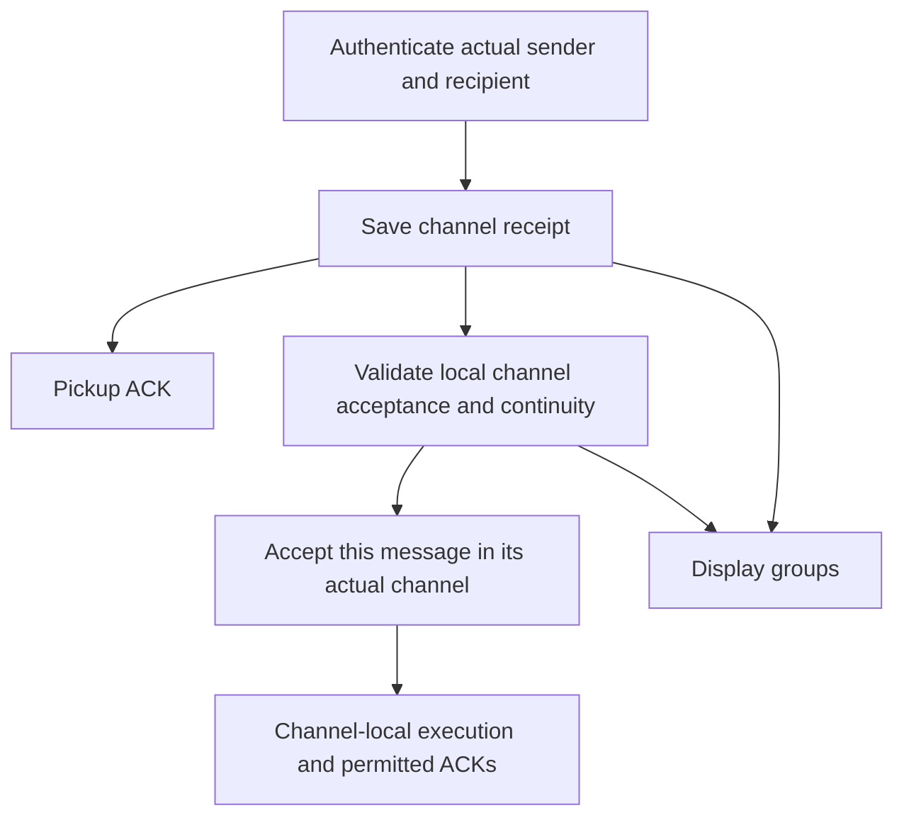
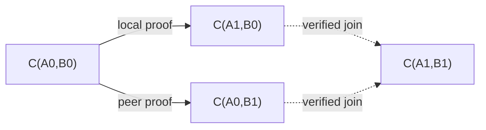

# Channels, continuity and local acceptance

Status: **draft, phase 1**. This document owns channel identity, channel
acceptance, directed continuity evidence and message acceptance. Storage
envelopes and durability follow [event-store.md](event-store.md). Sending and
effect ordering follow [distributed-delivery.md](distributed-delivery.md).
The capitalized requirement words have their BCP 14 meanings.

<a id="model"></a>

## 1. Model

A **channel** is a fixed unordered pair of distinct canonical communication
DIDs. The local vault supplies its orientation. Messages retain their actual
sender, recipient, authenticated keys and document snapshots. A DID's changed
document does not change the channel ID. Each authentication or preparation
uses the document authorized by that DID method for that operation and retains
its exact evidence. A snapshot records what was verified; it is not a permanent
limit on the keys that the same DID may authorize later.

A **continuity link** is a derived replacement of exactly one endpoint in the
context of one channel. The fold computes it from received proofs, resolution
evidence and local rotation decisions; no link event is stored.
Links form a directed graph. They do not create a global DID alias or require
a common birth pair, chain root, relationship ID or component identifier.

A **relationship** is a local display group containing selected channels or
channel chains. Grouping, ungrouping, renaming and contact assignment change no
message identity, permission, authentication evidence, ACK authorization or
dispatch eligibility.
The cryptographic graph exists independently of display groups.



Receipt never needs channel acceptance, display assignment or complete
continuity history. Anonymous input has no channel or application execution.
Application processing requires accepted authentication evidence and local
policy, independently of whether a relationship is displayed.

<a id="channel-identity"></a>

## 2. Channel identity

Validate and canonicalize both DIDs under
[the DID profile](relationships.md#peer-did-numalgo-4-profile). Sort canonical
UTF-8 bytes in unsigned byte order:

```text
[lo, hi] = sortCanonicalDids([A, B])
channelId = UUIDv5(estocNamespace("channel"), RFC8785(["v1", lo, hi]))
```

The namespace is `bab533fd-a809-5ec6-80bc-6eb81f7c17f9`.

| A | B | channelId |
| --- | --- | --- |
| `did:peer:4zQmd8CpeFPci817KDsbSAKWcXAE2mjvCQSasRewvbSF54Bd` | `did:web:bob.example` | `88a41cd6-a196-52a4-87df-7ce060e7d373` |
| `did:web:zoe.example` | `did:web:amy.example` | `8e0d9d52-628f-5440-ab58-2b6227341e85` |

Reversing the pair preserves the channel ID. Equal DIDs are invalid. These
are naming fixtures, not live resolution fixtures. A channel needs no
`channel.created`: an observation, outbound intent or acceptance can name it.
Replacing either DID means another channel. Updating keys, service endpoints
or other document contents under the same supported mutable DID does not.
Document CIDs, selected keys and resolution event IDs never enter channel,
inbound-message or execution identity. Sender direction remains part of
message identity even though the channel is unordered.

For `did:web`, document updates follow the method's HTTPS resolution rules;
they require no `from_prior` and create no continuity link. For `did:peer:4`,
the validated document is immutable under its canonical DID; a changed encoded
document yields another DID. Neither method aliases different DIDs merely
because they share keys or services. See [DID resolution](relationships.md#did-resolution-requirements).

<a id="receipt"></a>

## 3. Durable receipt

Perform exact recipient, route, cryptographic, syntax, resource and current
sender checks under [the receive gate](relationships.md#hard-pre-vault-gate).
Do not consult display groups or continuity membership. Retired local keys
may drain an otherwise eligible retained route; retirement still blocks new
sending, disclosure and channel acceptance.

Under the operation lock, recheck local prerequisites, commit/reuse the exact
resolution document, then commit `message.in` with objects and receipt ordinal.
`channelId` derives from the actual canonical sender and recipient and is null
exactly for anonymous input. Preserve the original `fromPrior`, local key,
resolution reference, hashes and source as immutable observations.

Normal pickup ACK follows process-durable receipt. An unknown, blocked,
superseded or incomplete channel can still retain an authenticated observation.
Receipt grants no peer ACK, protocol effect, invitation consumption or profile
lift. Hard cryptographic/wrong-recipient/resource rejection keeps the terminal
pre-vault ACK path. Failure to durably save an otherwise receivable input
withholds pickup ACK.

### 3.1 Carried proof and library boundary

Present-sender authentication and permission to inherit a predecessor's
channel authority are distinct checks. A raw `from_prior` is a retained claim
until verified. Use maintained DIDComm/JOSE verification APIs and the exact
predecessor document. Never strip the proof, fabricate unpack success or treat
decoding as verification. If unpack cannot authenticate plaintext without
missing predecessor material, wait unopened without `message.in` or pickup ACK.
The draft does not assert that the current adapter supports independent unpack.

A successful independent authentication may retain pending or invalid
continuity evidence. Invalid proof authorizes no message acceptance or effect.
This uses the rotation primitive in
[DIDComm Messaging 2.1](https://identity.foundation/didcomm-messaging/spec/v2.1/#did-rotation).
The channel graph and local policy below are this application's design.

<a id="verification-status"></a>

### 3.2 Verification status and display

Receipt and continuity verification are separate visible facts. A saved
authenticated message MAY be displayed before continuity completes, with an
explicit status beside the message. Do not present a pending sender as the
verified continuation of an earlier peer or silently group it on that basis.
The UI MUST distinguish these derived states:

| State | Meaning |
| --- | --- |
| `not-present` | No `from_prior`; ordinary channel policy still applies |
| `pending-proof` | A proof is present but its required verification document/evidence is unavailable |
| `pending-history` | The proof verifies, but the predecessor channel acceptance or its dependencies are missing |
| `verified` | Both proof and channel context validate; the link is derivable |
| `invalid` | The carried claims or complete verification evidence fail validation |
| `conflict` | Complete evidence establishes competing successors or contradictory channel authority |

Rebuild these states from retained evidence. Missing imported references remain
pending, not invalid. Resolver failures may add a bounded diagnostic; a failed
fetch without a document is not proof of a bad signature. Channel denial and
application-processing status are shown separately. If an imported receipt's
own sender evidence is missing, show that pending authentication separately;
do not claim its sender has already been verified. Pending/invalid/conflicted
continuity grants no peer ACK, handler effect or inherited channel permission.
Later evidence may update the display and graph without another pickup, receipt
ordinal or message ID. That change alone grants no new automatic dispatch action.

<a id="admission"></a>
<a id="channel-accepted"></a>

## 4. Channel acceptance and evidence

`channel.accepted` records a local decision to use an exact DID-pair channel,
with the evidence and policy basis for that decision. It does not fix a peer
document revision for future traffic or identify a larger chain. The closed
payload contains
exactly the five fields in this example:

```json
{
  "type": "channel.accepted",
  "roots": [],
  "data": {
    "channelId": "88a41cd6-a196-52a4-87df-7ce060e7d373",
    "localDidId": "019b2a60-c68e-75bf-b6fb-ae1a41f8d715",
    "peerResolutionEventId": "019b2a72-0626-7a87-a310-941fe4c1ce77",
    "sourceEventId": "019b2a71-4c18-760a-9017-b3e265aa89d1",
    "basis": { "kind": "manual" }
  }
}
```

The local DID and canonical resolved peer derive the channel ID. Resolution
`localKeyName` must match this local DID. Retain the exact document, supported
methods and selected key as historical evidence. Each later receipt or package
references its own resolution; it need not use this document CID or key. An
ordinary method-authorized update needs no replacement acceptance.

Complete acceptances for the same oriented canonical DID pair may coexist,
including different valid `did:web` revisions and selected keys. Validate each
decision's own source and basis independently; equivalence of the pair cannot
fill missing references or transfer invitation consumption. Different revisions
alone are not a conflict. A DID mismatch, invalid document or inconsistent
local DID/key mapping remains invalid or conflicted as appropriate. No event
order selects a channel-wide winning document or unions historical key sets
into authority for new traffic.

`sourceEventId` is required and nullable. An incoming acceptance references an
already committed complete authenticated `message.in` in this exact channel
whose local key and resolution match. A local/outbound decision may use null.
`basis` is exactly one of these closed forms:

```ts
type ChannelAcceptanceBasis =
  | { kind: "manual" }
  | { kind: "outbound"; messageId: MessageId }
  | { kind: "invitation"; disclosureEventId: EventReference<"did.disclosed"> }
  | { kind: "peer-continuation";
      predecessorAcceptanceEventId: EventReference<"channel.accepted"> }
  | { kind: "local-continuation";
      rotationEventId: EventReference<"did.rotationSelected"> }
  | { kind: "join";
      rotationEventId: EventReference<"did.rotationSelected">;
      peerSourceEventId: EventReference<"message.in"> };
```

Manual acceptance is an explicit local decision. Outbound acceptance must name
an explicit user-authored intent at exactly this fixed channel; an automatic
reply cannot use itself as its admission authority. Invitation acceptance
requires an exact source receipt, live disclosed recipient, matching `pthid`,
available use and `did.disclosed.admitChannel == true`. A `peer-continuation`
uses the acceptance's non-null `sourceEventId` as the proof carrier and its
explicit predecessor acceptance. A `local-continuation` uses the selected
rotation. A `join` uses that rotation and the exact opposite-side carrier.
Each must derive the target pair under the rules below; missing or cyclic
evidence grants no inherited permission. All event references in the basis
name already committed events; none names a projection row.

An unknown channel remains unaccepted until one of these bases exists. Missing
lookup, restart, timeout, control-message type or display similarity grants
nothing. A proof-bearing input with unresolved/invalid continuity cannot bypass
that check through automatic invitation acceptance. Explicit manual acceptance
does not validate or discard an invalid carried proof.

An inbound channel acceptance from a proof-free source with matching local OOB
recipient and `pthid` consumes that invitation, whether its basis is invitation
or explicit manual acceptance. The consumer is the exact channel, not a display
group. Other bases and other recipients consume nothing. Commit under the lock
after rechecking availability. Receipt alone consumes nothing; once acceptance
commits, a crash before message processing does not reopen the invitation.
Missing exact acceptance/source evidence makes potential consumption pending.
Validate positive consumption evidence before current availability; erasure,
later conflicts and contact deletion never release a committed consumption.

<a id="continuity"></a>
<a id="channel-linked"></a>

## 5. Derived continuity

`channel.linked` is retired. The graph is a rebuildable projection, with no
portable link ID or link commit step. Folding reads retained inputs only;
network resolution and event appends belong to producer/recovery operations.
Its inputs are the following facts.

<a id="message-frompriorresolved"></a>

### Peer proof evidence

`message.fromPriorResolved` associates one received proof with the exact
predecessor document obtained for its verification. Its closed data has only
these two fields; `roots` contains exactly `documentCid`:

```json
{
  "type": "message.fromPriorResolved",
  "roots": ["bafkrei...predecessor-document"],
  "data": {
    "sourceEventId": "019b2a81-4c18-760a-9017-b3e265aa89d1",
    "documentCid": "bafkrei...predecessor-document"
  }
}
```

The exact source is an already committed authenticated `message.in` with a
non-null original `fromPrior`. The document is the method-valid issuer document,
stored as raw RFC 8785 canonical JSON under the same representation rules as
[resolution evidence](vault-events.md#peer-resolved). Obtain it under
[predecessor resolution](relationships.md#predecessor-resolution). This event
records a resolution result, not a trusted Boolean verification result. It may
retain a document that does not authorize the JWT key or fails to verify its
signature; the fold computes that failure. It copies no channel IDs, sender
keys, JWT, local endpoint, acceptance or link direction from the source.

For a complete authenticated carrier `M` addressed to local DID `A`, validate
the original JWT's signature, `kid`, `iss`, `sub` and retained document under
[the proof checks](vault-events.md#relationship-peertransitioned). Its `sub`
must match the carrier's authenticated sender. Then derive:

```text
B0 = canonicalDid(fromPrior.iss)
B1 = canonicalDid(M.from)
peer link = C(A, B0) -> C(A, B1)
```

`A`, `B0` and `B1` must form two valid distinct channel pairs, with `B0 != B1`.
Channel context requires a complete acceptance of `C(A,B0)` oriented to `A`.
Proof verification itself needs no predecessor acceptance or `message.accepted`;
their absence cannot stop saving the resolution evidence. A valid proof with
missing predecessor acceptance is `pending-history`, not an authorized link.

A complete proof witness can serve another independently authenticated carrier
with the same compact JWT, canonical sender and canonical local recipient.
Each witness uses one exact source/document association; fields cannot be
assembled from different incomplete rows. Retained valid witnesses remain
valid after method updates; a later failed check or missing sibling does not
erase them. Without a valid witness, missing known dependencies mean pending;
otherwise complete failed checks mean invalid. Intrinsically invalid claims
cannot be repaired by another document. Arbitrary historical documents with
no such source association grant no proof authority.

<a id="did-rotationselected"></a>

### Local rotation decisions

A local rotation may be selected before any message exists. Preserve that
decision as `did.rotationSelected`, with `roots == []` and four closed fields:

```json
{
  "type": "did.rotationSelected",
  "roots": [],
  "data": {
    "fromAcceptanceEventId": "019b4d11-22d3-7fd0-82fb-f33864a75dd5",
    "toDidId": "019b4d12-22d3-7fd0-82fb-f33864a75dd5",
    "sourceEventId": null,
    "fromPrior": "<compact-jwt>"
  }
}
```

The acceptance fixes the oriented old pair `C(A0,B)`. `toDidId` names an
already committed eligible local DID `A1`, distinct from both old endpoints;
its document and route come from `did.created`. The original JWT is signed by
the retained local `A0` authentication method, with exact `iss`/`sub` spellings
for `A0`/`A1`. `sourceEventId` is null for manual rotation or names the accepted
predecessor-channel input selected by the live privacy policy. The producer
rechecks local lifecycle, denial and conflicts, and requires exact-address
confirmation of `A0` by a complete authenticated channel observation. That
confirmation need not depend on its own message acceptance.

Commit the decision before successor acceptance or disclosure. Reuse its
successor and frozen proof after interruption; no same-end branch before
successor confirmation. The fold derives `C(A0,B) -> C(A1,B)` from this decision,
without storing either derived channel ID. The peer DID is unchanged and later
packages obtain their own resolution. A prepared message carrying this local
proof must match the selected decision; it cannot independently select another
rotation. Recovery of the decision grants no dispatch action.

### 5.1 Both endpoints can rotate

With an accepted `C(A0,B0)`, a local decision deriving `C(A1,B0)` and a peer
carrier deriving `C(A0,B1)` can justify `C(A1,B1)`. A `join` acceptance references
the decision and carrier, not graph rows. They must share the same oriented
predecessor DID pair with complete acceptance and proof evidence.
Its local DID is the local link's successor; its peer DID is the peer link's
successor. The join retains valid peer resolution evidence under the joined
local key; document revisions need not match across links. This is a derived
join, not a fabricated received message or fabricated wire proof.



Only these evidence-backed joins are permitted. Sharing a DID, key, contact or
display group cannot fill a missing side. Competing successors for the same
endpoint/context, cycles and contradictory identity evidence are visible
conflicts, not ordinary opposite-side rotation. No graph-wide stable component
ID is needed.

For peer replacements, one context includes channels connected by validated
local-only replacements while retaining the same canonical peer DID. Compare
competing peer successors across that context, even when they cite different equivalent
acceptance events. For local replacements, apply the symmetric rule through
peer-only replacements. A join transports the existing two replacements; it
does not create another competing choice. Each derived link exposes its exact
source witnesses; document updates neither split the context nor hide
competing successors. These contexts are derived queries,
never message identifiers or stored relationship roots.

Compute the least positive closure from complete direct acceptances, peer proof
witnesses and local decisions, then dependent continuation/join acceptances.
Pure reference cycles with no independent basis grant nothing. Fold the full
available evidence before checking current conflicts or authorizing new work;
enumeration order and intermediate graph rows cannot authorize dispatch. A
missing exact reference in an acceptance basis remains pending even when a
different source derives an equivalent edge.

### 5.2 Supersession, confirmation and authorization

A verified peer link stops new application acceptance from its old peer in
that channel context. The same peer supersession applies through verified
local-only links in that context, including either end of those local links;
local address rotation cannot restore the old peer's authority. It does not
affect an unrelated channel using the same public peer DID. In a verified join,
the peer link supplies this same supersession fact at the joined local endpoint.

A complete channel observation can confirm knowledge of an exact local
successor when its own authentication and the local-only/paired-link context
validate.
No `message.accepted` prerequisite is imposed on that witness. Confirmation
permits future newly prepared messages to omit the frozen proof; it does not
edit an already attempted envelope or acknowledge any particular wire ID.

For ACK authorization, a path preserves endpoint roles and uses verified
forward replacements and the joins above. It relates a specific old channel
to a specific successor channel. General undirected graph connectivity never
authorizes ACKs, sending or protocol effects. An unrelated display-group member
cannot acknowledge a message even when it chooses the same wire ID.

<a id="message-scoped"></a>
<a id="message-accepted"></a>

## 6. Message acceptance

`message.accepted` replaces relationship scope. It freezes acceptance of one
actual observation in its already fixed channel; it does not assign that
observation to another identity. Its closed payload has these two fields:

```json
{
  "type": "message.accepted",
  "roots": [],
  "data": {
    "sourceEventId": "019b2a71-4c18-760a-9017-b3e265aa89d1",
    "channelAcceptanceEventId": "019b4d11-22d3-7fd0-82fb-f33864a75dd5"
  }
}
```

The exact source must be a complete authenticated `message.in`. Its channel,
local key and canonical peer DID must agree with the acceptance's oriented
pair. Its authenticated method must be authorized by its own exact resolution
document, which may be a later revision than the acceptance's evidence.
For proof-bearing input, derive the peer link from this source's original JWT,
a complete proof witness and accepted predecessor context. Proof-free input
needs no continuity witness. The acceptance references no link or status row;
the fold independently checks these prerequisites. Equivalent complete proof
carriers may supply the witness under section 5, but cannot supply this source's
sender authentication or replace its immutable claims.

Under the operation lock, producers recheck blocking, supersession, invitation
consumption and current policy, then reuse or append acceptance. All referenced
events must already be committed. A repeated accepted logical input may reuse
its existing decision; a new wire ID from a superseded peer cannot. Pending,
anonymous or invalid proof evidence authorizes no processing.

Import validates the saved positive references, not a reconstruction of the
producer's wall-clock state. Later rotation does not erase previous acceptance.
Conflicting identity evidence, authenticated intent or links stop new affected
work without rewriting completed output. Equivalent acceptance references are idempotent;
incomplete siblings do not erase complete evidence. Missing exact references
defer that row rather than borrowing fields from unrelated observations.

<a id="effects-and-recovery"></a>

## 7. Identity, local policy and display

The logical inbound identity is `(channelId, canonical sender DID, wire ID)`.
Key variants independently authorized by their own method-valid snapshots can
agree on that one input, including across `did:web` document revisions; intent
differences conflict. Another channel always has another logical input and
execution ID, even if its wire ID/content is equal and continuity is proven.
Neither later graph discovery nor grouping merges executions. The ID formulas
and within-channel vectors are in [delivery](distributed-delivery.md#observation-ids-and-vectors).

One accepted input may support at most one frozen ACK-bearing automatic
response. Other protocol effects retain their own deterministic tuples.
Historical or imported input never supplies a fresh dispatch action. Only the
single active executor may react automatically to newly accepted live input;
sync and mailbox fan-out do not grant another replica that role.

<a id="channel-blocked"></a>

### 7.1 Blocking

`channel.blocked` has `roots == []` and the closed payload
`{ "channelId": "<uuid>", "includeSuccessors": true }`. The boolean is required.
It is a permanent local denial decision for that channel; when true it also
covers evidence-backed successors through directed links/joins. Missing
required evidence defers inheritance and never authorizes effects from an
unaccepted channel. Known contradictory authority prevents new work. It does
not prevent authenticated receipt/pickup ACK or infer a global block of a DID.

Unassigned receipts may be explicitly erased. Retained message and acceptance
skeletons preserve identity and invitation consumption; erased input cannot
start automatic acceptance or new effects on recovery.

<a id="display-relationships"></a>

### 7.2 Display relationships

`relationship.channelsSet` has `roots == []` and closed data
`{ "relationshipId": "<uuidv7>", "channelIds": ["<uuidv5>"] }`.
The list is duplicate-free and sorted by UUID byte order; an empty list is
allowed. Latest canonical event per relationship selects the display set.
`relationship.contactAssigned` assigns that display group to a contact under
[the contact schema](vault-events.md#relationship-contactassigned).
These are presentation decisions only. Automatic grouping may be rebuilt from
verified graph components, but its changing identity is never a protocol key.

Deleting a display group/contact cannot silently mutate channel authority.
A product's explicit "delete and block" action separately appends denial
decisions for the concrete selected channels and optional successors; later
display regrouping cannot expand or remove them. Profile facts retain their
source channel even when a group displays facts from several chains.

<a id="fixed-outbound-channel"></a>

## 8. Fixed outbound channel and dispatch authority

One outbound message has one immutable oriented channel. This profile freezes
`channelId`, `senderDidId` and `recipientDid` in `message.out`, before any
preparation or transport call. Freezing at intent commit is deliberately earlier
than the first possible submission: no recovery procedure needs to prove that
an earlier call did not occur before selecting another channel.

Rotation selects addresses for newly created messages only. It MUST NOT move a
queued, prepared, attempted, submitted or automatic message to another channel.
The selected sender and recipient remain fixed even when no attempt is recorded.
If that channel can no longer send, retain the original outcome and require an
explicit new send with a new wire ID to use a successor channel. Message IDs,
automatic effect IDs and frozen ACK arrays are never rewritten to follow it.

Before each transport invocation, commit `delivery.attempted` naming the exact
already committed package. This event means that the call **may have happened**;
it is not proof of transport acceptance. Its returned event ID must be known
before invoking the transport. An uncertain commit authorizes no call. All
attempts for one message use that first attempted package's exact bytes and
package ID. A missing referenced package is a recovery dependency, not permission
to prepare another one. Conflicting attempted packages suppress further sending.

An initial send may run only from the live local user action or newly accepted
live input that created its intent. Resolving, preparing and registering before
that initial call may wait/retry locally. After a transport call fails or its
outcome becomes uncertain, another call requires a fresh explicit manual retry.
Opening a vault, importing events, restoring a backup, changing replicas,
receiving a duplicate, learning a rotation or losing local state supplies no
dispatch authority. Portable history is not an executable outbox queue.

A manual retry of an uncompleted message preserves the exact channel, wire ID,
package ID and envelope; check current expiry, erasure, retained keys, route,
security restrictions and content availability again. A submitted or terminal
message cannot retry. A deliberate new send, including a send over a new
channel, creates a new message ID. Any local UI link to the old message is
informative and cannot alias execution or imply that the first send failed.

After reopen or import, pending messages are visible for manual action even if
no attempt event survived the available snapshot. Restoring partial or old
history is never evidence that a message was not sent. Retained receipts may
rebuild display, acceptance and proof projections, but do not independently
dispatch old automatic replies, ACKs, notifications or protocol effects.
Phase 1 still permits only one active executor; passive replicas do not turn
mailbox fan-out into multiple independent automatic responses.

An explicit manual action may complete pending protocol-response work when
its source, channel authority and content remain eligible. It reuses the
source's deterministic execution/tuple and any already frozen response. If no
response intent exists, it may select one under the normal response rules;
its first dispatch is manual. It cannot reopen a submitted/erased response or
use another tuple to bypass an existing selection or conflict.

Sender policy alone cannot constrain an external peer. Cross-channel reuse of
a wire ID is not a channel-local duplicate, and this profile provides no
cross-channel exactly-once guarantee. Protocols needing business idempotency
must define an authenticated application operation ID and its own rules.

<a id="required-conformance-cases"></a>

## 9. Required conformance cases

1. <a id="ch-1"></a> Channel identity is symmetric, fixed by canonical DIDs and independent of keys, routes and display groups; direction remains part of message identity.
2. <a id="ch-2"></a> First authenticated receipt commits and pickup-ACKs without channel acceptance, continuity history or a display relationship.
3. <a id="ch-3"></a> A valid retained proof with missing predecessor acceptance is pending-history; recovery derives its link without another receipt or a stored graph event.
4. <a id="ch-4"></a> A recovered peer supersession refuses new old-peer input through its local-only context while preserving channel receipt and previous acceptance.
5. <a id="ch-5"></a> Independent local/peer links at one accepted channel justify their exact diagonal join without synthetic observations; unrelated shared DIDs justify nothing.
6. <a id="ch-6"></a> Same-channel/sender/wire-ID observations with equal intent and authorized keys share one execution. Another channel has another execution.
7. <a id="ch-7"></a> Contradictory accepted intent in one channel suppresses new effects; previously submitted IDs and outcomes remain unchanged.
8. <a id="ch-8"></a> Unknown policy, missing verification evidence and invalid continuity leave receipts intact and grant no effects.
9. <a id="ch-9"></a> A retained channel denial applies independently of display regrouping; deleting a contact alone grants or revokes no cryptographic authority.
10. <a id="ch-10"></a> Crash after receipt, proof-resolution association, channel acceptance or message acceptance preserves each committed fact; reopen rebuilds verification state and graph without dispatching old work.
11. <a id="ch-11"></a> Competing one-use invite receipts can both be saved; only eligible channel acceptance consumes the invitation. Crash and erasure never reopen it.
12. <a id="ch-12"></a> Unpack without authenticated plaintext creates no observation; missing cryptographic material waits without pickup ACK.
13. <a id="ch-13"></a> Unknown channel, timeout and control types grant no acceptance; explicit manual/outbound decisions or authorized invitation/continuation bases can.
14. <a id="ch-14"></a> A peer link applies only in its validated channel/local-continuation context and does not replace the peer in unrelated public-DID channels.
15. <a id="ch-15"></a> Earlier accepted input survives ordinary document updates and later extensions; contradictory identity evidence or same-end successors suppress new work without rewriting identity.
16. <a id="ch-16"></a> Retained retired recipient keys can drain eligible routes; new sending, disclosure and acceptance obey retirement.
17. <a id="ch-17"></a> A consistent unaccepted sibling cannot create another same-channel execution or erase accepted input. Cross-channel observations never merge executions.
18. <a id="ch-18"></a> Recovery uses retained authentication evidence without fresh resolution of a saved receipt; new network deliveries authenticate afresh.
19. <a id="ch-19"></a> Intent freezes its oriented channel; local or peer rotation changes only new intents, including when the old intent has never been attempted.
20. <a id="ch-20"></a> Commit attempt before transport. Crashes immediately before call and after transport acceptance both reopen without automatic submission.
21. <a id="ch-21"></a> Manual retry uses the first attempted package exactly; missing bytes defer, and changing channel requires a new ID.
22. <a id="ch-22"></a> Import, restore, replica change, duplicate pickup and missing ACK never dispatch an old intent or regenerate an automatic response for sending.
23. <a id="ch-23"></a> Submitted or terminal messages cannot retry. Deliberate new sends get new IDs and do not establish that the original was undelivered.
24. <a id="ch-24"></a> Missing attempt history grants no automatic recovery sending; incomplete exact references remain pending.
25. <a id="ch-25"></a> Renaming, merging or splitting display groups changes no message/execution ID, ACK authorization, verification evidence, denials or invitations.
26. <a id="ch-26"></a> A successor-channel ACK needs a verified role-preserving path to the exact outbound; general connectivity or shared display membership is insufficient.
27. <a id="ch-27"></a> Opposite directions in one channel using the same wire ID have different inbound/execution identities.
28. <a id="ch-28"></a> A cyclic acceptance/link dependency grants no authority; a complete independent channel remains usable.
29. <a id="ch-29"></a> Learning a missing graph link after independent channel executions never merges or replays those executions.
30. <a id="ch-30"></a> Same-DID service updates preserve channel and input identity; a redelivered wire ID with equal intent creates no second execution or automatic response.
31. <a id="ch-31"></a> A method-authorized same-DID key update permits new receipt and new-message preparation without another channel acceptance or from_prior. Historical snapshots remain unchanged.
32. <a id="ch-32"></a> A key absent from the currently resolved sender document cannot authenticate new delivery; previously committed receipt still validates with its own snapshot on import.
33. <a id="ch-33"></a> After a Web key update, a received replacement proof can use a new authorized authentication key through its exact message.fromPriorResolved document association. Unassociated old snapshots cannot bypass removal; a retained valid witness still verifies offline even if predecessor acceptance arrives later.
34. <a id="ch-34"></a> Repeated identical proof with an updated successor document remains the same DID replacement; each carrier authenticates independently and no document CID elects a competing link.
35. <a id="ch-35"></a> Document updates across local-only links do not split peer supersession/conflict context or break an otherwise complete join and cross-channel ACK path.
36. <a id="ch-36"></a> Independently authenticated receipt without a predecessor document commits and pickup-ACKs; UI shows pending-proof and no verified peer continuity or application effect.
37. <a id="ch-37"></a> Saving a method-valid proof document needs no predecessor channel acceptance. A valid signature with missing channel history shows pending-history; complete context derives the link without another proof lookup.
38. <a id="ch-38"></a> A malformed carried claim or complete failed signature check shows invalid while preserving authenticated receipt; a failed fetch without a usable document remains pending with a resolution diagnostic.
39. <a id="ch-39"></a> Importing missing proof/history updates verification status, links and eligible ACK projections without a new receipt ordinal, input identity or automatic reply/notification dispatch.
40. <a id="ch-40"></a> Rebuilding from receipts, exact document associations and local decisions yields the same graph and verification statuses in any import order. No consumer references a link/status projection row as an event.
41. <a id="ch-41"></a> A local rotation decision survives a crash before any outbound exists. Later preparation reuses its exact successor and JWT; merely preparing a package cannot select a competing rotation.
42. <a id="ch-42"></a> One complete valid proof witness survives a later failed snapshot check or incomplete sibling. With no valid witness, missing required references remain pending; different incomplete rows cannot be combined into success.
