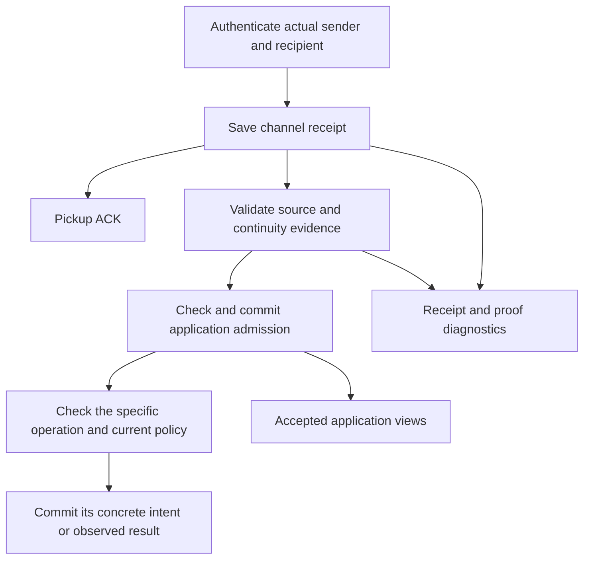

# Channels, continuity and operation evidence

Status: **phase 1, implemented**. This document owns channel identity,
invitations and the payloads of the three channel events: a local rotation
decision, an application admission and a channel denial. The
[`@estoc/continuity` API and host contract](../../packages/continuity/README.md)
own proof and graph semantics. The vault's reading of its evidence into that
model, operation eligibility, admission and dispatch authority are code, named
in [section 7](#folds-and-procedures). Storage envelopes and durability follow
[event-store.md](event-store.md). Sending and effect ordering follow
[distributed-delivery.md](distributed-delivery.md). The capitalized requirement
words have their BCP 14 meanings.

<a id="model"></a>

## 1. Model

A **channel** is the fixed ordered pair `(localDid, peerDid)` of distinct
canonical `did:peer:4` communication DIDs, viewed from one vault. Each
message retains its sender, recipient, authenticated keys and exact immutable
document evidence. Mediator DIDs follow a separate
[resolution policy](relationships.md#mediator-resolution).

A **continuity link** is a derived replacement of exactly one endpoint in the
context of one channel. The fold computes it from received proofs, resolution
evidence and local rotation decisions; no link event is stored.
Links form a directed graph whose authority is scoped to each channel context.

A **contact** organizes selected channels with local names and preferences.
Creation selects complete local/peer DID pairs and may precede receipt or peer
resolution. Contact edits affect presentation and preferences, not message
identity or protocol authority. Channels and continuity exist independently of
contacts; unassigned channels remain usable.


```mermaid
flowchart TD
    A[Authenticate actual sender and recipient] --> B[Save channel receipt]
    B --> C[Pickup ACK]
    B --> D[Validate source and continuity evidence]
    D --> H[Check and commit application admission]
    H --> E[Check the specific operation and current policy]
    E --> F[Commit its concrete intent or observed result]
    H --> G[Accepted application views]
    B --> I[Receipt and proof diagnostics]
    D --> I
```

Receipt needs no invitation state, contact or continuity history.
Anonymous input has no channel or application execution. Each later operation
checks its own evidence and policy in the module that owns it under
[section 7](#folds-and-procedures).

<a id="channel-identity"></a>

## 2. Channel identity

Validate and canonicalize both DIDs under
[the DID profile](relationships.md#peer-did-numalgo-4-profile). A channel value
has exactly these two DID strings:

```ts
type Channel = { localDid: Did; peerDid: Did };
```

Both endpoints use the canonical numalgo-4 short form. Compare each role
byte-for-byte; equal endpoints are invalid. `(A, B)` and `(B, A)` are different
vault-local views.
Receiving from B at A and sending from A to B use the same `(A, B)` channel.
The notation `C(A, B)` throughout this profile means `{localDid: A, peerDid: B}`.

Receipts derive the pair from the local key's DID and authenticated sender.
Outbound intents derive it from `senderDidId` and canonical `recipientDid`.
Source-based facts use the pair of their referenced message. Missing exact
endpoint evidence leaves that projection pending; contact membership, another
observation or a shared key cannot supply it.

Selectors such as contact membership and blocking store the two canonical DID
strings directly. Canonicalize supplied long forms before storing a selector.
Its syntax and distinctness can be checked offline; missing DID documents or
local entities leave evidence unresolved and grant no authority.
Compare selectors by both roles. Sort sets by unsigned UTF-8 byte order of
`RFC8785([localDid, peerDid])`, with no duplicate pairs. This ordering sorts the
set, not the two endpoints within a pair.

Replacing either DID creates another channel; document CIDs, keys and resolution
event CIDs are verification evidence. Changing a numalgo-4 encoded document
yields another DID. Shared keys or services never alias distinct DIDs.

<a id="invitations"></a>

## 3. Invitations

An OOB invitation is an address handed out, not a token. Whoever holds it
writes to the disclosed local DID in an exact channel of their own under
[section 1](#model), and a receipt under it is an ordinary receipt: it needs
no invitation state and grants none. No event records who used an invitation,
and nothing a peer sends under one takes it from the next. An invitation is
available while its disclosed DID is live on a route that may deliver, and
unavailable once the DID or its route ended or while one of them waits on
something that may recover; [the invitation fold](../../packages/vault/src/fold/invitations.ts)
owns that view. An `oobId` that distinct disclosures carry, once histories
that each disclosed it are merged, is unavailable under every one of them and
handed out again under none; the DIDs and their receipts are as they were.
Retirement of the disclosed DID ends new disclosure and sending at it while
retained keys still receive under [the receive gate](../../packages/agent-core/src/receive/gate.ts).

<a id="continuity"></a>
<a id="channel-linked"></a>

## 4. Derived continuity

The vault projects retained proof evidence and local rotation decisions into
`@estoc/continuity` and uses its queries. The package's public types, JSDoc,
README host contract and tests define normalization, joins, contexts, conflict
scope and query outcomes; the vault implements no second graph. What each
event establishes on its own is read by
[`packages/vault/src/fold/channels.ts`](../../packages/vault/src/fold/channels.ts): a source
is one authenticated `message.in` with its own resolution document, a carrier
is a source that brought a `from_prior` proof, a decision is a saved
`did.rotationSelected`. [`packages/vault/src/fold/continuity.ts`](../../packages/vault/src/fold/continuity.ts)
projects them into the model under IDs every replica derives from the same
event CIDs and reads the model's answers for the host: each carrier's or
decision's status, which channels take no new work, the admitted witness by
which an address is confirmed for new work, and the denials that cover a
channel. Proof verification is local and appends no verification events.
Application admission is a separate durable decision under
[section 5](#application-admission).

A verified carrier `M` addressed to local DID `A`, whose proof names issuer
`B0` and whose authenticated sender is `B1`, yields the peer link
`C(A, B0) -> C(A, B1)`. A decision from local `A0` toward peer `B` with
successor `A1` yields the local link `C(A0, B) -> C(A1, B)`. At one pair, a
local link and a peer link join to `C(A1, B1)`. A link replaces exactly one
endpoint; competing successors for one endpoint in one context, cycles and
contradictory identity evidence are conflicts the package exposes, and phase 1
defines no operation to clear them. A verified replacement ends new work from
and to the replaced endpoint in its context, and in no unrelated channel that
shares the DID.

<a id="did-rotationselected"></a>

### Local rotation decisions

A local rotation may be selected before any outbound message exists. Preserve
that decision as `did.rotationSelected`, with `roots == []` and five closed fields:

```json
{
  "type": "did.rotationSelected",
  "roots": [],
  "data": {
    "fromDidId": "019b2a60-c68e-75bf-b6fb-ae1a41f8d715",
    "peerDid": "did:peer:4zQmaszWy5nSWq5GjKaGPuRCuFfwBqML1SAQNxPJdpAxx3fP",
    "toDidId": "019b4d12-22d3-7fd0-82fb-f33864a75dd5",
    "sourceEventCid": null,
    "fromPrior": "<compact-jwt>"
  }
}
```

`fromDidId` names the already committed local DID `A0`; `peerDid` stores the
canonical peer DID `B`. They fix the oriented old pair `C(A0,B)`, including
when `sourceEventCid` is null. `toDidId` names an eligible local DID `A1`, distinct
from both old endpoints; its `did.created` is committed earlier or in the same
atomic commit as this decision. Its document and route come from that creation.
Validate both local DID entities and their exact retained
key evidence. The original JWT is signed by the retained local `A0`
authentication method, with exact `iss`/`sub` spellings for `A0`/`A1`.
Peer resolution is not supplied by this local signature;
each outgoing package retains its own peer resolution.

`sourceEventCid` is null for manual rotation; otherwise it names the complete
source witness in `C(A0,B)` that selected the rotation under
[the private-address policy](../../packages/agent-core/src/privacy.ts). The decision is committed
before any dependent intent or disclosure. What a producer checks before
committing one, that a pair rotates once in its context and how the
notification follows are [the rotation procedure](../../packages/agent-core/src/rotate.ts); what a
saved decision needs before it is projected, and that a decision still waiting
for its evidence already forbids another successor, is the continuity fold.
A prepared message carrying this proof must match the selected decision.

<a id="admission"></a>
<a id="channel-accepted"></a>
<a id="application-admission"></a>

## 5. Application admission

`message.in` records an authenticated observation, not permission to apply it.
Before a receipt can contribute accepted chat, profile values, an incoming ACK,
Report Problem correlation, new address confirmation or a new input-derived
operation, commit `message.admitted` for that exact observation. This is a
local acceptance decision, not a cached signature-verification result, a
handler result or permission to send. Its closed payload and roots are:

```json
{
  "type": "message.admitted",
  "roots": [],
  "data": { "sourceEventCid": "bafkreichxnhduewkkewrtmtgoaklp5f5s2ak7p62t3evkl77qpji3waffm" }
}
```

`sourceEventCid` is a non-null `EventReference<"message.in">`. The source and its
required evidence MUST already be committed. Admission retains no extra body
roots and does not undo erasure. Multiple admissions of the same exact source
are equivalent decisions, not multiple executions. Admission of one duplicate
cannot lend authority to another duplicate's headers or authentication. Pickup
ACK only removes a transport delivery and grants no application authority.

When an admission is effective, what stands in the way of a new one and the
disposition shown beside every observation are
[`packages/vault/src/admission/model.ts`](../../packages/vault/src/admission/model.ts). The pass
that records the admissions a vault owes, under the writer lock and in
canonical event order, is
[`packages/vault/src/admission/record.ts`](../../packages/vault/src/admission/record.ts), run by
[`packages/agent-core/src/reconcile.ts`](../../packages/agent-core/src/reconcile.ts); pure fold or replay never
appends an admission. Which admitted observations speak for one logical input,
and when they conflict, is [the inbound fold](../../packages/vault/src/fold/inbound.ts). As
with other local decisions, the event records a trusted vault runtime's
choice; it is not a cryptographic proof of what another disconnected runtime
knew.

### 5.1 Merge, restore and disconnected replicas

Merge unions events by CID under the
[event identity contract](event-store.md#invariants). Exact duplicate envelopes
are one event; distinct events retain their own exact references.
Import admissions with their exact sources and
proof evidence; import order must not determine their meaning. Once the same
complete union is available, all readers derive the same admitted history and
current restrictions. A late duplicate without its own admission cannot extend
a previously admitted message's receipt timing or profile content.
A consistent admitted duplicate keeps the original logical input accepted;
contradictory independently admitted claims still expose an application intent
conflict. A late unadmitted old-peer duplicate cannot create that conflict.

Do not use the earliest observation in canonical event order as a global
rotation cutoff: disconnected histories have no shared physical receive order.
If one independent history admitted an observation before learning a rotation,
its valid admission remains historical evidence after merge; another history's
local refusal cannot retroactively undo that fact or a reply already sent.
This does not authorize processing an unadmitted old-peer source after merge.

Phase 1 has one active executor. Future simultaneous replicas must define who
coordinates admission and dispatch, including rotation knowledge, before being
enabled. Requiring all replicas to stop as soon as any replica knows a rotation
requires coordination or suspending application processing while freshness
cannot be established. Offline independent processing cannot promise that rule.
Neither mediator fan-out nor deterministic event ordering provides it.

Restore from a snapshot that omits a rotation can lose knowledge of that
restriction. A fresh author, a seed or an admission event is not an anti-rollback
mechanism. State this limitation; recover newer history when available. Do not
use an old address as a guaranteed repair channel or enable manual bypass of a
known replacement. A fresh relationship may be needed when history is lost.
A deliberate new relationship using an unrelated local DID can form a new
context; a verified local successor remains in the old context and cannot
bypass its restriction. The new context inherits no prior conversation
authority, and the old peer address has no guaranteed delivery or safety.

<a id="effects-and-recovery"></a>

## 6. Identity, local policy and display

The logical inbound identity is `(canonical sender DID, canonical recipient DID, wire ID)`.
Key variants independently authorized by the same immutable DID document can
agree on that one input; intent differences conflict. Another channel always
has another logical input and
execution ID, even if its wire ID/content is equal and continuity is proven.
Neither later graph discovery nor grouping merges executions. The ID formulas
and within-channel vectors are in [delivery](distributed-delivery.md#observation-ids-and-vectors).

ACK, Ping reply and rotation notification are independent concrete intents
with distinct deterministic tuples. Each tuple permits one immutable intent.
Only the single active executor may react automatically to eligible live input;
the first dispatch of historical work is manual under
[the live action](../../packages/agent-core/src/action.ts).

<a id="channel-blocked"></a>

### 6.1 Blocking

`channel.blocked` has `roots == []` and three required data fields:

```json
{
  "type": "channel.blocked",
  "roots": [],
  "data": {
    "localDid": "did:peer:4zQmd8CpeFPci817KDsbSAKWcXAE2mjvCQSasRewvbSF54Bd",
    "peerDid": "did:peer:4zQmaszWy5nSWq5GjKaGPuRCuFfwBqML1SAQNxPJdpAxx3fP",
    "includeSuccessors": true
  }
}
```

The DID pair obeys section 2's selector rules; `includeSuccessors` is Boolean.
It is a permanent local denial decision for that channel. When
`includeSuccessors` is true, the denial also covers the channel's verified
successors, including through paths masked by a continuity conflict; this
deny-only traversal grants no continuity or operation authority, and
[the continuity fold](../../packages/vault/src/fold/continuity.ts) derives it. Denial prevents
new admission and new work in the channel. It does not prevent authenticated
receipt or pickup ACK, does not infer a global block of a DID, and does not
withdraw an already effective admission or its ACK evidence.

<a id="display-relationships"></a>
<a id="contact-channels"></a>

### 6.2 Contacts and channel views

`contact.channelsSet` directly selects a contact's channels under
[the contact membership schema](vault-events.md#contact-channelsset).
Two channels sharing a peer DID at different local addresses remain independently
selectable. [Contact creation](vault-events.md#contact-created) records a non-empty
initial set; clearing it leaves no contact-based send choice. The history a
contact shows beyond its selected channels, and the heads a new send from it
may go to, are [the contact view](../../packages/vault/src/fold/views.ts); a selected channel
stays told apart from a derived one.

A product's explicit "delete and block" action separately appends denial
decisions for the concrete selected channels and optional successors; later
contact membership changes cannot expand or remove them.

<a id="folds-and-procedures"></a>

## 7. Receipt, continuity and dispatch are code

Each module below states in its leading comment the rule it implements, and
its tests sit beside it. This document describes none of them a second time.

- The gate every delivery passes before the vault, and the bounded diagnostic
  a terminal delivery leaves: [`packages/agent-core/src/receive/gate.ts`](../../packages/agent-core/src/receive/gate.ts)
  and [`receiver.ts`](../../packages/agent-core/src/receive/receiver.ts). The authenticated unpack
  that keeps `from_prior` as the string it came as is the
  [DIDComm API](../../packages/agent-core/README.md#didcomm-api).
- Durable receipt, what the vault owes once it is in, and what is reported of
  the observation in hand: [`receive/receipt.ts`](../../packages/agent-core/src/receive/receipt.ts),
  [`reconcile.ts`](../../packages/agent-core/src/reconcile.ts) and
  [`receive/after.ts`](../../packages/agent-core/src/receive/after.ts).
- What each source, carrier and decision establishes on its own:
  [`packages/vault/src/fold/channels.ts`](../../packages/vault/src/fold/channels.ts). Locating
  the issuer material a carried proof verifies against, and signing a local
  proof: [`packages/vault/src/from-prior.ts`](../../packages/vault/src/from-prior.ts).
- Links, joins, conflicts, each carrier's and decision's status, the admitted
  witness that confirms an address for new work and which channels take no
  new work: [`fold/continuity.ts`](../../packages/vault/src/fold/continuity.ts) over
  `@estoc/continuity`.
- Effective admission, admission blockers and disposition:
  [`admission/model.ts`](../../packages/vault/src/admission/model.ts); the pass that
  records what is owed: [`admission/record.ts`](../../packages/vault/src/admission/record.ts). Logical inputs and intent
  agreement: [`fold/inbound.ts`](../../packages/vault/src/fold/inbound.ts).
- Rotation decisions and their notification: [`rotate.ts`](../../packages/agent-core/src/rotate.ts).
  The early private-address policy: [`privacy.ts`](../../packages/agent-core/src/privacy.ts).
- Which channels take new work, for every path to the wire:
  [`channel-policy.ts`](../../packages/vault/src/channel-policy.ts).
- Send heads for a contact, channel views and the errors peers reported:
  [`fold/views.ts`](../../packages/vault/src/fold/views.ts).
- Dispatch authority: [`action.ts`](../../packages/agent-core/src/action.ts) mints the one transport
  call a live action carries, [`dispatch.ts`](../../packages/agent-core/src/dispatch.ts) rereads the
  fold under the lock before making it, and [`dispatcher.ts`](../../packages/agent-core/src/dispatcher.ts)
  waits out prerequisites with its retry policy.
