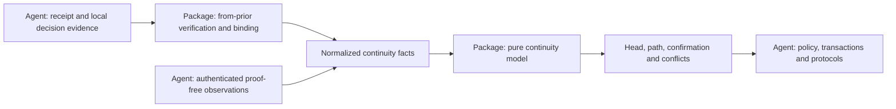
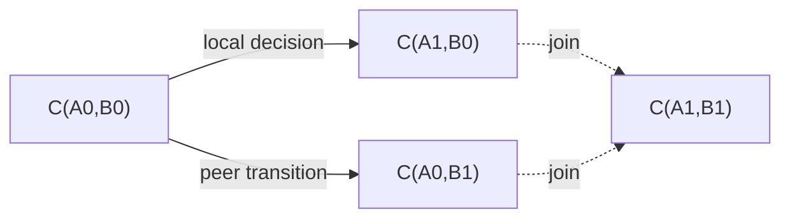

# Continuity domain package design draft

Status: **Exploratory proposal with a prototype in `packages/continuity`. This document defines the intended contract; the prototype is not yet a claim of conformance, and the vault does not consume it. The current phase-1 contract is unchanged.**

The proposed package, `@estoc/continuity`, provides a pure continuity model and a
`from-prior` module for DIDComm proofs. An agent supplies receipt evidence,
issuer resolution material and saved local decisions. The package verifies
proofs, binds them to endpoint evidence, and derives continuity from normalized
facts. The agent uses the results to conduct its own transactions and protocols.

This draft defines the domain boundary, required information and available
queries, including a [merge contract](#merge-contract) for replica histories.
Types and function names illustrate that boundary; they are not a frozen API.

The domain is **continuity between oriented DID pairs**: rotation, ending,
joins when both endpoints rotate, address confirmation and evidence conflicts.
Message content is unnecessary. Supporting the existing Estoc model does,
however, require more than JWTs: their pair context, saved local decisions and
minimal observations of which address a peer actually used.

<a id="boundary"></a>

## 1. Domain boundary

The package answers how an endpoint pair evolves under the supplied evidence,
and what supports each conclusion. The agent decides whether to perform an
application operation using that conclusion.



| Question | Package responsibility | Agent or other module responsibility |
| --- | --- | --- |
| Is this a valid rotation or ending proof? | Parse the JWT, validate claims, bind issuer resolution material to the DID, check key authorization and verify the signature under the supported profile | Obtain and retain the exact issuer material and original evidence |
| Which endpoints does this receipt establish? | Bind the verified proof to supplied receipt evidence and produce scoped facts | Decrypt and authenticate the envelope; establish the actual local recipient and sender |
| Did B0 become B1 in this relationship? | Derive links, contexts and supersession from normalized facts | Use the result under application policy |
| What pair follows rotations by both parties? | Derive joins and a unique head | Select new message endpoints and check their operational availability |
| Does the peer know A1? | Derive confirmation from exact address observations and continuity | Supply authenticated observations and impose any additional operation policy |
| Does the evidence conflict? | Retain branches and report affected contexts; provide no winning-branch selection in the first version | Present diagnostics and obtain additional evidence |
| May this message be processed, replied to or acknowledged? | Provide directed paths that preserve endpoint roles and their supporting evidence | Admission, message identity, ACK targets, thread correlation, protocols and user policy |
| Which channels belong to a contact? | Provide evidence-backed channel history | Contact selection, names, merging, deletion, preferences and UI |
| Can the next operation be created or sent? | Provide continuity queries and proof construction | Local lifecycle, denial, keys, routes, locking, commits, packaging and dispatch |

The package needs no message body, message type, wire ID, ACK list, invitation,
contact ID or vault event envelope. Its public API provides no `canSend()`,
`admitMessage()` or `CommitPlan`. The model has no side effects. Proof creation
uses a signing capability supplied by the host; it does not manage a keystore.

### How far can the input be restricted to from_prior?

| Available information | What it supports | What remains unavailable |
| --- | --- | --- |
| JWT claims alone | The issuer's declared successor or ending, subject to verification | Local/peer roles, the relevant pair and receipt context |
| Verified proof plus roles and pair evidence | Scoped peer changes and the peer side of joins | A local decision saved before notification, and knowledge of a new local address |
| Saved local decisions and minimal address observations as well | The complete continuity model proposed here | Application admission, message protocols and operation eligibility |

The package centralizes the proof rules and continuity rules. It remains
independent of the business meaning of messages carrying those proofs.

<a id="package-api"></a>

## 2. Package entry points and proof processing

Two public entry points separate proof processing from graph derivation:

| Entry point | Input | Output and responsibility |
| --- | --- | --- |
| `@estoc/continuity` | Compatible snapshots of normalized facts | Pure fact merging and synchronous, deterministic continuity queries without JWT parsing, cryptography or I/O |
| `@estoc/continuity/from-prior` | Original JWTs, issuer evidence, receipt context, or a proof creation request with a signer | Parsing, verification, context binding and proof creation under the package's supported profile |

The proof module depends on shared domain types and maintained JOSE/DID
libraries. The model entry point does not import that module or its
cryptographic dependencies. Neither entry point imports vault, agent-core or
storage APIs. The proof module has no built-in network resolver or object
reader; the host obtains and supplies documents and evidence.

The initial proof profile follows Estoc's immutable `did:peer:4` endpoints and
Ed25519 signing keys. That support must be explicit. Additional DID methods or
algorithms require defined validation and document-version rules; accepting
arbitrary keys from a caller is not a substitute for issuer authorization.
General-purpose JWT login or authorization policy is outside this package.

### Initial proof profile

The initial profile has the following receiving and creation rules. These are
package constraints; they do not describe every JWT or DIDComm implementation.

| Item | Rule |
| --- | --- |
| Container and signature | A compact signed JWT with a base64url-encoded JSON payload; `alg` is `EdDSA`, using an Ed25519 key authorized for issuer authentication. Detached or unencoded payloads, nested tokens and unsupported critical headers are not supported. |
| `kid` | Required; its DID portion identifies the issuer and its fragment selects an authorized verification method from the validated issuer material. |
| `iss` and `sub` | `iss` identifies the predecessor. Rotation has a distinct DID in `sub`; ending omits `sub`. Null and empty strings are not omission. |
| `aud` | The ending extension accepts one recipient DID string. A standard basic ending can omit it and still verify. This initial profile does not accept `aud` on rotations or an audience array. Binding is defined under [relationship ending](#ending). |
| `iat` | Required as an integer exactly representable by the API. It records the issuer's declared rotation or ending time, without selecting a branch or proving when a replica learned the claim. |
| `typ` | Creation emits `JWT`. Reception accepts omission, or the case-insensitive values `JWT` and `application/jwt`. Other values are refused. |
| `exp` and `nbf` | Unsupported in this initial profile and refused when present. The verifier neither ignores them nor evaluates a validity window. |
| Repeated JSON member names | Use the last member value consistently in inspection and verified-claim interpretation, as permitted by [RFC 7519](https://www.rfc-editor.org/rfc/rfc7519.html#section-4). Signature verification still covers the original bytes. |

Endpoint comparisons use the validated `did:peer:4` short-form identity. A
presented long form must pass the method's encoded-document hash check before
being equated with its short form. Preserve each original spelling. This rule
applies to issuer, subject, receipt sender and recipient, and ending audience;
it grants no equivalence through shared keys, services, arbitrary `alsoKnownAs`
entries or another DID method. Verification-method fragments remain exact.

The first profile deliberately leaves time-limited proof acceptance outside its
API. This is an interoperability limitation, not a consequence of purity: a
future profile can accept `exp` and `nbf` using a host-supplied evaluation time,
fixed tolerance and maintained JWT validation APIs. That extension must retain
the evaluation context and distinguish accepting a proof on receipt from
preserving previously accepted history. Neither proof verification, creation
nor model derivation reads the current clock implicitly. Historical continuity
uses [an explicit evidence snapshot](#historical-queries), not JWT expiry.

Profile identifiers cover these acceptance rules as well as normalization and
derivation. Changes to a published profile require a new version and explicit
cache/projection migration; a matching version string cannot conceal different
validation behavior. The prototype must match this contract before its initial
profile is treated as stable.

### Parse and verify a proof

The proof module owns JWT form and encoding checks, supported protected-header
parameters, algorithm restrictions, claim validation, issuer/document binding,
key authorization and signature verification. Use maintained JOSE and DID
libraries for their standard algorithms and validation APIs. Any extra strict
parsing must cover a concrete profile requirement that those APIs do not supply.

An inspection API may expose unverified claims so the host can locate issuer
material. Its output must remain distinct from a verified proof. Decoding a
JWT supplies no continuity fact.

Verification receives the original token and exact issuer evidence. Its result
retains the verified rotation or ending claims and provenance: original token,
original DID spellings, canonical endpoint identities, document reference and
verification method. Preserve the signed bytes; normalization for comparisons
does not rewrite the token or its retained document. Verification caches must
be tied to this evidence and the verifier/profile version.

Missing material and failed verification remain distinguishable. The host can
fetch missing material and retry; the pure model does not perform that work.
A verified proof establishes the issuer's declaration, before any receipt
binding or graph conflict analysis.

For this profile, issuer evidence is `{ ref, longForm }`: the retained
long-form `did:peer:4` and its immutable source reference. The package validates
and resolves that long form through the DID library, compares its short-form
identity to `iss`, and takes the authorized signing key from that same resolved
content. A caller-assembled document with a matching `id` is insufficient.
Short-form `iss` and `kid` are accepted with the corresponding long-form
material; a short form alone does not supply a verification key. Missing issuer
material remains a host material gap rather than an invitation to substitute a
key or reconstruct a hash from a reordered resolved document.

### Bind a proof to receipt evidence

Binding is part of the package's `from-prior` module. The host supplies the
exact receipt reference, its unchanged carried token, actual local recipient,
and authenticated sender when present. It preserves the presented DID spelling
as well as its validated canonical identity for profile-specific comparisons.
These are results of envelope verification, not unchecked plaintext headers.
The host also establishes consistency between the plaintext sender and the
authenticated envelope. A null sender is valid ending evidence only when the
host established both an anonymous envelope and the absence of plaintext
`from`; absence of an authenticated sender alone is insufficient.

For rotation, binding checks that the verified token is the receipt's own token
and that its subject matches the authenticated sender under the profile. It
then produces a peer transition at the old pair and an address observation at
the received pair, retaining their shared receipt reference. The issuer supplies
the old peer endpoint; the receipt supplies the fixed local endpoint.

Fact IDs are supplied by the host and remain stable across rebuilding. The
module does not allocate database IDs or silently use arrival order. Binding
reports a mismatch or missing context without producing affirmative facts.
Ending requires the additional context rule discussed under
[relationship ending](#ending); a verified ending token alone does not satisfy it.

The intended flow for a successfully verified and bound rotation is:

```ts
import { deriveContinuity } from "@estoc/continuity";
import { verifyFromPrior, bindFromPrior } from "@estoc/continuity/from-prior";

const proof = await verifyFromPrior(jwt, issuerEvidence);
const binding = bindFromPrior(proof, receiptEvidence, {
  transitionId: "p1",
  observationId: "o1",
});

if (binding.status === "bound") {
  const model = deriveContinuity([...history, ...binding.facts]);
  const head = model.head(selectedChannel);
}
```

A consumer may also supply normalized facts directly to the model when it
implements the same evidence contract. This entry point is a trusted in-process
boundary, not a mechanism for authenticating imported `verified: true` flags.

### Create a proof

The package provides proof creation for rotation and ending. It owns the claim
shape, protected header, encoding and consistency checks. The host supplies the
issuer, selected successor or ending, rotation time, issuer evidence and signing
capability. The package does not choose when to rotate, allocate a successor or
read the clock implicitly.

The signing capability must correspond to a key authorized by the issuer's
profile. Validate the returned proof against the requested claims and issuer
evidence before returning it for persistence. Cryptographic operations use
maintained libraries or the supplied signing provider; the package never reads
a vault seed or manages key storage. The initial signer interface names its
verification method and signs supplied JWS signing-input bytes. This permits
hardware or keystore providers that expose no key object. Manual JWS framing
is limited to supporting that callback; use standard encoding libraries and
the maintained verifier for the resulting token. Non-exportability alone is
not a reason to replace a library that already supports non-exportable keys.

The host saves the chosen proof with its local decision, commits any dependent
notification, and controls dispatch. Generating a proof neither creates a
saved decision nor authorizes sending it.

<a id="identity"></a>

## 3. Identity in the model

A channel is a fixed `C(localDid, peerDid)` with distinct DIDs and fixed roles.
Rotation produces another channel; it does not rewrite existing message pairs.

A `Did` in the model is an already validated canonical identifier. The model
compares identifiers exactly and does not parse documents. Shared keys,
services or contacts do not merge endpoints. Method-specific validation lives
in the proof profile and the host's endpoint authentication; the model itself
is independent of DID method encoding.

B0 appearing in both `C(A0,B0)` and `C(X0,B0)` does not establish a shared
rotation context. For peer changes, a context consists of pairs connected by
local-only links while retaining that peer. Local changes use the symmetric
context through peer-only links. Contexts are derived; no permanent
`relationshipId` replaces the pair.

Pair contexts, local decision prerequisites and conflict handling are model
choices carried forward from Estoc. DIDComm defines the wire proof and its
processing requirements. Those scopes remain separately documented.

<a id="inputs"></a>

## 4. Minimal model inputs

The model receives a snapshot of facts. `FactId` and `EvidenceRef` are stable
opaque references that the host can map to original records; the model does not
dereference evidence. Each fact ID is intended to identify one immutable value
across replicas and remains stable across rebuilding. Conflicting values under
one ID are retained under the merge contract rather than overwritten. Evidence
references identify exact immutable sources. Different carriers of one proof
retain their separate provenance.

Event timestamps, receipt order and authors are unnecessary for graph
selection. The proof module validates JWT `iat`; it does not use it to choose
a winning branch.

```ts
type Did = string;
type FactId = string;
type EvidenceRef = string;
type Channel = Readonly<{ localDid: Did; peerDid: Did }>;

type Change =
  | { kind: "rotate"; successor: Did }
  | { kind: "end" };

type PeerTransition = {
  kind: "peer-transition";
  id: FactId;
  at: Channel;
  change: Change;
  receipt: EvidenceRef;
};

type LocalDecision = {
  kind: "local-decision";
  id: FactId;
  at: Channel;
  change: Change;
  source: FactId | null;
  decision: EvidenceRef;
};

type AddressObservation = {
  kind: "address-observed";
  id: FactId;
  at: Channel;
  carriedTransition: FactId | null;
  receipt: EvidenceRef;
};

type ContinuityFact = PeerTransition | LocalDecision | AddressObservation;
```

### Peer transition

`at` fixes the predecessor pair. A rotation successor replaces only the peer:
`C(A0,B0)` with successor B1 supports `C(A0,B0) -> C(A0,B1)`. An ending records
a terminal assertion by B0 in that context without a successor.

A peer transition requires the proof module's verification and binding
contract: a valid issuer declaration, the exact carrier's authenticated
endpoint evidence, and their checked correspondence. An ending additionally
requires the agreed context binding. The host retains the original JWT,
documents and receipt evidence behind the reference.

This input is an independently verified assertion, not a conclusion about its
usability in the whole graph. B0-to-B1 and B0-to-B2 may each pass verification;
the model still reports their conflict in a shared context. Another carrier
cannot supply missing authentication or proof verification for this one.

### Local decision

A local A0-to-A1 decision may be durable before any notification is sent. The
model needs that saved choice rather than waiting for an inbound carrier.

The host establishes local endpoint ownership and durable decision identity.
The package verifies the saved proof and its agreement with the decision's
issuer and successor or ending. A decision with a source references the exact
`address-observed` fact selected by the host. The model checks that source's
pair and continuity dependencies; business content and application admission
remain outside it.

A local rotation is a candidate link until the model finds independent
confirmation of its exact predecessor address. Without that confirmation it
retains the candidate and its waiting reason. For a rotation, `source: null`
allows the model to find a qualifying observation; a named source must itself
qualify and cannot be silently replaced. An ending has no address confirmation
prerequisite and must use `source: null`; a non-null ending source is invalid
input. Permission to create that local decision remains host operation policy.

Every normalized saved choice participates in competition analysis, even when
its rotation is still waiting for confirmation or an exact dependency. This
does not admit that candidate as a link. Two different saved successors of the
same endpoint in one opposite-side context are a fork before either is sent;
repeated choices of the same successor add provenance rather than competition.

The host allocates the successor, invokes proof creation and atomically saves
the relevant records. The model consumes saved decisions and allocates nothing.

### Address observation

An observation at `C(A1,B0)` establishes that one exact authenticated receipt
was from B0 to local A1. It carries no wire ID, body, protocol or handler result.

The receipt may have no `from_prior`. This extra information is essential to
confirmation: a declaration that A0 became A1 cannot establish that the peer
has learned A1.

`carriedTransition: null` means the receipt really carried no proof. When a
rotation proof was present, the observation must reference its own peer
transition. The model checks the shared receipt reference, local recipient and
successor peer. A pending or invalid proof cannot be dropped to turn its carrier
into a proof-free observation. An ending carrier supplies no observation with
a current authenticated sender through this path.

A valid rotation carrier can produce both a transition and an observation with
different fact IDs and the same receipt reference. A consumer interested only
in peer topology may omit observations; missing confirmation then remains
missing, including for local rotation candidates.

### Verification gaps and snapshot completeness

The host retains pending or invalid source records and the proof module's
diagnostics. Only facts satisfying their own evidence contract enter the model.
Verified conflicting branches are retained regardless of head selection,
blocking or application admission.

The model checks fact structure, references and graph semantics. It cannot
reconstruct cryptographic evidence omitted by an untrusted caller; a branded
verified-proof type helps prevent accidental misuse but is not a security
boundary for imported data.

Every query is relative to the supplied facts. The model cannot establish that
unknown history does not exist or count proofs awaiting verification outside
its input. The host combines model results with material, verification and
binding diagnostics. A temporary unique head does not satisfy an operation's
missing exact prerequisites.

Before allocating a successor, the host must also inspect all saved decisions,
including ones that cannot yet be projected. An empty model decision query does
not authorize allocating another successor when a saved choice lacks evidence.

<a id="merge-contract"></a>

## 5. Merge contract

The model is designed for CRDT-like convergence: replicas with the same
normalized fact variants and model profile derive the same continuity state,
including domain conflicts. This section defines the merge semantics targeted
by the prototype; integration with replica synchronization remains unimplemented.

### 5.1 Scope and compatibility

A merge operates within one logical local identity, with the same local/peer
orientation and evidence trust policy. It does not combine the opposite
perspectives of two communicating agents. A host supplies an identity namespace
and a versioned profile identifying the fact schema, normalization, proof rules
and derivation rules. These tags are compatibility checks, not credentials.
The host authenticates imported source records under its replication trust model;
possession of a replica ID does not authenticate a receipt or local decision.
This source acceptance concerns provenance and integrity, independently of
application admission or current denial policy.

Merge rejects incompatible namespaces or profiles without changing either
input. Unknown versions require an explicit conversion before merging; a
consumer must not drop unknown fields to make a newer fact appear compatible.

The core can expose this shape without learning any storage or transport API:

```ts
type FactSnapshot = Readonly<{
  identityNamespace: string;
  profileVersion: string;
  facts: readonly ContinuityFact[];
}>;

declare function mergeFacts(
  left: FactSnapshot,
  right: FactSnapshot,
): FactSnapshot;

const merged = mergeFacts(left, right);
const view = deriveContinuity(merged.facts);
```

The matching model implementation interprets the profile. Scope/version tags
do not change fact meaning or authorize a caller to relabel another identity's
history. Direct model calls follow the same compatibility and evidence contract.

### 5.2 Identity and equality

The host allocates globally unique, persisted fact IDs in the namespace. An
imported source retains its IDs; an independently recorded receipt has its own
ID even if it carries the same JWT. Projection IDs can be derived from a stable
source ID and fact kind, or saved with that source. Rebuilding must not allocate
new IDs. Local row positions, wall-clock time alone and import order are not
identity schemes.

Within one profile, exact equality means identical canonical bytes for the
entire schema-valid fact, including its ID, kind, endpoints and references.
Use [RFC 8785 JCS](https://www.rfc-editor.org/rfc/rfc8785.html) through a maintained
implementation. Required nulls are explicit; missing required fields and extra
fields fail the version's schema. Object property order is irrelevant, while
string values and source references remain exact. This encoding is for fact
comparison; it does not canonicalize or rewrite a signed JWT.

Local receipt positions, verification-cache timestamps and diagnostic display
text are outside fact equality. Evidence references are also stable across
replicas and identify immutable material. A host must not resolve the same
reference to whichever local document happens to be available.

### 5.3 Union and merge laws

Logically, a snapshot maps each fact ID to a set of distinct canonical values.
The public facts array can represent these values without introducing a new
stored event type. A bucket with multiple values is retained in full.

```text
merge(A, B)[id] = A[id] union B[id]

merge(A, B) = merge(B, A)
merge(merge(A, B), C) = merge(A, merge(B, C))
merge(A, A) = A
```

These laws apply to compatible, schema-valid inputs and compare retained
values, independent of array enumeration order. Merge returns a new snapshot;
it does not mutate an input. Exact duplicates add nothing. Different IDs retain
their distinct provenance even when they establish the same graph edge.

No last-writer-wins rule, replica priority, JWT time or delivery order selects a
value. For reproducible serialization and diagnostics, enumerate IDs and then
canonical values in UTF-8 byte order; this order grants no domain precedence.

There is no deletion, replacement or conflict-clearing merge operation in this
version. A transport may send deltas, but omission from a partial transfer never
deletes a retained value. Local cache eviction is not evidence deletion. Any
future compaction must preserve the information required to reproduce identity
conflicts, dependencies and query results before it can replace this full set.

### 5.4 Collisions and domain conflicts

Two values under one fact ID are an **identity conflict**. Keep both, expose the
variants, and make no selection between them. The conflicting identity supplies
no usable witness or link. References to it, including a decision's `source`
and an observation's `carriedTransition`, report conflict rather than choosing
a value or treating the reference as merely absent.

Retain every variant's endpoint claims for diagnostics and conflict scoping.
Evaluate variants as distinct values, identified by the fact ID and canonical
value together. A peer-transition variant already carries its independent
verification and binding evidence. A local-rotation variant enters positive
closure only when its own exact references resolve and its predecessor is
independently confirmed without that candidate. Until then its saved choice
still participates in competition, but creates no link. A reference naming a
multi-value ID resolves to no variant, even if one would satisfy the caller.

These variants may contribute diagnostic positive links and joins; none is a
usable witness. Any usable join, confirmation or path relying on the ambiguous
identity loses that support. A head query must not hide a collided forward
change and fall back to the predecessor. Independent, unambiguous support for
the same uncontested change can still establish a usable result. This rule
applies equally to peer rotations, confirmed local rotations and endings.
The collided fact's status remains an identity conflict, and exact references
to it remain unusable; an independent result does not repair that identity.
It also cannot conceal any variant declaring a different continuation.

Scope a domain conflict using the actual variant claims and their opposite-side
context. An ID appearing in a conflict does not make all other variants' pairs
members of that domain conflict. An identity conflict is retained globally by
ID, while its effect on a query follows the claims or dependencies relevant to
that query. Unrelated contexts with independent support remain usable. Expose
the variant values so diagnostics do not confuse this with choosing a winner.

Different IDs declaring A0-to-A1 and A0-to-A2 in one local rotation context are
instead a **domain conflict**. Both facts may have valid independent evidence.
They remain in positive history and produce the same conflict on every replica
that has them. Different IDs supporting A0-to-A1 again add provenance without
creating a competing successor or authorizing another notification.

Neither kind of conflict is cleared by replaying one preferred value or by
omitting the other from a later transfer. Branch reconciliation and repairing
ambiguous identities require a separately specified operation; this draft
defines neither as an implicit consequence of merge.

### 5.5 Evidence, missing dependencies and projection

The merge helper operates on normalized facts satisfying the input evidence
contract. It is not an import verifier. A host integrating replica histories
must first retain the union of original source variants and their evidence,
then verify and project against that combined source snapshot. Material may
arrive separately, but the host must retain pending records for reevaluation.

Do not merge cached heads, confirmation Booleans or `verified` flags. Reuse a
verification cache only while its exact token, document, source bindings and
profile remain valid in the combined evidence. If a newly learned source
contradiction invalidates a prior projection, rebuild the normalized input;
blindly unioning yesterday's verified-fact caches does not meet this contract.
The retained source inventory and the currently usable projection are different
layers; only the retained inventory is required to grow by union.

An evidence-reference collision must preserve all conflicting source values
and prevent the affected sources from being treated as complete. The host
reports this as an integrity diagnostic and blocks operations depending on
that reference. If the contradiction has projected fact variants, pass all
variants to the core so it can report their identity conflict. Missing or
invalid raw sources that cannot be projected remain host diagnostics; their
absence from the core is never a positive completeness assertion.

Inside a fact snapshot, a missing referenced fact is unresolved. Another
replica may supply that exact dependency and permit a new result. Two different
receipts still cannot contribute separate halves of one complete witness.
Verification or binding failures do not become valid because another replica
reported success. Hosts preserve the minimal source and proof material needed
to reproduce validation; transport and evidence retention remain their duties.

Publish a model view from one complete projection of the selected merged
snapshot. An intermediate input prefix cannot authorize an operation merely
because the conflicting branch has not been projected yet. This requirement
does not claim that a replica can detect all evidence still unknown to it.

### 5.6 Convergence and operation boundaries

The fact union is commutative, associative and idempotent. Deterministic
derivation over the same fact variants and model profile gives strong
convergence of query results. Usable heads and paths need not grow monotonically:
more retained evidence may reveal conflict and remove previously usable support.
An identical conflict result is a converged state.

An integrated system can claim strong eventual consistency only when its hosts
also converge on source acceptance and evidence validation, relevant source
variants and material eventually reach every participating replica, and
validation and derivation terminate for finite supported inputs. The package
does not provide that dissemination or membership protocol. Equal metadata
tags alone do not establish equal evidence, verifier behavior or completeness.

Convergence provides no coordination for concurrent operations. Two offline
replicas may each allocate a different successor from A0 and send its proof
before learning the other's decision. Merge exposes the fork without undoing
those sends. A unique active writer or another operation-coordination mechanism
belongs to the host. Local locking alone does not coordinate remote replicas.
Merge itself creates no admission, ACK, notification, dispatch or replay action.

### 5.7 Replica-local history

<a id="historical-queries"></a>

The merged present does not reconstruct what each replica knew in the past.
Historical queries use a host-selected snapshot identified by that replica's
revision or another explicit evidence cut. Retain the verification/binding
state and profile needed for that interpretation, or retain the actual decision
and its supporting evidence when auditing an operation.

Event creation time, JWT `iat` and a source's early receipt time cannot backdate
knowledge gained through a later import or verification. A new merge creates a
new current view; it does not rewrite an earlier replica snapshot or recorded
admission. There is no global wall-clock ordering in this contract. The core
continues to evaluate the facts supplied for the chosen snapshot.

To ask whether a message had usable continuity at an earlier operation, the
host supplies the normalized snapshot visible to that replica then and queries
the message's fixed endpoint pair against it. This answers a continuity
prerequisite only. Message expiry, admission and protocol validity remain host
decisions, using their own explicit evaluation time. The package has no
`validMessageAt(time)` query and cannot reconstruct past knowledge by filtering
the current fact set on `iat`.

### 5.8 Existing vault integration

The current [vault import contract](vault-sqlite.md#import) retains the target
row on an event-ID content collision and reports the conflict. Accepted event
rows alone therefore cannot implement this proposal's preservation of all
variants. A conforming future adapter must durably retain and exchange the
conflicting source variants and their evidence, then expose ambiguity during
projection. A local-only diagnostic or target-selected row is insufficient.
This draft does not change current vault import behavior.

### 5.9 Acceptance cases

Implementation and integration checks must cover:

- The three merge laws and arbitrary delivery order/batching, including snapshots with identity conflicts and an empty compatible snapshot.
- Stable source/projection IDs across replicas and rebuilds; repeated carrier evidence adds no new successor, while independent receipt provenance remains distinct.
- Canonical equality with reordered object properties; malformed or unknown-version input is refused without a partial mutation.
- Same-ID variants arriving in either order or through a third replica; all variants and conflict results survive retransmission, with no target preference.
- Collision propagation through exact source references, observations and joins; independent support for an uncontested change remains usable, without predecessor fallback or hidden alternatives.
- Independently supported local rotations and endings surviving an equivalent collided claim; distinct variants in unrelated contexts cannot spread one context's fork into the other.
- Separate material arrival, pending dependencies and newly contradicted sources; cached verification results cannot conceal the merged evidence.
- Opposite-side rotations forming a supported join, concurrent same-side rotations producing conflict, and ending competing with rotation regardless of arrival order.
- Equal final views after hosts have the same accepted sources, evidence and profile, while preserving their different historical snapshots and recorded decisions.
- Merge and rebuild producing no external operation or dispatch, and demonstrating that a local lock cannot prevent independent replica decisions.

<a id="derivation"></a>

## 6. Derivation responsibilities

Derivation follows the evidence dependency direction:

1. **Input consistency.** Check pairs, successors, IDs and references under the [merge contract](#merge-contract). Retain same-ID variants and propagate their identity conflict; missing referenced facts remain unresolved.
2. **Positive closure.** Start with verified peer rotations and local rotations with independently confirmed predecessors, then compute the least closure of supported joins. Retain all independently supported branches. Endings remain terminal assertions scoped through opposite-side links, without an empty-endpoint edge.
3. **Contexts and conflicts.** Derive opposite-side contexts from the full positive closure. Within them, compare all normalized saved local decisions and independently verified peer changes, including local choices not yet admitted as links. Detect different same-side successors, ending versus rotation of the same endpoint, cycles and local/peer identity collisions. Repeated declarations of the same change do not compete. Event time and JWT `iat` select no winner.
4. **Usable continuity.** Exclude conflict-affected derivations and recompute closure with exact source and confirmation support. Links and joins losing their required support provide no usable path. Usability here concerns continuity alone.

For a proof-bearing observation, positive support requires its own independently
verified transition. Usable support additionally requires that transition to
be unaffected by context conflict. A proof-free observation confirms only its
exact local recipient; it cannot restore usable continuation through a
conflicted context.

A local rotation's confirmation uses links already established without that
decision or its descendants. A0-to-A1 cannot supply its own A0 prerequisite,
and a ring of mutually waiting decisions establishes nothing. The host does
not pass a graph-derived `confirmed: true` back as independent input.

Positive topology and usable paths are separately queryable. The former serves
history and conservative host policy, such as propagating a block over known
successors. The latter supplies continuity prerequisites for operations. The
model neither stores blocks nor decides their policy.

<a id="outputs"></a>

## 7. Available information

| Query | Domain result | Boundary |
| --- | --- | --- |
| `head(channel)` | A unique usable forward pair, ending, or reason it cannot be derived | Does not establish key/route availability, absence of blocking or permission to send |
| `changes(channel, side)` | Replacements and endings in that side's context, with support; usable for supersession checks | Does not supersede every relationship sharing a DID |
| `path(from, to)` | A directed usable path preserving endpoint roles and its supporting facts | Does not prove message receipt or authorize an ACK by itself |
| `confirmation(localDid, peerDid)` | Whether that peer or a usable peer successor wrote to the exact local DID, with observations and paths | Confirms no other local address, wire ID or application admission |
| `history(channel)` | Positive links, joins, endings, contexts and provenance | Historical connectivity establishes neither current usability nor contact identity |
| `localDecisions(channel)` | Supplied local decisions and their status in the relevant peer context | Excludes saved decisions not yet projected; insufficient on its own for successor allocation |
| `conflicts()` / `status(factId)` | Identity-conflict variants, affected scope, supporting facts, missing dependencies and domain contradictions | Selects no winner, deletes no history and creates no repair operation |

Head results distinguish different conditions instead of returning one `null`:

```ts
type HeadResult =
  | { status: "head"; channel: Channel; support: FactId[] }
  | { status: "ended"; endings: FactId[] }
  | { status: "unresolved"; waiting: FactId[]; missing: FactId[] }
  | { status: "conflict"; facts: FactId[] }
  | { status: "no-evidence" };
```

A head may be the original pair when it is independently established and has
no known forward choice requiring resolution. Resolve head outcomes in this
order: relevant conflict, an established ending, unresolved forward choices,
then a unique usable head. An equivalent ambiguous claim does not prevent a
head or ending supported entirely by independent unambiguous facts, but a
competing change still does. Waiting and identity diagnostics remain available
through decision and fact queries when another result has precedence.

`no-evidence` is reserved for a pair neither mentioned by any fact, including
a declared successor, nor covered by derived history or conflict scope. A pair
mentioned only as a waiting local decision's successor is `unresolved`; a fork
successor is `conflict`, even without a positive link. If only ambiguous
positive links establish a pair and no independent evidence establishes it,
its head is `conflict`. A known forward choice without usable continuation
never falls back to the old pair. These diagnostic rules add no usable edge or
address confirmation, and `no-evidence` never authorizes successor allocation.

An ending and rotation of the same side in one context are competing choices,
including an unconfirmed local rotation. A valid ending can take precedence
over a waiting opposite-side rotation: there is no continuing joined head.

Model-level unresolved results describe reference or confirmation gaps visible
to the core. Material and proof-verification gaps remain separate diagnostics
outside that input. Every result may change with the next snapshot.

Queries preserve support rather than only a Boolean. The initial API returns
one deterministic usable path and a complete supporting fact set for it;
confirmation lists the eligible observations, with one complete witness for
each. A confirmation witness includes the exact observation, its own carried
transition when present, the peer-only path from the queried pair to that
observer, and all recursive prerequisites of that path. Local-link support
also includes the decision and its independent predecessor confirmation.
Those facts must suffice to rederive the asserted links or confirmation under
the same profile. Sorting, shortest-path selection or combining provenance
must not discard a prerequisite. Support need not be a minimal fact set.

This API does not enumerate every alternative route or every minimal witness.
The support of positive diagnostic history can include conflicted identities;
it is provenance for analysis, not a usable witness. A usable witness proves
its affirmative links or observations, not the absence of conflicting or
missing evidence outside the snapshot. An unchanged head and a zero-step path
do not themselves prove an address observation or any rotation.

If an agent additionally requires an admitted confirmation observation, it
can inspect the returned observations and their witnesses. Failure of one
selected route to meet further host policy does not prove that no qualifying
route exists. A policy needing exhaustive alternatives requires a richer
support query before integration. Do not filter unadmitted facts out of the
model to search for a preferred result: that could hide rotation or conflict.
No policy may combine incomplete carriers into one complete receipt witness.

The same fact set produces the same semantic result regardless of enumeration
order or storage backend. Additional facts may expose conflict and invalidate
a previously usable head or path. Query authority is therefore not monotonic.
Complete snapshot derivation is sufficient initially; incremental indexing is
a later performance choice. The [merge contract](#merge-contract) defines the
scope of convergence and its host integration prerequisites.

<a id="examples"></a>

## 8. Concrete data flows

A and B below stand for validated canonical DIDs.

### Receiving a B0-to-B1 proof

The agent authenticates a receipt from B1 to A0 and supplies its token and issuer
evidence to the proof module. Successful verification and binding produce:

```ts
const facts: ContinuityFact[] = [
  {
    kind: "peer-transition", id: "p1",
    at: { localDid: "A0", peerDid: "B0" },
    change: { kind: "rotate", successor: "B1" }, receipt: "receipt-1",
  },
  {
    kind: "address-observed", id: "o1",
    at: { localDid: "A0", peerDid: "B1" },
    carriedTransition: "p1", receipt: "receipt-1",
  },
];

const continuity = deriveContinuity(facts);
const head = continuity.head({ localDid: "A0", peerDid: "B0" });
```

Absent other contradictions, the head is `C(A0,B1)`. Observation o1 establishes
that B1 knows A0 and, through p1, supports confirmation in the original B0
context. It does not affect `C(X0,B0)` without connecting local-only continuity
evidence. The agent separately decides whether to process or reply to the
original message.

### Both parties rotate

At `C(A0,B0)`, an independent observation confirms A0. Add a local A0-to-A1
decision and a peer B0-to-B1 transition:



The model derives head `C(A1,B1)` with support from both sides. It fabricates no
receipt from B1 to A1, so **A1 is not confirmed by this join**. The agent uses
exact-address confirmation when deciding whether new packages must carry its
saved A0-to-A1 proof.

### Confirmation without from_prior

A later authenticated receipt from B1 to A1 carries no proof. The host adds:

```ts
{
  kind: "address-observed", id: "o2",
  at: { localDid: "A1", peerDid: "B1" },
  carriedTransition: null, receipt: "receipt-2",
}
```

Observation o2 now supports confirmation of A1. Its shape is the same for chat,
Ping or any other protocol. The agent can use the result when preparing a new
package; a changed query result does not rewrite an existing package.

### Repetition and competition

Multiple valid carriers of the same B0-to-B1 proof add support without adding
a different successor. An independently valid B0-to-B2 proof in the same context
creates a visible conflict. Receipt order, JWT time and contact preference
select neither B1 nor B2.

### Using results in an agent transaction

Under its operation lock or snapshot discipline, the agent combines head,
path and confirmation results with saved decisions, admission, denial,
resource availability and protocol rules. It saves any new facts and projects
a new snapshot. Derived query results do not become independent evidence.

The model carries no database revision. The host keeps validation and commit
on the same valid snapshot, or checks again when its version changes. This is
an integration contract for using the model.

<a id="ending"></a>

## 9. Relationship ending

[DIDComm v2.1 Ending a Relationship](https://identity.foundation/didcomm-messaging/spec/v2.1/#ending-a-relationship)
expresses ending by omitting `sub` from the `from_prior` JWT and omitting `from`
from its carrier. Absence is distinct from a null or empty-string subject. The
proof module recognizes the ending claim shape; the model represents it as
`change: { kind: "end" }` without creating `C(A,null)`.

Rotation can compare the subject to an authenticated current sender; ending
lacks that sender. A valid signature establishes the issuer's declaration,
without by itself proving a recipient-specific relationship scope. The
standard's basic ending form does not require a signed recipient or audience.

The initial package profile separates verification from binding:

- An otherwise valid basic ending without `aud` verifies and is retained as an issuer declaration. Binding returns `unbound` and produces no `peer-transition` fact.
- The recipient-binding extension requires one signed DID in `aud`, the exact JWT from the retained receipt, an actual recipient canonically equal to that audience, an anonymous envelope and an absent plaintext `from`. The recipient and issuer must differ. Successful binding yields an ending at `C(recipient, issuer)`.
- A token mismatch, authenticated sender on an ending receipt, or nonmatching audience is a binding mismatch. Missing audience is insufficient context, not a bad signature.
- Proof creation for an ending requires its recipient audience in this initial API. The host supplies that selected recipient; the package validates the returned proof and leaves packaging and dispatch to the host.

The signed audience is a package extension, not a DIDComm requirement. Basic
endings from agents without this extension are verifiable but cannot
automatically terminate a scoped relationship under this profile. Retention
and diagnostics for those unbound proofs remain host responsibilities. The
package must not claim complete interoperability for received basic endings.

This boundary preserves the model's allowance for one DID in multiple
independent pairs. Our threat model includes a recipient reusing a valid token
in a new anonymous envelope to another recipient; decryption alone does not
bind the issuer's declaration to that second relationship. Seeing only one
local relationship does not establish that the remote DID is globally
pairwise. Supporting automatic binding of the basic form therefore needs a
separate profile with justified DID usage constraints, independent context
evidence, or an explicitly weaker transfer guarantee. A caller-selected pair
or added graph field supplies none of that evidence.

Proposed model semantics, separate from the standard's wire representation:

- An ending is a terminal assertion for a side, endpoint and context, retaining the original pair and evidence. It neither deletes contacts, messages, DIDs or keys nor acts as a local block.
- A peer ending applies across the local-only context retaining that peer. A local ending applies symmetrically across the peer-only context. Unconnected relationships sharing a DID are unaffected.
- An ending competing with a successor for the same endpoint/context is a conflict, without a time-based winner. B0-to-B1 followed by B1 ending is ordinary forward history, not competition at one predecessor.
- If one side ends while the other rotates, the ending extends with the opposite-side context and supplies no continuing joined head. Two endings do not create an empty pair.
- An ending carrier supplies neither successor-address confirmation nor evidence that an application message was processed.

The extension's proof and binding contract is defined here; its agent flow and
basic-form interoperability still require integration work. Choosing to end
locally, notifying the peer, handling delayed messages and governing existing
outbound dispatch remain agent operations.

<a id="extraction"></a>

## 10. Extraction from the existing implementation

| Existing location | Extraction direction |
| --- | --- |
| [`vault/src/fold/continuity.ts`](../../packages/vault/src/fold/continuity.ts) | Move graph, closure, joins, contexts, conflicts, head and confirmation into the model; expose `ackPath` as a general path query; leave `blocked` with its policy consumer |
| [`vault/src/fold/channels.ts`](../../packages/vault/src/fold/channels.ts) | Keep event reading, local key/entity evidence and document retrieval in the adapter; call package proof verification and binding, then project minimal facts with exact source dependencies |
| [`vault/src/from-prior.ts`](../../packages/vault/src/from-prior.ts) | Move parsing, claim validation, issuer authorization, signature verification and proof creation into the formal `from-prior` module; keep retained-document lookup and vault key ownership with the host |
| [`vault/src/fold/contacts.ts`](../../packages/vault/src/fold/contacts.ts) | Keep contact payloads, selections and preferences in their existing domain, consuming continuity queries |
| [`agent-core/src/rotate.ts`](../../packages/agent-core/src/rotate.ts), [`agent-core/src/receive/receipt.ts`](../../packages/agent-core/src/receive/receipt.ts) | Keep locking, envelope receipt, successor allocation, decision persistence and notifications in the agent; provide evidence and signing capability to package APIs |

Dependency direction is `agent/vault adapter -> continuity`, with the proof
module using shared domain types and JOSE/DID libraries. Shared validation or
encoding helpers must not pull vault or event-store runtime dependencies into
the package. Fact IDs impose no storage format. The host need not use event
sourcing, but must supply a consistent snapshot with traceable evidence.

First align the prototype's proof processing and derivation with these minimal
inputs and query contracts. Then implement the vault projection and the agent
flow for the defined ending extension, preserving diagnostics for basic unbound
endings. The initial objective is shared continuity and proof rules, before
designing further command or transaction abstractions.

Implementation acceptance should cover malformed tokens, unsupported headers
or algorithms, unauthorized keys, wrong issuer documents, altered signed bytes,
carrier/subject mismatch, signer/request mismatch, and rotation/ending claim
shapes. It also covers short-form issuers with retained long-form evidence,
key substitution, omitted and media-type-equivalent `typ`, repeated JSON
members, unsupported time claims, absence of clock reads, unbound basic endings
and the recipient-binding extension. Model cases include input permutations
and rebuilding, multiple carriers, independent contexts, joins without fabricated confirmation,
proof-free confirmation, exact-source dependencies, missing references,
self-supporting or cyclic decisions, conflicting IDs, competing successors,
cycles and ending/rotation interactions. The merge contract adds replica union,
identity-conflict preservation and convergence cases. Returned link and
confirmation witnesses must replay from their complete support, including
multi-hop and derived-join prerequisites. This draft changes no current vault
runtime behavior.

<a id="open-questions"></a>

## 11. Remaining design questions

1. **Basic ending interoperability.** The initial signed-audience extension is defined; automatic binding of basic endings without it remains unsupported. Any additional profile must state its DID usage assumptions, evidence and transfer guarantees before adding an acceptance path.
2. **Alternative support.** The initial API supplies complete deterministic witnesses and alternative observations. An integration requiring policy-specific route selection needs a richer query or traceable support graph, without enumerating exponentially many paths or removing conflicts from its input.
3. **Combined diagnostics.** Integrate core unresolved results with missing-material, verification and binding results so a temporary unique head is not mistaken for complete operation evidence.
4. **Time-limited proof profile.** The initial profile refuses `exp` and `nbf`. Supporting them later requires explicit evaluation time, retained validation context, profile migration and a separate rule for historical accepted evidence.
5. **Vault conflict retention.** Design storage and interchange for all colliding source variants before claiming that the existing vault adapter satisfies the merge contract.

<a id="references"></a>

## 12. References

- [Current channel and continuity model](channels.md#continuity): the rotation behavior baseline for extraction.
- [Current address and contact policy](relationships.md#what-it-is-for): the boundary between continuity and application policy.
- [Current vault import](vault-sqlite.md#import): existing event-ID collision handling and the adapter gap.
- [RFC 8785 JCS](https://www.rfc-editor.org/rfc/rfc8785.html): canonical encoding for normalized fact equality.
- [DIDComm DID Rotation](https://identity.foundation/didcomm-messaging/spec/v2.1/#did-rotation): wire proofs and address confirmation.
- [DIDComm Ending a Relationship](https://identity.foundation/didcomm-messaging/spec/v2.1/#ending-a-relationship): the ending wire representation.
- [Peer DID method 4](https://identity.foundation/peer-did-method-spec/#method-4-short-form-and-long-form): document-bound identity and short/long-form equivalence.
- [RFC 7519](https://www.rfc-editor.org/rfc/rfc7519.html): JWT claim interpretation and the optional `typ` header.
- [RFC 7797](https://www.rfc-editor.org/rfc/rfc7797.html#section-1): JWTs do not use the JWS unencoded-payload option.
