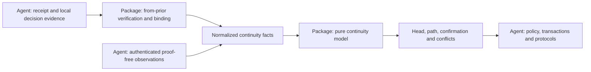
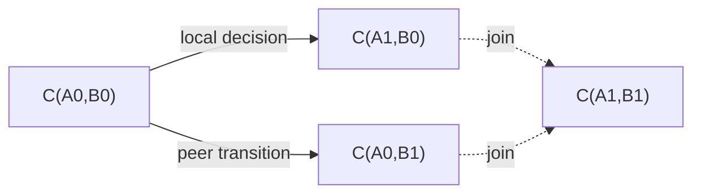

# Continuity domain package design draft

Status: **Exploratory proposal. Not implemented; the current phase-1 contract is unchanged.**

The proposed package, `@estoc/continuity`, provides a pure continuity model and a
`from-prior` module for DIDComm proofs. An agent supplies receipt evidence,
issuer documents and saved local decisions. The package verifies proofs, binds
them to endpoint evidence, and derives continuity from normalized facts. The
agent uses the results to conduct its own transactions and protocols.

This draft defines the domain boundary, required information and available
queries. Types and function names illustrate that boundary; they are not a
frozen API.

The domain is **continuity between oriented DID pairs**: rotation, ending,
joins when both endpoints rotate, address confirmation and evidence conflicts.
Message content is unnecessary. Supporting the existing Estoc model does,
however, require more than JWTs: their pair context, saved local decisions and
minimal observations of which address a peer actually used.

<a id="boundary"></a>

## 1. Domain boundary

The package answers how an endpoint pair evolves under the supplied evidence,
and what supports each conclusion. The agent decides whether to perform an
application operation using that conclusion.



| Question | Package responsibility | Agent or other module responsibility |
| --- | --- | --- |
| Is this a valid rotation or ending proof? | Parse the JWT, validate claims, check issuer key authorization and verify the signature under the supported profile | Obtain the exact issuer document and retain the original evidence |
| Which endpoints does this receipt establish? | Bind the verified proof to supplied receipt evidence and produce scoped facts | Decrypt and authenticate the envelope; establish the actual local recipient and sender |
| Did B0 become B1 in this relationship? | Derive links, contexts and supersession from normalized facts | Use the result under application policy |
| What pair follows rotations by both parties? | Derive joins and a unique head | Select new message endpoints and check their operational availability |
| Does the peer know A1? | Derive confirmation from exact address observations and continuity | Supply authenticated observations and impose any additional operation policy |
| Does the evidence conflict? | Retain branches and report affected contexts; provide no winning-branch selection in the first version | Present diagnostics and obtain additional evidence |
| May this message be processed, replied to or acknowledged? | Provide directed paths that preserve endpoint roles and their supporting evidence | Admission, message identity, ACK targets, thread correlation, protocols and user policy |
| Which channels belong to a contact? | Provide evidence-backed channel history | Contact selection, names, merging, deletion, preferences and UI |
| Can the next operation be created or sent? | Provide continuity queries and proof construction | Local lifecycle, denial, keys, routes, locking, commits, packaging and dispatch |

The package needs no message body, message type, wire ID, ACK list, invitation,
contact ID or vault event envelope. Its public API provides no `canSend()`,
`admitMessage()` or `CommitPlan`. The model has no side effects. Proof creation
uses a signing capability supplied by the host; it does not manage a keystore.

### How far can the input be restricted to from_prior?

| Available information | What it supports | What remains unavailable |
| --- | --- | --- |
| JWT claims alone | The issuer's declared successor or ending, subject to verification | Local/peer roles, the relevant pair and receipt context |
| Verified proof plus roles and pair evidence | Scoped peer changes and the peer side of joins | A local decision saved before notification, and knowledge of a new local address |
| Saved local decisions and minimal address observations as well | The complete continuity model proposed here | Application admission, message protocols and operation eligibility |

The package centralizes the proof rules and continuity rules. It remains
independent of the business meaning of messages carrying those proofs.

<a id="package-api"></a>

## 2. Package entry points and proof processing

Two public entry points separate proof processing from graph derivation:

| Entry point | Input | Output and responsibility |
| --- | --- | --- |
| `@estoc/continuity` | A snapshot of normalized facts | Synchronous, deterministic continuity queries without JWT parsing, cryptography or I/O |
| `@estoc/continuity/from-prior` | Original JWTs, issuer evidence, receipt context, or a proof creation request with a signer | Parsing, verification, context binding and proof creation under the package's supported profile |

The proof module depends on shared domain types and maintained JOSE/DID
libraries. The model entry point does not import that module or its
cryptographic dependencies. Neither entry point imports vault, agent-core or
storage APIs. The proof module has no built-in network resolver or object
reader; the host obtains and supplies documents and evidence.

The initial proof profile follows Estoc's immutable `did:peer:4` endpoints and
Ed25519 signing keys. That support must be explicit. Additional DID methods or
algorithms require defined validation and document-version rules; accepting
arbitrary keys from a caller is not a substitute for issuer authorization.
General-purpose JWT login or authorization policy is outside this package.

### Parse and verify a proof

The proof module owns JWT form and encoding checks, supported protected-header
parameters, algorithm restrictions, claim validation, issuer/document binding,
key authorization and signature verification. Use maintained JOSE and DID
libraries for their standard algorithms and validation APIs. Any extra strict
parsing must cover a concrete profile requirement that those APIs do not supply.

An inspection API may expose unverified claims so the host can locate issuer
material. Its output must remain distinct from a verified proof. Decoding a
JWT supplies no continuity fact.

Verification receives the original token and exact issuer evidence. Its result
retains the verified rotation or ending claims and provenance: original token,
original DID spellings, canonical endpoint identities, document reference and
verification method. Preserve the signed bytes; normalization for comparisons
does not rewrite the token or its retained document. Verification caches must
be tied to this evidence and the verifier/profile version.

Missing material and failed verification remain distinguishable. The host can
fetch missing material and retry; the pure model does not perform that work.
A verified proof establishes the issuer's declaration, before any receipt
binding or graph conflict analysis.

### Bind a proof to receipt evidence

Binding is part of the package's `from-prior` module. The host supplies the
exact receipt reference, its unchanged carried token, actual local recipient,
and authenticated sender when present. It preserves the presented DID spelling
as well as its validated canonical identity for profile-specific comparisons.
These are results of envelope verification, not unchecked plaintext headers.

For rotation, binding checks that the verified token is the receipt's own token
and that its subject matches the authenticated sender under the profile. It
then produces a peer transition at the old pair and an address observation at
the received pair, retaining their shared receipt reference. The issuer supplies
the old peer endpoint; the receipt supplies the fixed local endpoint.

Fact IDs are supplied by the host and remain stable across rebuilding. The
module does not allocate database IDs or silently use arrival order. Binding
reports a mismatch or missing context without producing affirmative facts.
Ending requires the additional context rule discussed under
[relationship ending](#ending); a verified ending token alone does not satisfy it.

The intended flow for a successfully verified and bound rotation is:

```ts
import { deriveContinuity } from "@estoc/continuity";
import { verifyFromPrior, bindFromPrior } from "@estoc/continuity/from-prior";

const proof = await verifyFromPrior(jwt, issuerEvidence);
const binding = bindFromPrior(proof, receiptEvidence, {
  transitionId: "p1",
  observationId: "o1",
});

if (binding.status === "bound") {
  const model = deriveContinuity([...history, ...binding.facts]);
  const head = model.head(selectedChannel);
}
```

A consumer may also supply normalized facts directly to the model when it
implements the same evidence contract. This entry point is a trusted in-process
boundary, not a mechanism for authenticating imported `verified: true` flags.

### Create a proof

The package provides proof creation for rotation and ending. It owns the claim
shape, protected header, encoding and consistency checks. The host supplies the
issuer, selected successor or ending, rotation time, issuer evidence and signing
capability. The package does not choose when to rotate, allocate a successor or
read the clock implicitly.

The signing capability must correspond to a key authorized by the issuer's
profile. Validate the returned proof against the requested claims and issuer
evidence before returning it for persistence. Cryptographic operations use
maintained libraries or the supplied signing provider; the package never reads
a vault seed or manages key storage. The precise signer interface remains an
API design choice, including how to support non-exportable keys.

The host saves the chosen proof with its local decision, commits any dependent
notification, and controls dispatch. Generating a proof neither creates a
saved decision nor authorizes sending it.

<a id="identity"></a>

## 3. Identity in the model

A channel is a fixed `C(localDid, peerDid)` with distinct DIDs and fixed roles.
Rotation produces another channel; it does not rewrite existing message pairs.

A `Did` in the model is an already validated canonical identifier. The model
compares identifiers exactly and does not parse documents. Shared keys,
services or contacts do not merge endpoints. Method-specific validation lives
in the proof profile and the host's endpoint authentication; the model itself
is independent of DID method encoding.

B0 appearing in both `C(A0,B0)` and `C(X0,B0)` does not establish a shared
rotation context. For peer changes, a context consists of pairs connected by
local-only links while retaining that peer. Local changes use the symmetric
context through peer-only links. Contexts are derived; no permanent
`relationshipId` replaces the pair.

Pair contexts, local decision prerequisites and conflict handling are model
choices carried forward from Estoc. DIDComm defines the wire proof and its
processing requirements. Those scopes remain separately documented.

<a id="inputs"></a>

## 4. Minimal model inputs

The model receives a snapshot of facts. `FactId` and `EvidenceRef` are stable
opaque references that the host can map to original records; the model does not
dereference evidence. Fact IDs are unique across the combined snapshot and
stable across rebuilding. Evidence references identify exact immutable sources.
Different carriers of one proof retain their separate provenance.

Event timestamps, receipt order and authors are unnecessary for graph
selection. The proof module validates JWT `iat`; it does not use it to choose
a winning branch.

```ts
type Did = string;
type FactId = string;
type EvidenceRef = string;
type Channel = Readonly<{ localDid: Did; peerDid: Did }>;

type Change =
  | { kind: "rotate"; successor: Did }
  | { kind: "end" };

type PeerTransition = {
  kind: "peer-transition";
  id: FactId;
  at: Channel;
  change: Change;
  receipt: EvidenceRef;
};

type LocalDecision = {
  kind: "local-decision";
  id: FactId;
  at: Channel;
  change: Change;
  source: FactId | null;
  decision: EvidenceRef;
};

type AddressObservation = {
  kind: "address-observed";
  id: FactId;
  at: Channel;
  carriedTransition: FactId | null;
  receipt: EvidenceRef;
};

type ContinuityFact = PeerTransition | LocalDecision | AddressObservation;
```

### Peer transition

`at` fixes the predecessor pair. A rotation successor replaces only the peer:
`C(A0,B0)` with successor B1 supports `C(A0,B0) -> C(A0,B1)`. An ending records
a terminal assertion by B0 in that context without a successor.

A peer transition requires the proof module's verification and binding
contract: a valid issuer declaration, the exact carrier's authenticated
endpoint evidence, and their checked correspondence. An ending additionally
requires the agreed context binding. The host retains the original JWT,
documents and receipt evidence behind the reference.

This input is an independently verified assertion, not a conclusion about its
usability in the whole graph. B0-to-B1 and B0-to-B2 may each pass verification;
the model still reports their conflict in a shared context. Another carrier
cannot supply missing authentication or proof verification for this one.

### Local decision

A local A0-to-A1 decision may be durable before any notification is sent. The
model needs that saved choice rather than waiting for an inbound carrier.

The host establishes local endpoint ownership and durable decision identity.
The package verifies the saved proof and its agreement with the decision's
issuer and successor or ending. A decision with a source references the exact
`address-observed` fact selected by the host. The model checks that source's
pair and continuity dependencies; business content and application admission
remain outside it.

A local rotation is a candidate link until the model finds independent
confirmation of its exact predecessor address. Without that confirmation it
retains the candidate and its waiting reason. This draft proposes no address
confirmation prerequisite for an ending, which establishes no successor;
permission to create that local decision remains host operation policy.

The host allocates the successor, invokes proof creation and atomically saves
the relevant records. The model consumes saved decisions and allocates nothing.

### Address observation

An observation at `C(A1,B0)` establishes that one exact authenticated receipt
was from B0 to local A1. It carries no wire ID, body, protocol or handler result.

The receipt may have no `from_prior`. This extra information is essential to
confirmation: a declaration that A0 became A1 cannot establish that the peer
has learned A1.

`carriedTransition: null` means the receipt really carried no proof. When a
rotation proof was present, the observation must reference its own peer
transition. The model checks the shared receipt reference, local recipient and
successor peer. A pending or invalid proof cannot be dropped to turn its carrier
into a proof-free observation. An ending carrier supplies no observation with
a current authenticated sender through this path.

A valid rotation carrier can produce both a transition and an observation with
different fact IDs and the same receipt reference. A consumer interested only
in peer topology may omit observations; missing confirmation then remains
missing, including for local rotation candidates.

### Verification gaps and snapshot completeness

The host retains pending or invalid source records and the proof module's
diagnostics. Only facts satisfying their own evidence contract enter the model.
Verified conflicting branches are retained regardless of head selection,
blocking or application admission.

The model checks fact structure, references and graph semantics. It cannot
reconstruct cryptographic evidence omitted by an untrusted caller; a branded
verified-proof type helps prevent accidental misuse but is not a security
boundary for imported data.

Every query is relative to the supplied facts. The model cannot establish that
unknown history does not exist or count proofs awaiting verification outside
its input. The host combines model results with material, verification and
binding diagnostics. A temporary unique head does not satisfy an operation's
missing exact prerequisites.

Before allocating a successor, the host must also inspect all saved decisions,
including ones that cannot yet be projected. An empty model decision query does
not authorize allocating another successor when a saved choice lacks evidence.

<a id="derivation"></a>

## 5. Derivation responsibilities

Derivation follows the evidence dependency direction:

1. **Input consistency.** Check pairs, successors, IDs and references. An exact duplicate is idempotent; conflicting contents under one ID are an input conflict, never last-writer-wins. Missing referenced facts remain unresolved.
2. **Positive closure.** Start with verified peer rotations and local rotations with independently confirmed predecessors, then compute the least closure of supported joins. Retain all independently supported branches. Endings remain terminal assertions scoped through opposite-side links, without an empty-endpoint edge.
3. **Contexts and conflicts.** Over the full positive closure, detect competing same-side successors, cycles, a local/peer identity collision, and ending competing with a successor of the same endpoint. Event time and JWT `iat` select no winner.
4. **Usable continuity.** Exclude conflict-affected derivations and recompute closure with exact source and confirmation support. Links and joins losing their required support provide no usable path. Usability here concerns continuity alone.

For a proof-bearing observation, positive support requires its own independently
verified transition. Usable support additionally requires that transition to
be unaffected by context conflict. A proof-free observation confirms only its
exact local recipient; it cannot restore usable continuation through a
conflicted context.

A local rotation's confirmation uses links already established without that
decision or its descendants. A0-to-A1 cannot supply its own A0 prerequisite,
and a ring of mutually waiting decisions establishes nothing. The host does
not pass a graph-derived `confirmed: true` back as independent input.

Positive topology and usable paths are separately queryable. The former serves
history and conservative host policy, such as propagating a block over known
successors. The latter supplies continuity prerequisites for operations. The
model neither stores blocks nor decides their policy.

<a id="outputs"></a>

## 6. Available information

| Query | Domain result | Boundary |
| --- | --- | --- |
| `head(channel)` | A unique usable forward pair, ending, or reason it cannot be derived | Does not establish key/route availability, absence of blocking or permission to send |
| `changes(channel, side)` | Replacements and endings in that side's context, with support; usable for supersession checks | Does not supersede every relationship sharing a DID |
| `path(from, to)` | A directed usable path preserving endpoint roles and its supporting facts | Does not prove message receipt or authorize an ACK by itself |
| `confirmation(localDid, peerDid)` | Whether that peer or a usable peer successor wrote to the exact local DID, with observations and paths | Confirms no other local address, wire ID or application admission |
| `history(channel)` | Positive links, joins, endings, contexts and provenance | Historical connectivity establishes neither current usability nor contact identity |
| `localDecisions(channel)` | Supplied local decisions and their status in the relevant peer context | Excludes saved decisions not yet projected; insufficient on its own for successor allocation |
| `conflicts()` / `status(factId)` | Affected scope, supporting facts, missing dependencies and contradictions | Selects no winner, deletes no history and creates no repair operation |

Head results distinguish different conditions instead of returning one `null`:

```ts
type HeadResult =
  | { status: "head"; channel: Channel; support: FactId[] }
  | { status: "ended"; endings: FactId[] }
  | { status: "unresolved"; waiting: FactId[]; missing: FactId[] }
  | { status: "conflict"; facts: FactId[] }
  | { status: "no-evidence" };
```

A head may be the original pair when it is known and has no established forward
change. `no-evidence` means there are no facts or derivable history for the pair.
A known forward change without usable continuation does not fall back to the
old pair. A local decision waiting for confirmation is explicitly unresolved,
so the host cannot mistake it for an absence of a selected successor.

Model-level unresolved results describe reference or confirmation gaps visible
to the core. Material and proof-verification gaps remain separate diagnostics
outside that input. Every result may change with the next snapshot.

Queries preserve support rather than only a Boolean. If an agent additionally
requires an admitted confirmation observation, it must be able to inspect
alternative observations and their paths. Filtering all unadmitted facts out
of the graph could hide real rotation or conflict. Policy may choose qualifying
support, but cannot combine individually incomplete sources into one witness.

The same fact set produces the same semantic result regardless of enumeration
order or storage backend. Additional facts may expose conflict and invalidate
a previously usable head or path. Query authority is therefore not monotonic.
Complete snapshot derivation is sufficient initially; incremental indexing is
a later performance choice.

<a id="examples"></a>

## 7. Concrete data flows

A and B below stand for validated canonical DIDs.

### Receiving a B0-to-B1 proof

The agent authenticates a receipt from B1 to A0 and supplies its token and issuer
evidence to the proof module. Successful verification and binding produce:

```ts
const facts: ContinuityFact[] = [
  {
    kind: "peer-transition", id: "p1",
    at: { localDid: "A0", peerDid: "B0" },
    change: { kind: "rotate", successor: "B1" }, receipt: "receipt-1",
  },
  {
    kind: "address-observed", id: "o1",
    at: { localDid: "A0", peerDid: "B1" },
    carriedTransition: "p1", receipt: "receipt-1",
  },
];

const continuity = deriveContinuity(facts);
const head = continuity.head({ localDid: "A0", peerDid: "B0" });
```

Absent other contradictions, the head is `C(A0,B1)`. Observation o1 establishes
that B1 knows A0 and, through p1, supports confirmation in the original B0
context. It does not affect `C(X0,B0)` without connecting local-only continuity
evidence. The agent separately decides whether to process or reply to the
original message.

### Both parties rotate

At `C(A0,B0)`, an independent observation confirms A0. Add a local A0-to-A1
decision and a peer B0-to-B1 transition:



The model derives head `C(A1,B1)` with support from both sides. It fabricates no
receipt from B1 to A1, so **A1 is not confirmed by this join**. The agent uses
exact-address confirmation when deciding whether new packages must carry its
saved A0-to-A1 proof.

### Confirmation without from_prior

A later authenticated receipt from B1 to A1 carries no proof. The host adds:

```ts
{
  kind: "address-observed", id: "o2",
  at: { localDid: "A1", peerDid: "B1" },
  carriedTransition: null, receipt: "receipt-2",
}
```

Observation o2 now supports confirmation of A1. Its shape is the same for chat,
Ping or any other protocol. The agent can use the result when preparing a new
package; a changed query result does not rewrite an existing package.

### Repetition and competition

Multiple valid carriers of the same B0-to-B1 proof add support without adding
a different successor. An independently valid B0-to-B2 proof in the same context
creates a visible conflict. Receipt order, JWT time and contact preference
select neither B1 nor B2.

### Using results in an agent transaction

Under its operation lock or snapshot discipline, the agent combines head,
path and confirmation results with saved decisions, admission, denial,
resource availability and protocol rules. It saves any new facts and projects
a new snapshot. Derived query results do not become independent evidence.

The model carries no database revision. The host keeps validation and commit
on the same valid snapshot, or checks again when its version changes. This is
an integration contract for using the model.

<a id="ending"></a>

## 8. Relationship ending

[DIDComm v2.1 Ending a Relationship](https://identity.foundation/didcomm-messaging/spec/v2.1/#ending-a-relationship)
expresses ending by omitting `sub` from the `from_prior` JWT and omitting `from`
from its carrier. Absence is distinct from a null or empty-string subject. The
proof module recognizes the ending claim shape; the model represents it as
`change: { kind: "end" }` without creating `C(A,null)`.

**The package must define an explicit context-binding rule for received
endings.** Rotation can compare the subject to an authenticated current sender;
ending lacks that sender. A valid signature establishes the issuer's declaration,
without by itself proving a recipient-specific relationship scope. The standard's
basic ending form does not require a signed recipient or audience binding.
This leaves a profile design question when an issuer DID serves multiple
relationships.

The proof module must not bind an ending to every pair containing its issuer,
or accept an arbitrary caller-selected pair solely because the JWT verifies.
The supported profile still needs to define which retained receipt evidence,
DID usage constraints or mutually supported additional binding can establish
a scoped ending. The host supplies that evidence; the package owns its binding
checks. Adding graph fields cannot supply missing evidence.

Proposed model semantics, separate from the standard's wire representation:

- An ending is a terminal assertion for a side, endpoint and context, retaining the original pair and evidence. It neither deletes contacts, messages, DIDs or keys nor acts as a local block.
- A peer ending applies across the local-only context retaining that peer. A local ending applies symmetrically across the peer-only context. Unconnected relationships sharing a DID are unaffected.
- An ending competing with a successor for the same endpoint/context is a conflict, without a time-based winner. B0-to-B1 followed by B1 ending is ordinary forward history, not competition at one predecessor.
- If one side ends while the other rotates, the ending extends with the opposite-side context and supplies no continuing joined head. Two endings do not create an empty pair.
- An ending carrier supplies neither successor-address confirmation nor evidence that an application message was processed.

The types can accommodate ending now, but received-ending binding remains
unresolved. Recognizing and verifying its JWT form does not complete that
integration. Choosing to end locally, notifying the peer, handling delayed
messages and governing existing outbound dispatch remain agent operations.

<a id="extraction"></a>

## 9. Extraction from the existing implementation

| Existing location | Extraction direction |
| --- | --- |
| [`vault/src/fold/continuity.ts`](../../packages/vault/src/fold/continuity.ts) | Move graph, closure, joins, contexts, conflicts, head and confirmation into the model; expose `ackPath` as a general path query; leave `blocked` with its policy consumer |
| [`vault/src/fold/channels.ts`](../../packages/vault/src/fold/channels.ts) | Keep event reading, local key/entity evidence and document retrieval in the adapter; call package proof verification and binding, then project minimal facts with exact source dependencies |
| [`vault/src/from-prior.ts`](../../packages/vault/src/from-prior.ts) | Move parsing, claim validation, issuer authorization, signature verification and proof creation into the formal `from-prior` module; keep retained-document lookup and vault key ownership with the host |
| [`vault/src/fold/contacts.ts`](../../packages/vault/src/fold/contacts.ts) | Keep contact payloads, selections and preferences in their existing domain, consuming continuity queries |
| [`agent-core/src/rotate.ts`](../../packages/agent-core/src/rotate.ts), [`agent-core/src/receive/receipt.ts`](../../packages/agent-core/src/receive/receipt.ts) | Keep locking, envelope receipt, successor allocation, decision persistence and notifications in the agent; provide evidence and signing capability to package APIs |

Dependency direction is `agent/vault adapter -> continuity`, with the proof
module using shared domain types and JOSE/DID libraries. Shared validation or
encoding helpers must not pull vault or event-store runtime dependencies into
the package. Fact IDs impose no storage format. The host need not use event
sourcing, but must supply a consistent snapshot with traceable evidence.

First extract existing rotation verification, binding and derivation behavior
through the minimal inputs. Then settle received-ending context binding and
its agent flow. The initial objective is equivalent continuity results and
shared proof rules, before designing further command or transaction abstractions.

Implementation acceptance should cover malformed tokens, unsupported headers
or algorithms, unauthorized keys, wrong issuer documents, altered signed bytes,
carrier/subject mismatch, signer/request mismatch, and rotation/ending claim
shapes. Model cases include input permutations and rebuilding, multiple
carriers, independent contexts, joins without fabricated confirmation,
proof-free confirmation, exact-source dependencies, missing references,
self-supporting or cyclic decisions, conflicting IDs, competing successors,
cycles and ending/rotation interactions. This draft adds no runtime behavior.

<a id="open-questions"></a>

## 10. Remaining design questions

1. **Ending context binding.** Define a concrete interoperable acceptance rule before implementing received endings. This belongs to the package profile, with evidence supplied by the host.
2. **Support representation.** Preserve alternative observations and paths without expanding exponentially many paths. A traceable support graph is a candidate; the query API needs a prototype.
3. **Combined diagnostics.** Integrate core unresolved results with missing-material, verification and binding results so a temporary unique head is not mistaken for complete operation evidence.
4. **Signing capability.** Choose an interface that supports the host's non-exportable keys while keeping claim construction, authorization checks and returned-proof validation in the package.

<a id="references"></a>

## 11. References

- [Current channel and continuity model](channels.md#continuity): the rotation behavior baseline for extraction.
- [Current address and contact policy](relationships.md#what-it-is-for): the boundary between continuity and application policy.
- [DIDComm DID Rotation](https://identity.foundation/didcomm-messaging/spec/v2.1/#did-rotation): wire proofs and address confirmation.
- [DIDComm Ending a Relationship](https://identity.foundation/didcomm-messaging/spec/v2.1/#ending-a-relationship): the ending wire representation.
