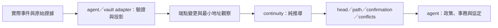
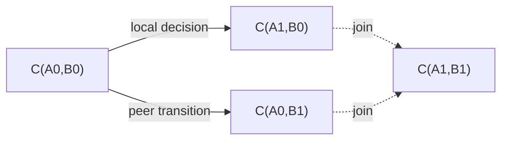

# Continuity domain package 設計草案

狀態：**探索中的設計提案，尚未實作，也不修改現行 phase-1 契約。**

暫名 `@estoc/continuity`。它是一個純模型：agent 把實際事件轉成端點變更與地址觀察，模型推導 continuity，agent 再使用結果處理自己的事務。本文先界定「需要知道什麼、能回答什麼」，型別與函式名稱用來說明邊界，尚非凍結的 API。

建議邊界是 **DID pair 的連續性**：rotation、ending、兩端同時 rotation 的 join、地址確認，以及證據之間的衝突。模型不需要訊息內容；但若要承接目前 Estoc 的 continuity 語意，輸入不能只剩 `from_prior` JWT，還需要它所屬的 pair、本地已保存的決定，以及最小的收件觀察。

<a id="boundary"></a>

## 1. Domain 的邊界

這個模型回答：「在這組證據下，這對端點如何演變，哪些推導有依據？」

它不回答：「現在應不應該對某人執行某個協定操作？」



| 問題 | Continuity model | Agent／其他模組 |
| --- | --- | --- |
| A、B 是哪些端點？ | 使用有角色的 canonical DID pair | 驗證 DID、文件、金鑰與實際收件／寄件端點 |
| B0 是否在這個關係換成 B1？ | 依正規化事實推導 link、context、supersession | 驗證原始 `from_prior`、carrier 與 context 的對應 |
| A、B 各自輪換後要得到哪一對地址？ | 推導兩端的 join 與唯一 head | 選擇何時建立新訊息、檢查實際可用性 |
| 對方是否已知道 A1？ | 由精確地址觀察和 continuity 推導 confirmation | 提供經驗證的收件觀察、決定操作還需要哪些政策條件 |
| 證據互相矛盾嗎？ | 保留分支、找出受影響 context、停止相關唯一推導 | 顯示診斷、取得新證據；第一版不提供人工選勝方功能 |
| 這封訊息可否處理／回覆／ACK？ | 提供有方向且保留角色的 path 與支持證據 | admission、訊息 identity、ACK targets、thread、協定與使用者政策 |
| 哪些 channels 屬於某 contact？ | 提供 channel 間有證據的歷史關聯 | contact selection、名稱、合併、刪除、偏好與 UI |
| 能否建立或送出下一個操作？ | 提供 continuity 查詢結果 | local lifecycle、block、金鑰、route、lock、commit、packaging、dispatch |

模型不接收 message body、message type、wire ID、ACK 列表、invitation、contact ID、vault event envelope、私鑰或 transport。沒有 `canSend()`、`admitMessage()`、`CommitPlan` 或執行副作用的 callback。

### 「只處理 from_prior」可以縮到哪裡

| 輸入範圍 | 可以做到 | 做不到 |
| --- | --- | --- |
| 只有 JWT claims | 描述 issuer 宣告的 successor 或 ending | 判斷 local／peer 角色、所屬 pair、收件 context |
| 加上角色與 pair | peer rotation 的 graph、join 所需的單邊資訊、ending assertion | 表達尚未送出的本地輪換決定、確認對方已知道哪個本地地址 |
| 再加本地決定、最小地址觀察 | 本文建議的完整 continuity 模型 | 應用 admission、訊息協定、實際操作資格 |

因此這個 package 以 `from_prior` 所表達的端點變更為中心，同時接受形成 continuity 必要的事實。它不需要理解承載事實的具體訊息。

<a id="identity"></a>

## 2. 模型中的身分

Channel 是固定的 `C(localDid, peerDid)`；兩個 DID 不同，角色不可交換。Rotation 產生新的 channel，既有訊息的 pair 不隨之改寫。

`Did` 是 adapter 已驗證並 canonicalize 的識別值。模型以精確相等比較，不解析 DID document，也不把共用 key、service 或 contact 解釋為同一端點。第一個 Estoc adapter 延續 immutable `did:peer:4` profile；核心不依賴該 DID method 的編碼。支援其他 method 時，仍須另訂該 adapter 的解析、文件版本與驗證規則。

同一個 B0 出現在 `C(A0,B0)` 和 `C(X0,B0)`，並不代表兩個 channel 共用 rotation context。對 peer 的變更，只有保留該 peer、由 local-only links 連接起來的 pairs 屬於同一 context；對 local 的變更則對稱地經由 peer-only links 判定。Context 由證據推導，不引入可取代 pair 的永久 `relationshipId`。

Pair/context、local decision 的前提和衝突處理是這個 package 延續 Estoc 的模型選擇；DIDComm 定義 wire proof 的表示與處理要求。兩者的範圍需分別說明。

<a id="inputs"></a>

## 3. 最小輸入

核心接收同一 snapshot 的 facts 集合。以下三種輸入已足夠表達邊界；`FactId` 與 `EvidenceRef` 是 agent 可對回原始資料的穩定 opaque reference，模型不解引用後者。

Fact ID 在合併後的輸入集合內唯一，重建時保持不變；evidence reference 指向確切且不可變的來源。同一 proof 的不同 carriers 保留各自來源。核心不需要 event timestamp、receipt 順序或 author；JWT `iat` 的格式檢查留在 adapter，不用它決定哪個分支勝出。

```ts
type Did = string;
type FactId = string;
type EvidenceRef = string;
type Channel = Readonly<{ localDid: Did; peerDid: Did }>;

type Change =
  | { kind: "rotate"; successor: Did }
  | { kind: "end" };

type PeerTransition = {
  kind: "peer-transition";
  id: FactId;
  at: Channel;
  change: Change;
  receipt: EvidenceRef;
};

type LocalDecision = {
  kind: "local-decision";
  id: FactId;
  at: Channel;
  change: Change;
  source: FactId | null;
  decision: EvidenceRef;
};

type AddressObservation = {
  kind: "address-observed";
  id: FactId;
  at: Channel;
  carriedTransition: FactId | null;
  receipt: EvidenceRef;
};

type ContinuityFact = PeerTransition | LocalDecision | AddressObservation;
```

### Peer transition：對方的端點變更

`at` 固定變更前的 pair；`rotate` 的 successor 只取代 peer 端。例如 `C(A0,B0)` 加 `successor: B1`，支持 `C(A0,B0) → C(A0,B1)`。`end` 則在該 context 記錄 B0 結束關係，沒有 successor。

提交這個 fact 前，adapter 必須完成與 graph 無關的檢查：

- 原始 JWT 的格式、claims、簽章，以及 issuer key 的授權均符合 profile。
- Rotation 的 issuer 是 B0、subject 是 B1；carrier 已通過 DIDComm 解密與驗證，實際 authenticated sender 是 B1，實際 local recipient 是 A0。只讀 plaintext `from`／`to` 不足以建立這個 fact。
- Ending 沒有 current sender 可供這樣比對，須按 [ending 的 context 邊界](#ending) 另外建立依據。
- 原始 JWT、確切文件及 carrier 之間的對應可由 `receipt` 追溯。相同 claims 的另一封訊息不能補上這封 carrier 缺少的驗證。

輸入代表「自身證據已驗證的宣告」，不代表它已取得整張 graph 下的可用地位。B0→B1 和 B0→B2 都可能各自通過密碼學驗證；模型仍須把它們判為 conflict。

### Local decision：已保存的本地決定

本地 A0→A1 可能已保存，但通知尚未送出。不能等收到某個 `from_prior` carrier，才讓模型知道本地已選了 A1。Agent 因此需要把自己的 durable decision 投影成 fact。

Adapter 檢查本地端點的 ownership／identity、已保存 proof 和 decision 的一致性。若 decision 有指定 source，`source` 引用這一筆精確的 `address-observed`，不能用另一筆看似相同的觀察替代。模型檢查 source 的 pair 與 continuity 依賴；不檢查 source 的業務內容或 application admission。

本地 rotation 仍是候選 link：模型須找到 predecessor 的獨立精確地址 confirmation，才能納入 closure。沒有該 confirmation 時保留候選與原因，不把它當成已成立的 link。Ending 不建立 successor，本文提議不以地址 confirmation 作為其 graph 前提；是否允許使用者建立該 ending decision，由 agent 的操作政策決定。

新 decision 的建立、successor 配置、簽章與原子保存均在 agent。模型只讀已保存的決定，不產生另一個 successor。

### Address observation：對方確實寫到了哪個地址

`at: C(A1,B0)` 表示一個確切 observation 已驗證為 B0 寫給本地 A1。它只透露兩個實際端點，不包含 wire ID、body、協定或 handler 結果。

這種 fact 可以來自完全沒有 `from_prior` 的訊息。它是 confirmation 所需的額外資訊：僅有「我從 A0 輪換到 A1」的 proof，無法證明對方已知道 A1。

`carriedTransition: null` 表示原始 observation 確實沒有 carried proof。若它帶有 rotation proof，欄位必須引用該 observation 自己的 `peer-transition`；模型核對相同 `receipt`、相同 local recipient，以及 observation 的 peer 等於 transition 的 successor。不能把 pending／invalid proof 刪掉，再把 carrier 當成 proof-free confirmation。Ending carrier 不產生這類有 current sender 的觀察。

同一封合法 rotation carrier 可以同時投影出一個 transition 和一個 observation，兩者使用不同 fact IDs、相同 receipt reference。只需要 topology 的 consumer 可以不提供 observations；但因此缺少的 confirmation 不會自動視為成立。

### 驗證未完成時放在哪裡

核心不接收 JWT 字串或可任意勾選的 `verified` Boolean。它信任 adapter 的輸入契約，再驗證 facts 的結構、參照與 graph 語意。這個邊界不是安全隔離：不可信的呼叫端可以捏造 facts，核心無法還原它從未收到的密碼學證據。

Adapter 保留 pending／invalid 的原始資料與診斷，不把未通過自身驗證的資料變成肯定事實。它也不根據 head、block 或 admission 刪掉已驗證的矛盾分支。需要密碼學 helper 時，可以另設 adapter 層，使用現有 JOSE／DID 通用庫，核心保持同步且沒有 I/O。

模型的結果都相對於「已提供的 facts」。它不能宣稱未知歷史不存在，也不知道 adapter 尚有多少 proof 待驗證。Agent 組合模型結果與自己的 pending 診斷；凡某個操作所需的確切證據尚未就緒，不能只看到模型暫時有 head 就繼續操作。特別是配置 successor 前，仍須查完整的 saved decision 紀錄，包括尚不能投影的決定，避免因資料缺失而再配置一次。

<a id="derivation"></a>

## 4. 模型負責的推導

推導按依賴方向分開，避免「先相信結果，再用結果證明自己的輸入」。

1. **輸入一致性。** 檢查 pair、successor、fact ID 與參照。完全相同的 fact 重複輸入是冪等；同 ID 不同內容是輸入衝突，不覆寫成最後一筆。缺少被引用的 fact 留下 unresolved 原因。
2. **Positive closure。** 從已驗證的 peer rotations、可獨立確認 predecessor 的 local rotations，以及它們能支持的 joins，求最小 closure。保留所有獨立成立的分支。Peer／local endings 另保留為 terminal assertions，沿對側 links 展開 context，不生成指向空端點的 link。
3. **Context 與 conflict。** 在完整 positive closure 上找同側競爭 successor、循環、將 local／peer 變成同一 DID 的矛盾，以及 ending 與同側 successor 的競爭。不用事件時間或 JWT `iat` 選勝方。
4. **可用的 continuity。** 排除受 conflict 影響的推導，再依精確 source 與 confirmation 支持重新求 closure；失去必要支持的 link 或 join 不提供可用 path。這個層次只表示 continuity 可用，不等於任何應用操作已獲授權。

Address observation 若帶有 proof，positive 階段依賴它自己的 transition 已通過自身驗證；可用階段還依賴該 transition 不受 context conflict 影響。Proof-free observation 仍只能確認它的精確 local recipient；若查詢涉及 conflicted context，不能據它恢復一條可用 continuation。

Local rotation 的 confirmation 只能使用當輪已建立、且不依賴該 decision 的 links。A0→A1 的 decision 及其 descendants 不能反過來證明 A0 的前提；一圈互相等待的 decisions 不會憑空成立。Adapter 不傳入 graph-derived `confirmed: true`，以免把這個循環藏到核心外面。

Positive topology 和可用 paths 要分別可查。前者供歷史顯示與 host 的保守政策使用，例如沿已知 successor 傳遞 block；後者供需要有效 continuity 的操作作為其中一項條件。模型不接收 block，也不自行作出該政策決定。

<a id="outputs"></a>

## 5. 能提供什麼

| 查詢 | 回傳的 domain 資訊 | 不代表什麼 |
| --- | --- | --- |
| `head(channel)` | 唯一可用的 forward pair、ending，或無法推導的原因 | 不代表 key／route 可用、沒有 block，或允許送出 |
| `changes(channel, side)` | 該側在相應 context 的 replacement／ending、支持 facts；可用於判定 supersession | 不把同 DID 的所有關係一律標成 superseded |
| `path(from, to)` | 有方向、保留 local／peer 角色的可用路徑及支持 facts | 不證明任何訊息已收到，也不直接准許 ACK |
| `confirmation(localDid, peerDid)` | 對方或其可用 peer successor 是否寫到這個精確 local DID、哪些 observations 與 paths 支持 | 不確認另一個 local DID，不 ACK 某個 wire ID，也不表示 application admission |
| `history(channel)` | Positive links、joins、endings、context 與來源 | 歷史上連通不等於目前可用，更不等於同一個人或 contact |
| `localDecisions(channel)` | 已輸入的本地決定在相應 peer context 的狀態 | 不包含 adapter 尚未能投影的 saved decisions，不能單獨用來配置 successor |
| `conflicts()`／`status(factId)` | 受影響範圍、支持資料、等待或矛盾的原因 | 不自動選勝方、刪歷史或產生修復操作 |

Head 不用單一 `null` 混合所有情況。建議區分：

```ts
type HeadResult =
  | { status: "head"; channel: Channel; support: FactId[] }
  | { status: "ended"; endings: FactId[] }
  | { status: "unresolved"; waiting: FactId[]; missing: FactId[] }
  | { status: "conflict"; facts: FactId[] }
  | { status: "no-evidence" };
```

`head` 可以是原 pair：模型知道該 pair，且目前沒有成立的 forward change。完全沒有該 pair 的 facts 或可推導歷史才回 `no-evidence`。正向已知的變更無法提供可用 continuation 時，不退回舊 pair 假裝它是可用 head。待確認的 local decision 也要明確列出 `unresolved`，避免 host 誤認為尚未選 successor。

`unresolved` 僅描述核心看得見的參照／confirmation 缺口；外部 proof 的 pending 狀態仍來自 adapter。所有狀態都可能隨下一個 snapshot 改變。

查詢應保留支持鏈，而不只回 Boolean。Agent 若有「confirmation 的 observation 還必須 admitted」等額外條件，應能檢查候選 observations 及各自 path；不能只篩掉整張 continuity graph 的未 admitted facts，否則可能把真實的 rotation 或 conflict 一併藏掉。政策可以選擇符合條件的支持，不能混合不同來源各自不完整的證據。

同一組 facts 的推導不依輸入順序；換資料庫或重建得到相同語意。新增事實可能揭露 conflict，使原本的 head／path 不再可用，因此不承諾查詢結果單調增加。第一版採完整 snapshot 推導即可，增量索引屬於之後的效能選擇。

<a id="examples"></a>

## 6. 具體資料流

以下 A、B 都是已 canonicalize DID 的示意名稱。

### 收到 B0→B1 的 proof

Agent 驗證一封 B1 寫給 A0 的訊息及其 `from_prior`，投影：

```ts
const facts: ContinuityFact[] = [
  {
    kind: "peer-transition", id: "p1",
    at: { localDid: "A0", peerDid: "B0" },
    change: { kind: "rotate", successor: "B1" }, receipt: "receipt-1",
  },
  {
    kind: "address-observed", id: "o1",
    at: { localDid: "A0", peerDid: "B1" },
    carriedTransition: "p1", receipt: "receipt-1",
  },
];

const continuity = deriveContinuity(facts);
const head = continuity.head({ localDid: "A0", peerDid: "B0" });
```

沒有其他矛盾時，`head` 是 `C(A0,B1)`。`o1` 能證明 B1 知道 A0，也能經由 p1 支持原 B0 context 的地址 confirmation。它不影響沒有 local-only continuity 證據連接的 `C(X0,B0)`。Agent 自行判斷原訊息的業務內容是否處理，以及是否建立回覆。

### 雙方各自輪換

在同一 `C(A0,B0)`，已有獨立 observation 確認 A0；加入本地 decision A0→A1，以及 peer transition B0→B1。



模型導出 head `C(A1,B1)`，join 保留兩邊的支持 facts。這沒有捏造一封 B1 寫給 A1 的訊息，所以 **A1 尚未因此 confirmed**。是否仍須附帶已保存的 A0→A1 proof，由 agent 使用 exact-address confirmation 結果決定。

### 沒有 from_prior 的地址確認

之後收到 B1 寫給 A1、沒有 proof 的訊息，adapter 只新增：

```ts
{
  kind: "address-observed", id: "o2",
  at: { localDid: "A1", peerDid: "B1" },
  carriedTransition: null, receipt: "receipt-2",
}
```

模型現在可以指出 `o2` 確認了 A1。無論這是一封聊天、Ping 或其他訊息，輸入形狀都一樣。Agent 若據此讓下一封新 package 不再附 proof，仍由 agent 執行；既有 package 不因查詢結果改變而被重寫。

### 重複與競爭

同一 B0→B1 proof 由多封合法 carrier 帶入，只增加支持證據，不產生另一個 successor。若另一個獨立有效的 proof 宣告同 context 的 B0→B2，模型保留兩者並回 conflict。它不依收到順序、JWT 時間或 contact 偏好選 B1／B2。

### Agent 如何使用結果

Agent 在自己的操作 lock／snapshot 下取得模型 view，查詢 head、path、confirmation，再與 saved decisions、admission、denial、local resource 和協定規則合併判斷。若需要新事實，由 agent 保存後重新投影；模型不自行把查詢結果寫回成新的證據。

模型不攜帶資料庫 revision；host 必須確保檢查和 commit 對應同一有效 snapshot，或在版本改變時重新檢查。這是使用純模型的整合契約，不是 package 內的 transaction framework。

<a id="ending"></a>

## 7. Rotate 到「空」如何落在這個邊界

[DIDComm v2.1 的 Ending a Relationship](https://identity.foundation/didcomm-messaging/spec/v2.1/#ending-a-relationship) 用省略 `from_prior` JWT 的 `sub` 表達 ending，承載訊息也沒有 `from`。這是欄位不存在，不是 `sub: null`、空字串或新的空 DID。模型因此使用 `change: { kind: "end" }`，不建立 `C(A,null)`。

**Context binding 是 adapter 必須明說的前提。** 一般 rotation 可核對 carrier 的 authenticated sender 與 subject；ending 缺少這一側的 sender。JWT 的有效簽章證明 issuer 作了宣告，並不單靠這件事證明它是向某個特定 local DID 結束關係。標準的基本 ending 形式沒有要求已簽署的 recipient／audience binding，不能在草案中假定標準已提供它。

因此 agent 不能只看到某 issuer 的 ending JWT，就把該 DID 出現的所有 pairs 都標成 ended。第一版 adapter 的接收規則仍需確定：哪些 retained receipt 證據、DID 使用限制或雙方支援的附加 binding，足以建立一個 scoped `peer-transition/end`。核心只能在這個輸入契約成立後推導，不能用新增幾個 graph 欄位補出缺少的證據。

模型內的 ending 語意提議如下，與標準的 wire 表示分開決定：

- Ending 是特定側、特定 endpoint/context 的 terminal assertion，保留原 pair 與 evidence。它不刪 contact、訊息、DID 或金鑰，也不等同本地 block。
- Peer ending 沿保留相同 peer 的 local-only context 生效；local ending 對稱地沿 peer-only context 生效。沒有證據連接的同 DID 關係不受影響。
- 同一 endpoint/context 同時宣告 successor 與 ending，回 conflict；時間較新不自動勝出。B0→B1 之後 B1 ending 則是正常的 forward history，沒有這種同 predecessor 競爭。
- 一側 ending、另一側合法 rotation 時，ending 隨對側 context 延伸，沒有可繼續使用的 joined head；兩側都 ending 也不製造空 pair。
- Ending carrier 本身不提供「新地址已被對方知道」的 confirmation，也不證明任何業務訊息已處理。

這些規則讓資料型別現在就能容納 ending，但 **接收 ending 的 context binding 尚未定案，不能據此宣稱已完成互通或可安全開啟接收功能**。本地 ending 的產生／通知、延遲訊息如何處置與既有 outbound 的 dispatch 規則，也屬於 agent 協定設計。

<a id="extraction"></a>

## 8. 從現有程式抽出的範圍

| 現有位置 | 抽取方向 |
| --- | --- |
| [`vault/src/fold/continuity.ts`](../../packages/vault/src/fold/continuity.ts) | Graph、closure、join、context、conflict、head、confirmation 進核心；`ackPath` 改為一般 path 查詢；`blocked` 留給 policy consumer |
| [`vault/src/fold/channels.ts`](../../packages/vault/src/fold/channels.ts) | Vault event、local key/entity、resolution、JWT checks 留在 adapter；輸出本文的最小 facts，保留 source 依賴 |
| [`vault/src/from-prior.ts`](../../packages/vault/src/from-prior.ts) | 原始 proof 的解析、驗證與簽署留在邊界外；可另抽 helper，但不讓核心依賴 keys／vault |
| [`vault/src/fold/contacts.ts`](../../packages/vault/src/fold/contacts.ts) | Contact payload、selection 與偏好保留原 domain，消費 continuity 查詢 |
| [`agent-core/src/rotate.ts`](../../packages/agent-core/src/rotate.ts)、[`agent-core/src/receive/receipt.ts`](../../packages/agent-core/src/receive/receipt.ts) | 鎖、收件、decision 建立、簽章、保存與通知保留 agent；增加正規化投影和查詢的整合 |

依賴方向是 `agent/vault adapter → continuity`。核心不 import `@estoc/vault`、`@estoc/agent-core` 或 event-store；fact IDs 不要求沿用任何儲存格式。純模型也不要求 host 使用 event sourcing，只要求提供可追溯且一致的事實 snapshot。

建議先以 rotation 的現有行為驗證抽取邊界，再定稿 ending 的 adapter 契約和 agent 流程。第一步不是建立一套通用命令／事件框架，而是讓既有 fold 能用本文的最小投影得到同等 continuity 結果。

實作時至少以以下案例驗證邊界：亂序與重建、相同 proof 多個 carriers、獨立 context、雙端 join 不憑空 confirmation、proof-free confirmation、失敗 carrier 不借用其他 carrier、缺失參照、decision 自我支持／環狀支持、同 ID 不同內容、競爭 successor、循環及 ending 與 rotation 的互動。這是未來實作的驗收範圍；本文沒有新增 runtime 行為。

<a id="open-questions"></a>

## 9. 仍需定稿的設計點

1. **Ending 的 context binding。** 這是實作接收前必須解決的語意問題。需選定能與 DIDComm 對接的具體規則，不能只留下 `trusted: true`。
2. **支持證據的回傳形式。** 要能保留不同 observations／paths 的替代支持，又不把所有路徑展開成指數大小；可用可追溯的 support graph，具體 API 待 prototype 驗證。
3. **Pending 的組合介面。** 核心只回它看得到的 unresolved；adapter 另保留驗證缺口。整合層應提供易用的合併診斷，避免 consumer 誤把「目前唯一 head」當成「所有相關證據皆已就緒」。

<a id="references"></a>

## 10. 參照

- [現行 channel 與 continuity 模型](channels.md#continuity)：抽取 rotation 行為的基線。
- [現行 address／contact 政策](relationships.md#what-it-is-for)：區分 continuity 和應用政策。
- [DIDComm DID Rotation](https://identity.foundation/didcomm-messaging/spec/v2.1/#did-rotation)：wire proof 與地址確認的背景。
- [DIDComm Ending a Relationship](https://identity.foundation/didcomm-messaging/spec/v2.1/#ending-a-relationship)：ending 的 wire 表示。
