# Continuity illustrated: concepts and test boundaries

Starting from an oriented DID pair, this guide puts test inputs, derivation and
query results side by side. Read the [README](../README.md) and
[public types](../src/model.ts) for the API and integration contract. Test links
point to the fixed source revision used to check these examples.

Start with [both parties rotating and joining](#join), then explore
[contexts](#contexts), [ambiguous evidence](#ambiguity) and
[onward rotations](#onward). Proof input boundaries are collected under
[verification and binding](#proofs).

| Notation | Meaning |
| --- | --- |
| `C(A0,B0)` | From A's perspective: A0 is the local DID and B0 is the peer DID. Swapping them changes the question. |
| A0, A1, B0, B1 | DID abbreviations used in the tests. Numbers identify predecessors and successors in an example; they provide no timestamp or ordering authority. |
| `p1` | A `peer-transition`: the peer's verified and bound rotation or ending. |
| `d1` | A `local-decision`: a local rotation or ending decision the host has saved. |
| `o1` | An `address-observed` fact: an authenticated receipt from the peer to an **exact local DID**. |
| Dashed `join` edge | An edge derived from the two sides' rotations. It can be usable without another receipt. |
| Dashed `diagnostic` edge | An edge retained to explain history or ambiguity. It cannot serve as a usable path. |
| `support` | Fact IDs supporting the asserted links or an individual confirmation, rather than a complete snapshot. |

Edges are labeled with their purpose. In dependency diagrams, `source` and
`carriedTransition` are fact references, not DID rotations.

## From evidence to queries

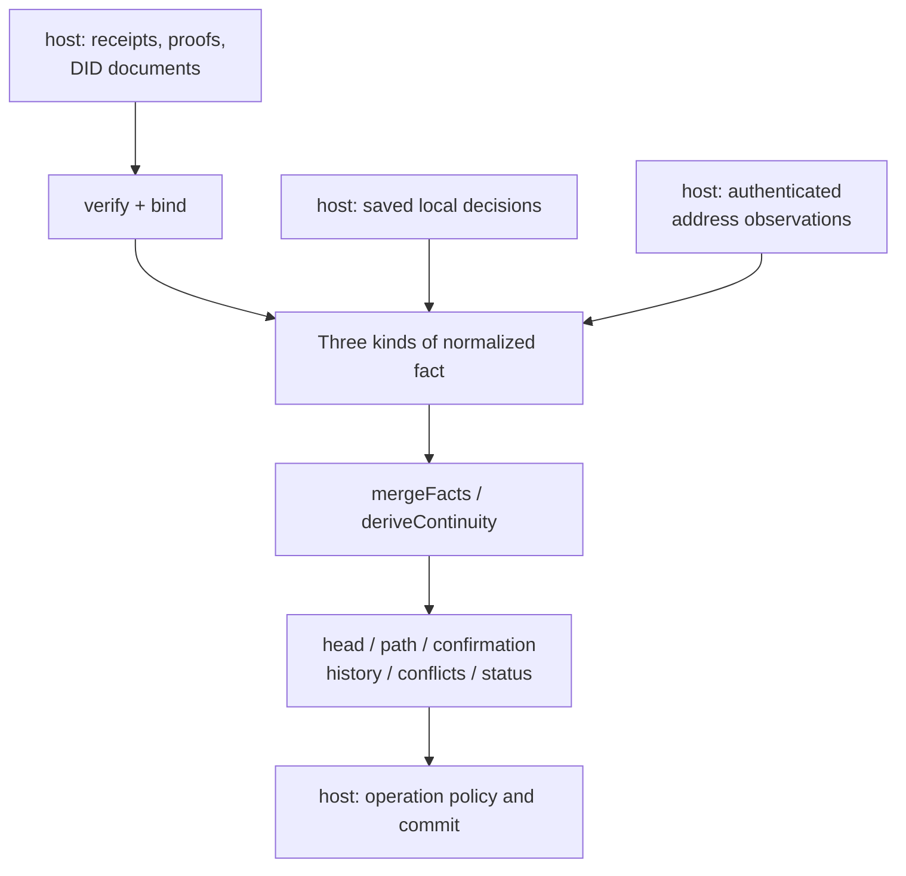

One receipt can supply both a transition and an observation. The transition
establishes how addresses continue; the observation establishes which address
the peer wrote to. A transition alone can establish topology. An observation
alone can confirm the exact address it records.

<a id="peer-rotation"></a>

## Receiving a peer rotation: continuation and confirmation have their own evidence

B1 writes to A0 carrying a B0-to-B1 proof. The host projects two facts: `p1`
declares the rotation at the old pair, and `o1` records the receipt at the new
pair. Both use the same receipt reference.

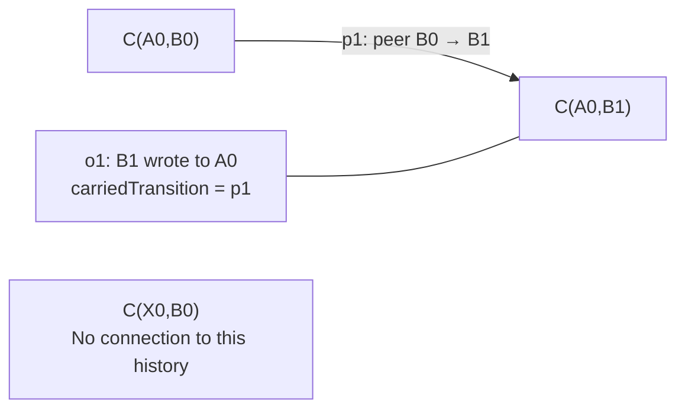

| Query or variation | Result |
| --- | --- |
| `head(C(A0,B0))` | `head C(A0,B1)`, with support `[p1]`. |
| `head(C(A0,B1))` | The queried pair is already the head, with support `[]`. |
| `confirmation(A0,B0)` | `confirmed`, with witness `[o1,p1]` for `o1`. |
| `confirmation(A0,B1)` | `o1` also confirms A0 here; the `p1` it carried remains part of its witness. |
| An independent observation exists at `C(X0,B0)` | Its head stays `C(X0,B0)`. Sharing B0 creates no connection to the rotation. |
| No fact mentions a pair | Its head is `no-evidence`. |

**Tests:** [receiving a peer rotation][test-peer].

<a id="local-rotation"></a>

## Local rotation needs predecessor confirmation

Saving `d1`, a local A0-to-A1 decision, does not immediately establish a usable
link. An observation must confirm **A0**. It can come from B0 or from a successor
of B0 reached by a usable peer-only path.

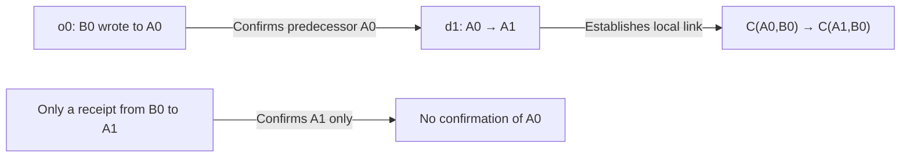

| Input | `status(d1)` | `head(C(A0,B0))` |
| --- | --- | --- |
| Only `d1`, with `source: null` | `waiting` | `unresolved`, waiting `[d1]`, missing `[]`. |
| Add `o0`, addressed to A0 | `usable` | `head C(A1,B0)`, support `[d1,o0]`. |
| Only an observation addressed to A1 | `waiting` | Still `unresolved`: receipt at the successor does not confirm the predecessor. |
| `source: o0`, but o0 is absent | `unresolved`, missing `[o0]` | `unresolved`, naming the exact missing reference o0. |
| The named o0 addresses A0, but its peer is not on a reachable peer path | `waiting` | `unresolved`. |
| The named o0 addresses another local DID, or the reference names a non-observation fact | `invalid` | The decision establishes no usable link. |

With `source: null`, the model finds a qualifying observation. A named source
requires that exact fact; another observation cannot replace it. A chain of
unconfirmed A0-to-A1-to-A2 decisions also cannot become usable just because an
observation addresses A2 at its far end.

The declared but unestablished successor `C(A1,B0)` is also `unresolved`.
`FactStatus.waiting` describes an individual fact, while
`HeadResult.unresolved` says the query still has forward choices to account for.

**Tests:** [local rotation and confirmation][test-local].

<a id="join"></a>

## Both parties rotate: a join establishes a pair without inventing a receipt

At the starting pair, `o0` confirms A0. A saves `d1`, an A0-to-A1 decision, and
B supplies `p1`, a B0-to-B1 transition. Once both base edges are established, the
model derives two join edges:

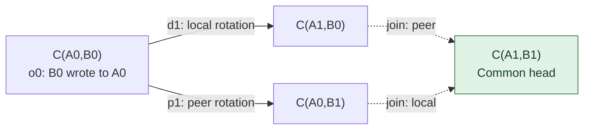

The diamond shows where the two address changes continue together.
**It contains no receipt from B1 to A1, so A1 remains unconfirmed.**

This minimal example uses the public API. A0 and the other strings are the
abbreviations used by the core tests; the proof API requires actual did:peer:4
identifiers.

```ts
import { deriveContinuity, type ContinuityFact } from "@estoc/continuity";

const C = (localDid: string, peerDid: string) => ({ localDid, peerDid });
const facts: ContinuityFact[] = [
  { kind: "address-observed", id: "o0", at: C("A0", "B0"),
    carriedTransition: null, receipt: "receipt-0" },
  { kind: "local-decision", id: "d1", at: C("A0", "B0"),
    change: { kind: "rotate", successor: "A1" }, source: null, decision: "decision-1" },
  { kind: "peer-transition", id: "p1", at: C("A0", "B0"),
    change: { kind: "rotate", successor: "B1" }, receipt: "receipt-1" },
];

const model = deriveContinuity(facts);
model.head(C("A0", "B0"));
model.confirmation("A1", "B1");
```

| Query | Result |
| --- | --- |
| `head` from C(A0,B0), C(A1,B0) or C(A0,B1) | All reach `C(A1,B1)`, with support `[d1,o0,p1]`. |
| `confirmation(A0,B0)` | `confirmed`, established by o0. |
| `confirmation(A1,B1)` or `confirmation(A1,B0)` | `unconfirmed`, with unusable `[]`: there is no observation addressed to A1. |
| The two join edges in `history` | `derived: true` and `usable: true`, each with support `[d1,o0,p1]`. |

A later authenticated, proof-free message from B1 to A1 supplies the missing
observation `o2`:

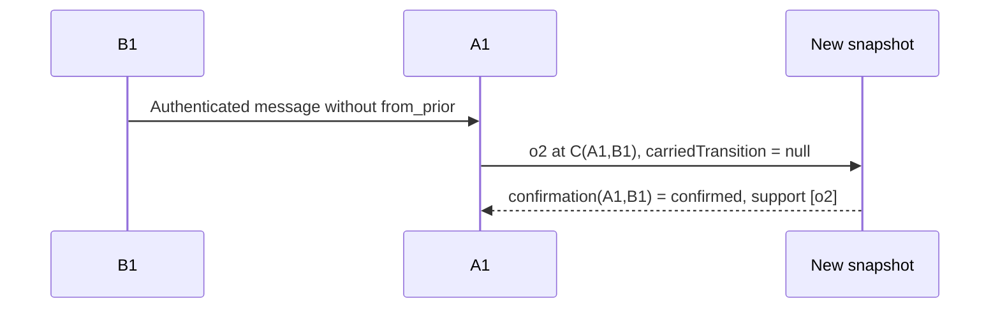

For `confirmation(A1,B0)`, the witness must also establish how B0 reaches B1, so
o2's support is `[d1,o0,o2,p1]`. The same observation can need different complete
witnesses for different query starting points.

**Tests:** [both parties rotate][test-join].

<a id="contexts"></a>

## Contexts establish scope; paths preserve direction

In the join example, `history(C(A0,B0))` has these two contexts:

| Name | Fixed endpoint | Members in this example | Purpose |
| --- | --- | --- | --- |
| `localContext` | Peer B0 | C(A0,B0), C(A1,B0) | Determines whether B0's peer changes belong to the same context. |
| `peerContext` | Local A0 | C(A0,B0), C(A0,B1) | Determines whether A0's local decisions belong to the same context. |

A context follows connectivity through the corresponding side's links in either
direction. A `path` follows usable rotations only in their forward direction.

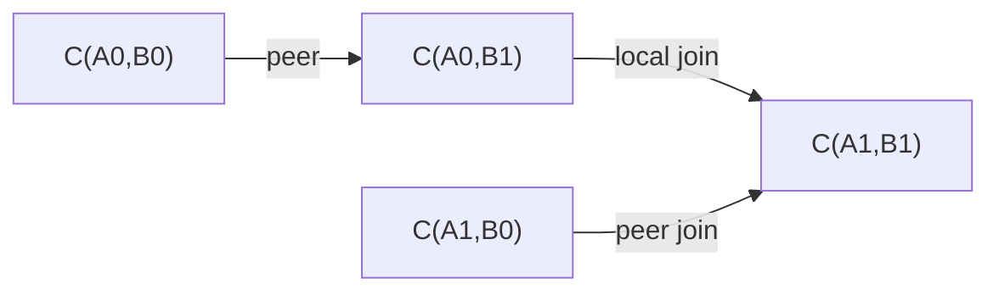

| `path(from, to)` | Result |
| --- | --- |
| C(A0,B0) → C(A1,B1) | This example selects C(A0,B0) → C(A0,B1) → C(A1,B1), with support `[d1,o0,p1]`. |
| C(A1,B1) → C(A0,B0) | `none`: context membership does not let a path reverse rotations. |
| C(A0,B1) → C(A1,B0) | `none`: belonging to the same history does not establish a directed path. |
| Known C(A0,B0) → itself | A zero-step `path`, containing only that channel, with support `[]`. |
| A pair with no evidence → a known pair | `none`. |

The graph's `peer` traversal does not cross local edges; `any` can traverse both
sides. Tests use 1,000 graph edges to check complete reachability, stopping at a
requested target and rebuilding paths on demand. The model also checks heads
and paths over 3,000 peer rotations. These are correctness examples, not
throughput guarantees.

**Tests:** [join paths and contexts][test-join], [graph reach][test-graph],
[long rotation history][test-convergence].

<a id="competition"></a>

## Repetition, competition and structural conflicts

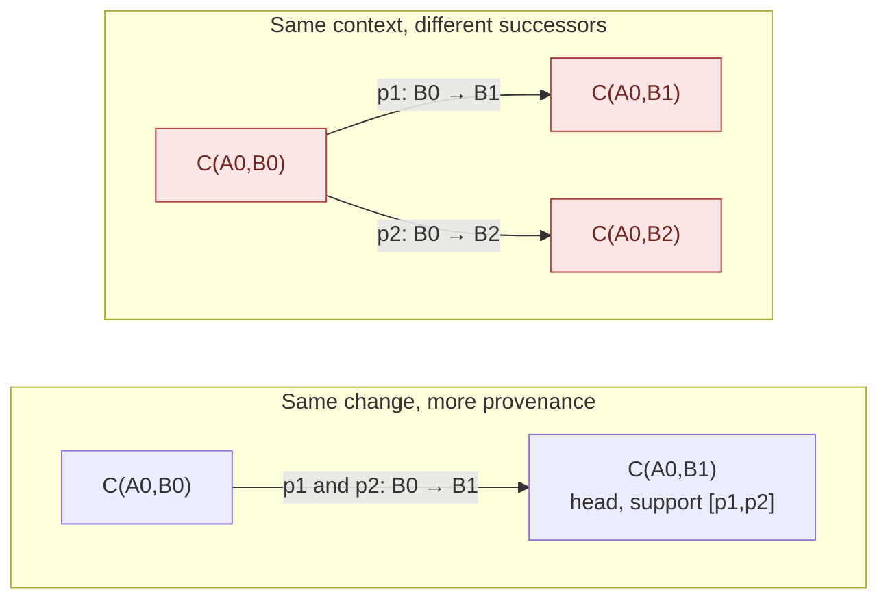

The edges in the "different successors" group are competing claims. `head` and
the affected `path` and `confirmation` queries return `conflict`. Arrival order
and time select no successor.

| Boundary | Result and reason |
| --- | --- |
| Two distinct IDs both declare B0 → B1 | More support, with no additional successor or fork. |
| p1 is at C(A0,B0), p2 is at C(A1,B0), and a local link connects the pairs | Different successors still compete in the same B0 context. |
| Remove that local connection, with no other context connection between the pairs | Sharing B0 alone does not establish this competition across pairs. |
| Save both A0 → A1 and A0 → A2 at one pair, before any observation arrives | Already `competing-changes`: missing confirmation does not erase a saved fork. |
| Add a proof-free observation to a conflicted context | It cannot restore usable continuation through the conflict. |
| Another disconnected relationship also uses B0 | It keeps its own usable head. |

Two other graph shapes prevent an ordinary head:

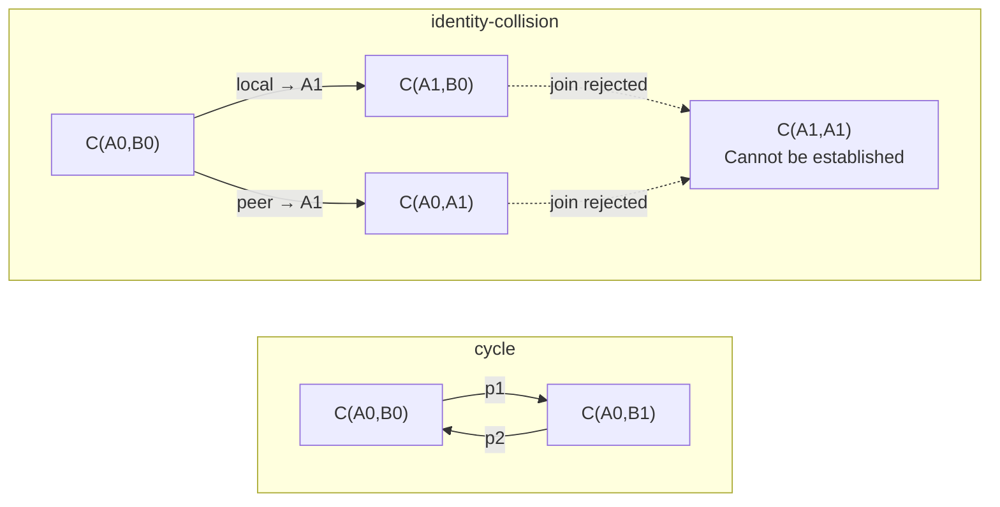

A `cycle` returns to a pair the rotations left. An `identity-collision` would
give both endpoints the same successor DID. These are positive claims; the
resulting conflicts prevent usable paths. The local rotation in the collision
example has predecessor confirmation. Endpoint collision is distinct from
`identity-conflict`, where a fact ID has multiple values.

**Tests:** [repeated carriers][test-peer], [competing changes][test-competition],
[observations][test-observations].

<a id="merge"></a>

## Merge converges even when a head is withdrawn

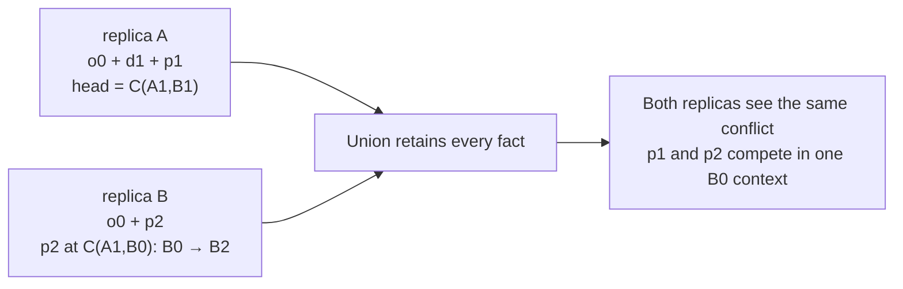

Learning more facts can withdraw a previously usable head. The result still
converges: replicas holding the same facts report the same conflict. Merge
cannot undo messages that have already been sent.

| Merge or input boundary | What the tests establish |
| --- | --- |
| Swap inputs or change delivery order and batching | The same result: commutativity and associativity. |
| Deliver the same snapshot again or merge an empty snapshot | No new values: idempotence and identity. |
| Same ID, same canonical value | Deduplicated; object property order does not affect equality. |
| Same ID, different values | Every variant is retained, without last-write-wins selection. |
| Same change, different IDs | Retained as separate provenance. |
| Different string case | Different values; the core does not normalize DIDs for the host. |
| Enumeration order | IDs, then canonical values, in UTF-8 byte order rather than UTF-16 or locale order. |
| Different identity namespace or unsupported profile | `IncompatibleSnapshot`; unknown fields are not dropped to make inputs appear compatible. |
| Extra members, empty IDs, equal endpoints, a successor equal to either endpoint, or direct self-reference | `InvalidFact`. |
| Missing or incorrectly typed `source` or `carriedTransition`, an ending with a successor, or invalid Unicode | Rejected; a required explicit null cannot be omitted. |
| An input member is an accessor | Validation captures its value instead of reading a changing member again later. |

`mergeFacts` does not mutate its inputs. Invalid structure rejects the whole
call; it produces no partial result that skips the malformed fact.

**Tests:** [merge laws][test-merge], [identity and equality][test-equality],
[compatibility][test-compatibility],
[convergence and monotonicity][test-convergence].

<a id="ambiguity"></a>

## Colliding IDs preserve history; independent evidence can still establish a change

Suppose ID `p1` has two values. Both declare B0 → B1, but their receipt references
differ. This is still an `identity-conflict`. Agreement on the successor does
not make either ambiguous variant usable support.

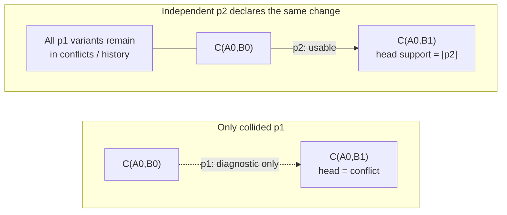

| Situation | Result |
| --- | --- |
| Only collided p1, with no other evidence | Positive history retains the forward claim. There is no usable path and no fallback to the predecessor head. |
| Independent p2 supports the same B0 → B1 | p2 can establish the head and path; p1's identity conflict remains queryable. |
| A p1 variant actually declares B0 → B2 | p2 cannot hide the alternative successor; a domain conflict remains. |
| A local rotation or same-side ending has a collided twin | Independent, unambiguous evidence for the same change can establish it too. |
| A peer ending is collided, with only a local ending as independent evidence | The other side's ending is not the same change and cannot settle the ambiguity. |
| ID p appears in two disconnected histories | The global ID diagnostic is retained; a fork in one context does not spread to every variant elsewhere merely because they share an ID. |

Support in `history().links` is positive provenance. Even when a link has
`usable: true`, its history support can contain collided IDs. For a usable
witness, read the corresponding `path`, `head` or `confirmation` result.

**Tests:** [identity conflicts][test-identity], including independent support,
fork scope across contexts and equivalent changes.

<a id="onward"></a>

## Onward rotations on a side branch still need an answer

Here is a harder boundary. `p + o + i` establish a usable route to A1B1: p
rotates B0 → B1, o observes B1 writing to A0, and i decides A0 → A1 at C(A0,B1).
A collided `d` declares the same A0 → A1 and leaves a side branch through
C(A1,B0) in positive history.

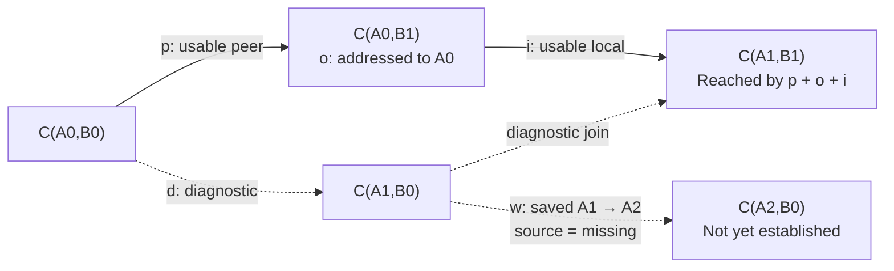

w is outside the original usable forward path, but it still declares an onward
choice for A1. The query must account for that choice before returning a head.

| Evidence added to the base example | `head(C(A0,B0))` | Why |
| --- | --- | --- |
| w has not been added | `head C(A1,B1)`, support `[i,o,p]` | Independent evidence establishes the same change. |
| Add w as shown | `conflict`, facts `[w]` | Only diagnostic history connects w's scope to the query; `status(w)` itself remains `unresolved` for its missing source. |
| Also add usable `scope: C(A1,B0) → C(A1,B1)` | `unresolved`, waiting `[w]`, missing `[missing]` | Its scope is established; the exact source is still missing. |
| Then supply `missing`, an observation from B0 to A1 | `head C(A2,B1)` | Both scope and confirmation prerequisites are satisfied. |
| Without adding scope, independently establish A1 → A2 at C(A1,B1) using a new observation | `head C(A2,B1)` | The same onward change has usable support; w remains provenance. |
| Instead save A1 → A3 at C(A1,B1) | `conflict` | It competes with w's A1 → A2. |

This explains why `status(fact)` and `head(pair)` can return different statuses.
The former describes the fact's own prerequisites; the latter also accounts for
ambiguity in how the claim applies to the queried continuity.

**Tests:** [the same change elsewhere in a context][test-covered],
[saved onward rotation][test-onward].

<a id="ending"></a>

## Endings terminate a context without creating an empty pair

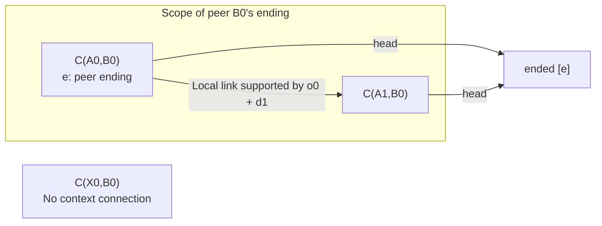

A peer ending applies across the local-only context that retains that peer.
A local ending applies across the peer-only context that retains that local
DID. Other pairs with no connecting evidence are unaffected.

| Combination | Result |
| --- | --- |
| B0 ending and B0 → B1 in the same B0 context | `conflict`: incompatible choices for the same side. |
| B0 → B1, followed by B1 ending | `ended`: ordinary forward history at different predecessors. |
| Local A0 ending and peer B0 → B1 | Both pairs are `ended`; there is no continuing joined head. |
| Local ending and A0 → A1 in the same A0 context | `conflict`. |
| An observation claims it carried an ending | `invalid`: an ending establishes no successor-address observation. |
| An unambiguous ending at another pair applies only through diagnostic links | The query reports `conflict`; historical connectivity alone cannot apply the ending. |
| Add a usable opposite-side context link, or an independent same-side ending at the queried pair | The corresponding `ended` result can be established. |

Endings retain the original pair and assertion. They create no `C(A,null)` and
do not mean a contact was deleted, a peer was blocked or an application message
was processed. `ended.endings` lists ending IDs without including the complete
context witness across pairs.

**Tests:** [ending][test-ending], [usable scope for an ending][test-ending-scope].

<a id="dependencies"></a>

## Diagnose missing and conflicted evidence along the whole dependency chain

Assume an independent, unambiguous `scope` establishes C(A0,B0) → C(A0,B1).
At the old pair, w decides A0 → A1 and names observation s. At the new pair,
s claims that its receipt carried transition t.

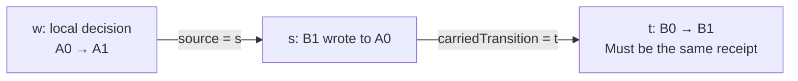

| State of t and other inputs | Query result |
| --- | --- |
| t is absent | `head` is `unresolved`, missing `[t]`. Diagnose the exact reference; s cannot become proof-free. |
| t is absent and B1 has a valid peer ending | `head` is `ended`; `status(w)` still exposes the missing evidence. |
| t has two distinct values | `head` is `conflict`, facts `[t]`, tracing through s to the conflicting reference. |
| t has two values and that ending is also present | Still `conflict`: relevant conflict takes precedence over an ending. |
| t is complete, unique and matches the receipt | w can become usable, yielding the common head C(A1,B1). |
| t exists, but s names a different receipt reference | s is ineligible; w is `waiting` and the head is `unresolved` in this example. No ID is missing. |

Another subtle case uses only an observation whose carried transition is
missing. `head` can return the original pair with empty support while
`confirmation` remains `unconfirmed`, listing that observation as unusable.
**A head cannot replace an operation's exact evidence prerequisites.**

For known forward choices, the result accounts for relevant conflicts first,
then established endings, unresolved choices and finally a usable head.
`no-evidence` is reserved for an unknown pair.

**Tests:** [the full reference chain][test-dependencies],
[observations and carried transitions][test-observations].

<a id="support"></a>

## A short link can need a witness spanning several hops

o2 is a proof-free observation from B2 to A0. For d1 in B0's context to use it
as predecessor confirmation, the witness also needs the B0 → B1 → B2 peer path.

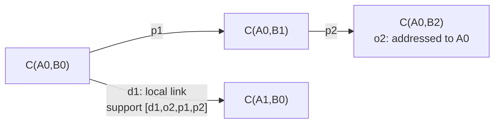

Keeping only d1 and o2 loses the evidence that lets B2 confirm A0 in B0's
context. A usable witness includes the required peer path and the recursive
prerequisites of its links. Support need not be a minimal set.

| Returned evidence | What it establishes |
| --- | --- |
| `path.support` | Re-derives the asserted usable links under the same profile. |
| Each `confirmation.observations[n].support` | Re-derives that individual confirmation, including the transition its observation carried. |
| `head.support` | Supports the usable links leading to the head; it does not promise to replay the whole query verdict. |
| An unchanged head or zero-step path, with support `[]` | There is no rotation link to prove; this establishes no address observation. |
| Positive provenance in `history` | Explains origins and ambiguity; it is not a general usable witness. |

Keep the snapshot and profile to replay a query result. Support proves no
absence of conflicts or missing evidence outside that snapshot. `path` selects
one deterministic path. `confirmation` lists eligible observations with one
complete witness each; it does not enumerate every alternative route to the
same observation.

**Tests:** [confirmation support across several hops][test-local],
[join witnesses and zero-step paths][test-join]. The complete replay boundary
is in the [README's query explanation](../README.md#what-the-answers-mean).

<a id="proofs"></a>

## Inspect, precheck, verify and bind are separate proof-processing stages

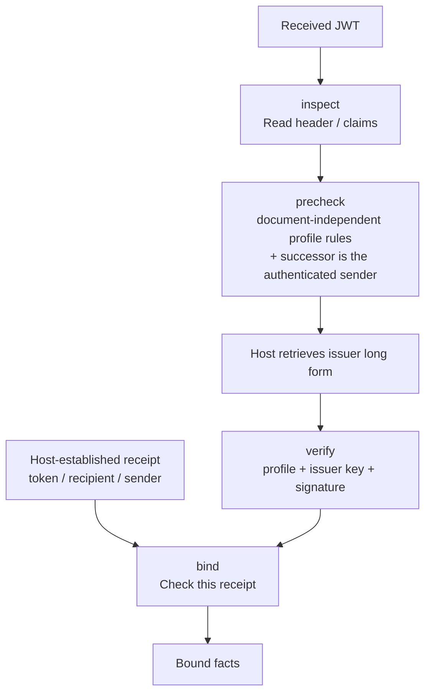

`inspect` can successfully read a token whose signature has been tampered with.
`precheck` refuses, before the host has any issuer material, what the profile
can already decide: the algorithm, media type and critical headers, the DIDs,
the shape of the change and, given the authenticated sender, a rotation whose
successor is someone else; what it passes is still unverified, and a host that
lacks the issuer's material waits rather than rejects. `verify` applies the
same rules again, takes the authorized key from the issuer's own long-form DID
and verifies the signature. `bind` checks the exact token against the receipt
and establishes facts only when binding succeeds.

| Input boundary exercised by the tests | Result |
| --- | --- |
| Wrong JWT segment count or JSON shape, non-integer `iat`, `sub: null`, or array-valued `aud` | `form` failure. |
| A signature segment that is not base64url or not 64 bytes long | `form` failure at inspection, precheck and verification; a well-formed wrong signature is left to verification. |
| `exp` or `nbf` | Rejected: this profile evaluates no validity window, and verification reads no clock. |
| Unsupported DID method or algorithm, rotation to the issuer itself, or a rotation with an audience | `profile` failure. |
| Absent `typ`, or case variants of JWT / application/jwt | Accepted; extra whitespace, parameters and other media types are rejected. |
| Absent `b64`, or `true` with `b64` listed in `crit` | Accepted; `false`, wrong types and missing required critical-header declarations are rejected. |
| Unknown critical extension | `profile` failure at the precheck and at verification; inspection still reads the token. |
| `crit` naming a `b64` the header lacks, or listing a header twice | `form` failure at every stage. |
| An authorized JWK whose `x` is not a 32-byte Ed25519 key | `document` failure, the same as a Multikey of another type. |
| A rotation whose successor is not the authenticated sender the precheck was given | `binding` failure before any issuer material; an ending is left to `bind`. |
| A tampered signature | Passes the precheck without a verified type; `signature` failure at verification. |
| Repeated JSON claim name | The parser's last value is used; inspection and interpretation of the verified payload agree. |
| Short-form `iss` and `kid` with the matching retained long form | Accepted; presented spellings and canonical short forms are both retained. |
| Wrong, malformed or hash-mismatched issuer document, or a key not authorized for authentication | `document` failure; a caller-assembled document cannot substitute another key. |
| A qualifying Multikey, JWK or embedded authentication method | Can verify an Ed25519 signature; a key authorized only for keyAgreement cannot. |
| Altered signed payload, another signing key or incorrect signature bytes | `signature` failure. |
| A different receipt token, a sender other than the rotation successor, or an ineligible recipient | Binding `mismatch`, producing no fact. |
| Rotation binding supplied only a transition ID | Produces only a transition; it does not invent an observation ID. |

### A verified ending can still be unbound

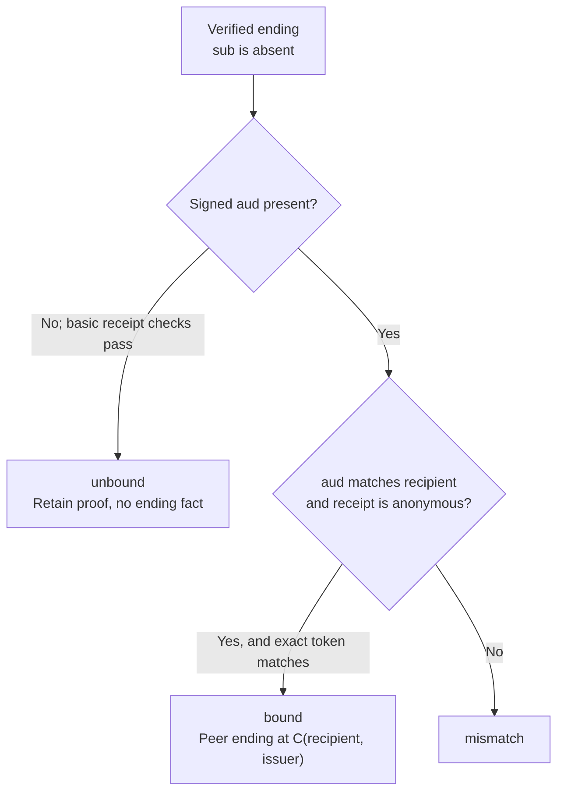

`sender: null` is the host's assertion of an anonymous receipt, requiring the
plaintext to contain no `from`. Signed audience is an extension of this
package's profile. A valid basic ending token alone does not identify which
recipient's relationship it ends. Ending binding produces no address observation.

### Creation verifies the signer's output too

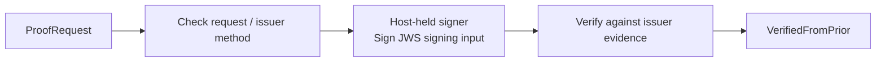

An inconsistent request is rejected before signing. An unauthorized method,
another key or invalid signature bytes cannot produce a verified proof. The
signer can hold a non-exportable key. Creating a proof saves no decision and
sends no message.

**Tests:** [inspect][test-inspect], [precheck][test-precheck],
[verify][test-verify], [bind][test-bind], [create][test-create].

<a id="host"></a>

## Queries and commits must use a valid revision

This is an integration requirement from the [host contract](../README.md#host-contract).
Core tests demonstrate that a new snapshot can change an answer. The core has
no database transaction and cannot validate the atomicity of a host's commit.

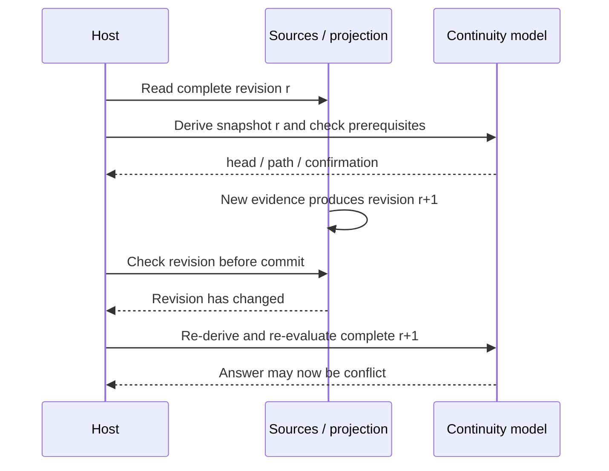

Validation and the state commit must use the same valid revision. The host can
use a transaction, lock or optimistic version check. Snapshot completeness,
commit consistency and successor-allocation coordination across replicas each
have their own role: a local lock cannot prevent another offline replica from
saving a different successor.

Head, path and confirmation also do not decide key, route, block, admission or
ACK policy. Those decisions remain with the host that uses the results.

## Find the corresponding tests

| Question | Illustrated section | Test coverage |
| --- | --- | --- |
| How do address changes differ from address confirmation? | [Peer rotation](#peer-rotation), [local rotation](#local-rotation), [join](#join) | Receiving a peer rotation; local rotation and confirmation; both parties rotate. |
| Where can a path go, and which pairs share a scope? | [Contexts](#contexts), [support](#support) | Graph reach; join paths and history; witnesses spanning several hops. |
| When is there no longer a unique head? | [Competition](#competition), [colliding IDs](#ambiguity), [onward rotations](#onward) | Competing changes; identity conflicts. |
| Why does an ending or missing evidence take precedence? | [Endings](#ending), [dependency chains](#dependencies) | Ending; observations; pending-choice diagnostics. |
| How can replicas converge to a conflict? | [Merge](#merge) | Merge laws; identity and equality; compatibility; convergence and monotonicity. |
| Which inputs are rejected between a token and a fact? | [Proofs](#proofs) | Inspect; precheck; verify; bind; create. |

[test-peer]: https://github.com/estoc-net/estoc/blob/38212acdeb4a88ecfacf070fca880ae81329505b/packages/continuity/test/model.test.ts#L30
[test-local]: https://github.com/estoc-net/estoc/blob/38212acdeb4a88ecfacf070fca880ae81329505b/packages/continuity/test/model.test.ts#L74
[test-join]: https://github.com/estoc-net/estoc/blob/38212acdeb4a88ecfacf070fca880ae81329505b/packages/continuity/test/model.test.ts#L153
[test-competition]: https://github.com/estoc-net/estoc/blob/38212acdeb4a88ecfacf070fca880ae81329505b/packages/continuity/test/model.test.ts#L203
[test-ending]: https://github.com/estoc-net/estoc/blob/38212acdeb4a88ecfacf070fca880ae81329505b/packages/continuity/test/model.test.ts#L275
[test-observations]: https://github.com/estoc-net/estoc/blob/38212acdeb4a88ecfacf070fca880ae81329505b/packages/continuity/test/model.test.ts#L319
[test-identity]: https://github.com/estoc-net/estoc/blob/38212acdeb4a88ecfacf070fca880ae81329505b/packages/continuity/test/model.test.ts#L357
[test-ending-scope]: https://github.com/estoc-net/estoc/blob/38212acdeb4a88ecfacf070fca880ae81329505b/packages/continuity/test/model.test.ts#L438
[test-covered]: https://github.com/estoc-net/estoc/blob/38212acdeb4a88ecfacf070fca880ae81329505b/packages/continuity/test/model.test.ts#L463
[test-onward]: https://github.com/estoc-net/estoc/blob/38212acdeb4a88ecfacf070fca880ae81329505b/packages/continuity/test/model.test.ts#L497
[test-dependencies]: https://github.com/estoc-net/estoc/blob/38212acdeb4a88ecfacf070fca880ae81329505b/packages/continuity/test/model.test.ts#L528
[test-convergence]: https://github.com/estoc-net/estoc/blob/38212acdeb4a88ecfacf070fca880ae81329505b/packages/continuity/test/model.test.ts#L599
[test-graph]: https://github.com/estoc-net/estoc/blob/38212acdeb4a88ecfacf070fca880ae81329505b/packages/continuity/test/graph.test.ts#L6
[test-merge]: https://github.com/estoc-net/estoc/blob/38212acdeb4a88ecfacf070fca880ae81329505b/packages/continuity/test/merge.test.ts#L16
[test-equality]: https://github.com/estoc-net/estoc/blob/38212acdeb4a88ecfacf070fca880ae81329505b/packages/continuity/test/merge.test.ts#L60
[test-compatibility]: https://github.com/estoc-net/estoc/blob/38212acdeb4a88ecfacf070fca880ae81329505b/packages/continuity/test/merge.test.ts#L91
[test-inspect]: https://github.com/estoc-net/estoc/blob/e655214d9fd220bdd3445e68f800427c114a6390/packages/continuity/test/from-prior.test.ts#L74
[test-precheck]: https://github.com/estoc-net/estoc/blob/e655214d9fd220bdd3445e68f800427c114a6390/packages/continuity/test/from-prior.test.ts#L94
[test-verify]: https://github.com/estoc-net/estoc/blob/e655214d9fd220bdd3445e68f800427c114a6390/packages/continuity/test/from-prior.test.ts#L184
[test-bind]: https://github.com/estoc-net/estoc/blob/e655214d9fd220bdd3445e68f800427c114a6390/packages/continuity/test/from-prior.test.ts#L344
[test-create]: https://github.com/estoc-net/estoc/blob/e655214d9fd220bdd3445e68f800427c114a6390/packages/continuity/test/from-prior.test.ts#L396
